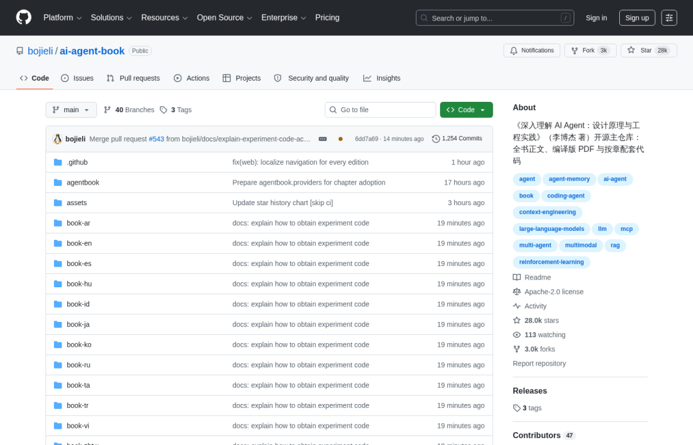
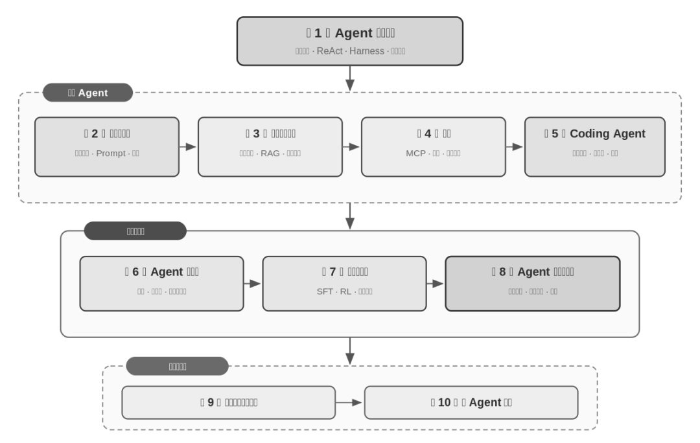
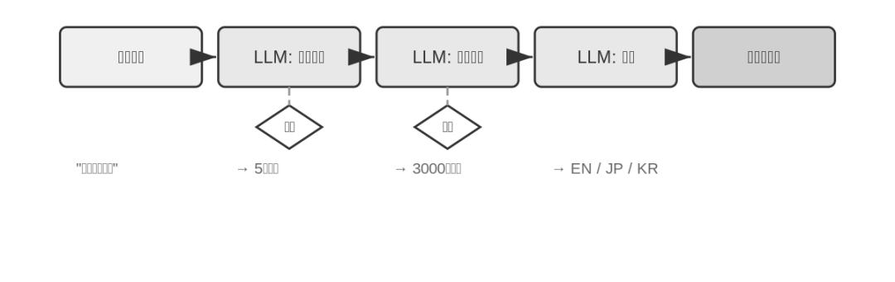
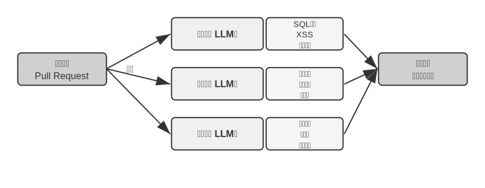
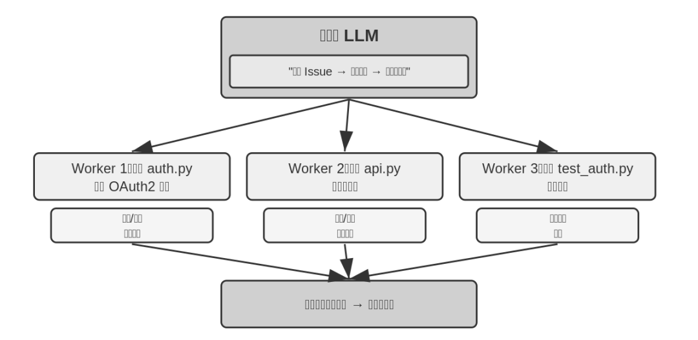
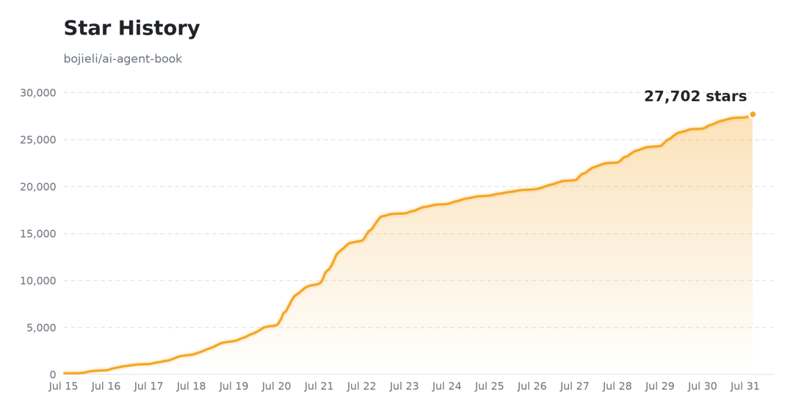

# 2.8万Star！AI Agent 教材来了：10章94实验，中科大博士免费开源
> 💡 备注属性未写入，可能是备注属性名称或者类型被修改了，建议将字段类型设置为 rich_text，可以在小程序-操作-修改文章数据库页面进行调整
> 💡 原文链接:[https://mp.weixin.qq.com/s?__biz=MzI2NjI1OTQ1MA==&mid=2247494793&idx=1&sn=dc871d4effe3fee240af840277b857dd&chksm=eb0864e08764edc2613ae1a0082ec9a6de0ced5233ffb56254df83972266263ece6e9502d5d6#rd](https://mp.weixin.qq.com/s?__biz=MzI2NjI1OTQ1MA%3D%3D&mid=2247494793&idx=1&sn=dc871d4effe3fee240af840277b857dd&chksm=eb0864e08764edc2613ae1a0082ec9a6de0ced5233ffb56254df83972266263ece6e9502d5d6#rd)
↑阅读之前记得关注+星标⭐️，😄，每天才能第一时间接收到更新
大家好，我是杰克王，AI 算法 6 年老兵。
---
一个朋友在学 AI Agent，买了三本书，收藏了几十篇教程，把 LangChain 文档从头到尾看了两遍。
然后他告诉我：还是不知道怎么真正从头搭一个。
他看的不是不够多，是看的那些，没有一个东西把"为什么"讲清楚。
上个月，他发给我一个 GitHub 链接，说：就是这个，看完第一章，之前那些拼图全补上了。
那个链接是：**《深入理解 AI Agent：设计原理与工程实践》**，作者李博杰，Pine AI 首席科学家，中科大校友。
截至 2026-07-31，这本书在 GitHub 上有 **27,979 Star、2,957 Fork**，连续登上 GitHub 全球 Trending 日榜。全书正文、配图、94 个配套实验，全部免费开源。

---
### 一个公式，贯穿全书
这本书用一个公式统领所有内容：
**Agent = LLM + 上下文 + 工具**
不是比喻，是架构定义。
- **LLM 是大脑**：决策、规划、判断
- **上下文是眼睛**：当前任务里能看到的全部信息
- **工具是手脚**：执行代码、调 API、操控浏览器、调用子 Agent
你用过 Cursor 写代码，看着它搜索代码库、改几个文件、跑测试直到通过——那三个组件就在运转。你用过 Deep Research 调研课题，看着它反复搜索、阅读、汇总——也是这三个。你让豆包手机助手帮你订票——还是这三个。
这个公式让 AI Agent 的所有复杂性，变得有地方放了。
下面这张图是书里第一章的整体架构：

---
### 作者是谁
李博杰，GitHub ID `@bojieli`，现任 **Pine AI 首席科学家**，中科大 Linux 用户组成员，个人博客 01.me。
他的另一个身份：19PINE-AI（Pine AI）的核心技术负责人，Pine AI 做的事情是"帮你打电话给运营商协商降低账单"这类个人事务 Agent——不是 demo，是真的在跑的产品。
这本书不是象牙塔里写出来的。
---
### 10 章从原理到工程，每章有代码
全书 10 章，层层递进：
| **章节** | **主题** | **实验数** |
| 第 1 章 | Agent 基础知识：核心公式与架构 | 4 |
| 第 2 章 | 上下文工程：KV Cache、提示工程、压缩 | 9 |
| 第 3 章 | 用户记忆和知识库：RAG、结构化索引、知识图谱 | 13 |
| 第 4 章 | 工具：MCP 协议、感知/执行/协作三类 | 7 |
| 第 5 章 | Coding Agent 与代码生成 | 12 |
| 第 6 章 | Agent 评估：指标、统计显著性、评估驱动选型 | 11 |
| 第 7 章 | 模型后训练：SFT 与 RL，工具调用内化 | 16 |
| 第 8 章 | Agent 的持续进化：从运行轨迹获取学习信号 | 8 |
| 第 9 章 | 多模态与实时交互：语音、Computer Use、机器人 | 10 |
| 第 10 章 | 多 Agent 协作：协作框架、涌现的"Agent 社会" | 8 |
**合计：94 个配套实验。**
不是"看看就好"的示意代码——每个实验都有 README、依赖列表，支持 Python 3.10+，一条命令装好就能跑：
```bash
uv sync --locked --extra ch1
uv run python chapter1/context/main.py

```
---
### 看看书里的架构图长什么样
第 1 章讲四种经典 Agent 工作流模式——下面是其中"链式"和"并行"两种的架构图，直接来自书里的 SVG 原图：
链式调用（Chaining）：

并行调用（Parallel）：

Orchestrator 模式（编排者-执行者）：

书里类似的架构图贯穿每一章，不是摆设，是跟正文一一对应的。
---
### 第 1 章里的一张对比表，值得反复看
书里列了一张现代 Agent 产品的"三维对比表"：
| **Agent 产品** | **眼睛（感知）** | **手脚（行动）** | **策略** |
| Cursor 等 Coding Agent | 需求文档、代码库、终端环境 | 文件读写、执行命令 | 增量开发：理解→搜索→编辑→测试→调试 |
| Deep Research 等搜索 Agent | 网络资源、学术数据库 | 搜索查询、网页阅读、摘要生成 | 迭代深化：根据已有信息调整搜索方向 |
| Browser Use 等电脑操控 Agent | 浏览器页面、文件系统 | 点击、输入、滚动、截图 | 视觉感知+操作：观察→识别元素→执行→验证 |
| 豆包等手机助手 | 手机屏幕、App | 点击、滑动、打开 App | 意图理解+App 操控 |
| Pine AI 等个人办事 Agent | 账户信息、历史账单 | 打电话、发邮件、与用户确认 | 多步骤任务执行，谈判+汇报 |
你现在用到的所有 AI 工具，都能放进这张表里找到位置。
---
### 13 种语言：社区自发翻译
书里有一个细节，最能说明这本书的分量。
它上线之后，社区自发把书翻译成了 13 种语言：中文（原版）、英文、西班牙语、印度尼西亚语、阿拉伯语、繁体中文（台湾）、俄语、泰米尔语、越南语、日语、土耳其语、韩语、匈牙利语。
每一种语言都有 PDF 和 EPUB 可以下载。
没有人要求。翻译者自己来，自己做，自己提 PR。
一本书让13个语言圈的人都愿意花时间翻译，说明它确实有东西。
---
### Star 增长趋势

从 2025 年 9 月上线到现在，增长曲线没有出现过"冲一下就平了"的迹象。持续涨说明一件事：不是靠营销，靠的是口碑传播。
---
### 怎么获取
全部免费，GitHub 直接下载：
```bash
# 在线阅读（支持多语言、全文搜索）
# https://bojieli.github.io/ai-agent-book/

# 下载中文 PDF
# https://github.com/bojieli/ai-agent-book/releases/download/latest/AI-Agents-in-Depth-zh-CN.pdf

# 克隆全书（含代码实验）
git clone https://github.com/bojieli/ai-agent-book

```
GitHub 链接：https://github.com/bojieli/ai-agent-book[1]
---
### 最后说一句
AI Agent 的技术栈正在快速演变。但底层的逻辑变化没那么快：**大脑怎么做决策、眼睛能看到什么、手脚能做什么**——这三个问题，在新的模型和框架出来以后，还是这三个问题。
这本书教的是这个。
一个公式，10 章，94 个能跑的实验，免费。
觉得有收获，点个**在看**支持一下 👇 感谢阅读。我是杰克王，欢迎加微交流 🚀
**➕V: 2831062189，分享你 PDF 版本**
#### 引用链接
[1]_https://github.com/bojieli/ai-agent-book_

## 摘要

（待补充）

## 我的笔记

（待补充）
