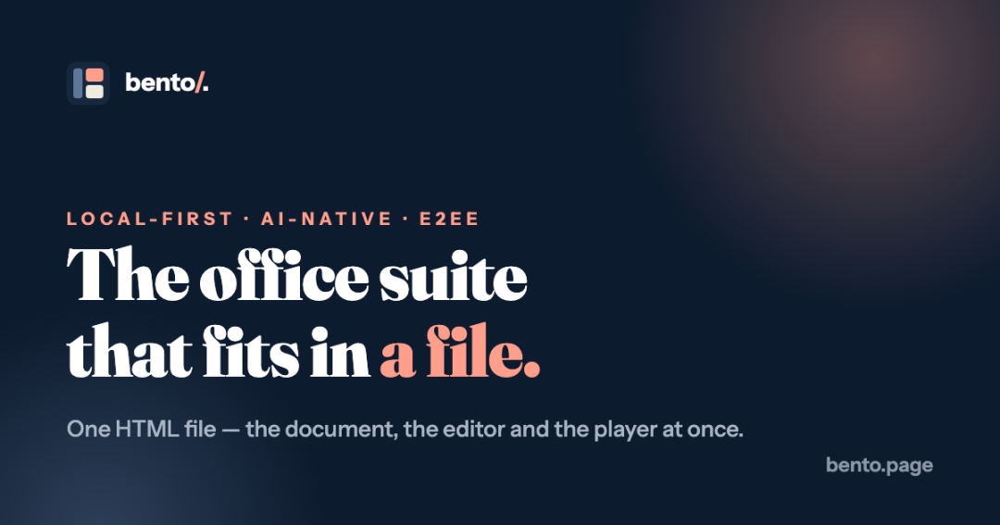

# Bento：一个 HTML 文件就是一个完整的 Office 套件，5000 星背后的本地优先革命
> 💡 备注属性未写入，可能是备注属性名称或者类型被修改了，建议将字段类型设置为 rich_text，可以在小程序-操作-修改文章数据库页面进行调整
> 💡 原文链接:[https://mp.weixin.qq.com/s?__biz=MzcwMjI0MjAxNQ==&mid=2247484642&idx=1&sn=f4f4f3fd1d1bac71732a863c11e4ffb6&chksm=f54f0d98e8aeb3695a30d3d1bcb4139dacf327763ca6935f332fbac1bb3ee17293f49d47e74e#rd](https://mp.weixin.qq.com/s?__biz=MzcwMjI0MjAxNQ%3D%3D&mid=2247484642&idx=1&sn=f4f4f3fd1d1bac71732a863c11e4ffb6&chksm=f54f0d98e8aeb3695a30d3d1bcb4139dacf327763ca6935f332fbac1bb3ee17293f49d47e74e#rd)
QUOTE
**Office 文档曾经是你拥有的东西，现在变成了你租用的东西——锁在别人的云端、挡在别人的登录墙后面。**
2026 年 7 月，一个名为 Bento 的开源项目在 GitHub 上悄然上线，仅用不到两个月时间就狂揽 5000+ 星、350 个 fork，并在 9 月 14 日发布了 v1.1.0 版本，引入了「Live broadcast」实时广播演示功能。它的口号简单到令人怀疑——「the office suite that fits in a file」（装在一个文件里的办公套件）——但当你真正打开那个 560 KB 的单文件 HTML 时，会发现它不只是个噱头：文档、编辑器、播放器全部打包在同一个文件里，双击打开就能用，关掉浏览器还能离线编辑。在 Google Docs 和 Microsoft 365 几乎垄断在线协作的今天，Bento 走了一条完全相反的路。
本文看点
01
**自包含文档架构的突破**
02
**四大核心技术突破**
03
**AI Agent 天然友好**
**01**
SELF-CONTAINED DOCUMENT
#### 什么是"自包含文档"
Bento 本质上是一个自包含文档范式。你收到的不是一份需要特定软件才能打开的 .pptx 文件，而是一个完整的 .bento.html 文件——它自带查看器、编辑器、演示播放器，甚至还能进行端到端加密的实时协作。发送文件就是发送软件，接收方不需要安装任何东西，不需要登录任何账号，甚至不需要联网。
用项目创始人的话说：「Office 文档曾经是你拥有的东西，现在变成了你租用的东西——锁在别人的云端、挡在别人的登录墙后面、只有在别人的服务器还开着的时候才能读取。Bento 选择了另一条路。」

— Bento 官方分享卡片
**02**
CORE TECHNOLOGY
#### 四大核心技术突破
核心技术层面，Bento 实现了几个令人惊讶的工程突破：
**自写回机制**
利用浏览器原生的 **File System Access API**，文件在保存时会重写自身的 JSON 数据块，把编辑后的内容无缝写回同一个 HTML 文件，同时保留一个明文 JSON 块在文件顶部，让外部工具（包括 AI agent）可以直接读写文档内容。

— Bento 内置模板示例：太空主题演示
**自研 CRDT 协作引擎**
`sync/crdt.ts` 模块实现了字符级别的文本合并，经过数十万次收敛测试验证，支持多人离线编辑后精确合并。这意味着多个编辑者可以同时修改同一段文字，各自离线操作后重新连接，所有变更会无冲突地合并——就像 Google Docs 的协作能力，但完全去中心化。
**端到端加密协作**
AES-GCM 加密密钥只存在于文件本身，协作时通过一个"盲中继"服务器传递密文，中继服务器看不到内容、看不到名称、看不到结构——它只知道密文和连接时间。文件即邀请，任何人打开副本即可加入协作，"轮换密钥"即可撤销权限。
**全自建引擎栈**
自建的动画引擎（`anim.ts`）、图表引擎（`charts.ts`）和 morph 变形系统，全部在 560 KB 的文件壳内完成，不依赖任何外部 CDN 或第三方库。图表支持柱状图、折线图、饼图、散点图，并且在演示时可实时交互：悬停提示、缩放、甚至柱状图变饼图的 morph 动画。

— Bento 内置模板示例：设计展示
**03**
COMPARATIVE ADVANTAGE
#### 与同类产品的架构哲学差异
与同类产品相比，Bento 的差异不在功能覆盖的广度，而在架构哲学的深度。Reveal.js 和 impress.js 是成熟的 HTML 演示框架，但它们只是播放器——你还需要编辑器、文档格式、协作方案。Google Slides 和 PowerPoint Online 功能强大，但它们是 SaaS 服务——你的文档永远存在别人的服务器上。Notion 和 Obsidian 强调本地优先，但它们的文档格式是私有的，离开对应的应用就无法编辑。
**560 KB**
文件体积
**0**
服务器依赖
Bento 的独特之处在于它把文件格式和应用运行时统一了：文件本身就是软件，格式是公开可读的 JSON，编辑和查看都是浏览器原生的，没有服务器依赖。这种架构带来了一个副产品——AI 友好性极强。
**发送文件就是发送软件，接收方不需要安装任何东西。**
**04**
USE CASES
#### 实际应用场景
实际应用场景中，Bento 已经展现出几个有潜力的方向：
**教学演示**
老师创建一个带 morph 动画的课件，发送给学生后，学生打开就能看——不需要 PowerPoint、不需要 Google 账号、甚至不需要下载额外的软件。v1.1.0 的 Live broadcast 功能让老师可以在演讲时实时广播幻灯片切换给观众，观众收到的是干净的演示副本，不含演讲者备注。
**团队协作**
Bento 的 E2EE 协作模型适合对数据安全敏感的场景：密钥在文件创建时客户端生成，文件即邀请，任何人打开副本即可加入协作，"轮换密钥"即可撤销权限——不需要中心化的身份管理系统。

— Bento 内置模板示例：产品发布演示
**∞**
THE END
#### 对开发者的意义与未来展望
对开发者而言，Bento 最大的启示不是"又一个演示工具"，而是本地优先架构在办公软件领域的可行性证明。它证明了一个现代办公应用可以在 560 KB 的文件壳内包含文档模型、渲染引擎、动画系统、图表引擎、CRDT 协作、端到端加密、签名自更新等完整功能栈，同时保持零服务器依赖和完全的离线可用。
在 AI coding agent 快速普及的背景下，Bento 的 JSON-in-file 文档格式天然适合 agent 编辑——Claude Code、Cursor 等可以直接读写文档内容，本地部署的 Ollama 或 llama.cpp 也能在完全离线的状态下操作文档。这或许是它最值得关注的长期潜力。
项目目前仅支持 slides（演示文稿），spaces（笔记）和 dash（表格）正在开发中。5000 星只是开始，这场"文件即软件"的实验能否真正挑战 SaaS 办公套件，取决于它的路线图执行力和社区参与度。

END

我是智元论编辑，一个热衷于用技术视角解读开源世界的观察者。
如果你觉得今天这篇有收获，欢迎**点赞、在看、转发**三连，我们下篇见。

## 摘要

（待补充）

## 我的笔记

（待补充）
