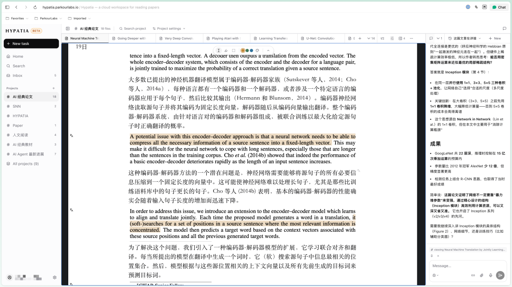

# HYPATIA：一款 AI 原生的电子阅读器
> 💡 备注属性未写入，可能是备注属性名称或者类型被修改了，建议将字段类型设置为 rich_text，可以在小程序-操作-修改文章数据库页面进行调整
> 原文链接:[https://mp.weixin.qq.com/s/_8kD1tdTEvGPL2U5PH3Bww](https://mp.weixin.qq.com/s/_8kD1tdTEvGPL2U5PH3Bww)
最近发现 AI 的能力挺强的，正好有朋友在读 PhD，想要读论文。于是我就着手开始做了一款 AI 的电子阅读器。

目前大概支持以下这些功能：
- 搜索 arxiv 等下载文档
- 阅读 + 批注 pdf、epub、html，同时也支持对于视频的批注（需要插件）
- 翻译、查词典、上传自己的词典
可能还有一些其他的功能，但是暂时想不起来了。
想要试一试的朋友们可以访问，或者点击「查看原文」直接跳转。
https://hypatia.parkourlabs.io/?ref=WXZK-55C7-73HA
 P.S. 作为一个产品的发布的文案，我感觉这个写的是相当草率的。但我逐渐意识到我一直在拖延做宣发这件事，于是决定打破一下完美主义，直接发就好了。我觉得关键在于能否坚持，而不是一个文案做得多好。嗯

## 摘要

（待补充）

## 我的笔记

（待补充）
