# 一揽子共19个报纸副刊投稿信箱
> 💡 备注属性未写入，可能是备注属性名称或者类型被修改了，建议将字段类型设置为 rich_text，可以在小程序-操作-修改文章数据库页面进行调整
> 💡 原文链接:[https://mp.weixin.qq.com/s?__biz=Mzg5Mjg3ODIzOA==&mid=2247486146&idx=1&sn=d32c2bad80b82512080ce252c7b44ad3&chksm=c1c8d967fee39569fc6842b546022179187bf53d992197f183285c5c718b9eead9a96fc16a6a#rd](https://mp.weixin.qq.com/s?__biz=Mzg5Mjg3ODIzOA%3D%3D&mid=2247486146&idx=1&sn=d32c2bad80b82512080ce252c7b44ad3&chksm=c1c8d967fee39569fc6842b546022179187bf53d992197f183285c5c718b9eead9a96fc16a6a#rd)
各位老师可以投稿试试。祝发表！
觉得有用的话，麻烦点个关注，点个赞点个红心留条评论，以免下次系统不推送我，您找不到我。
《北京日报》文化周刊，广场版，投稿信箱：bjdprose@163.com
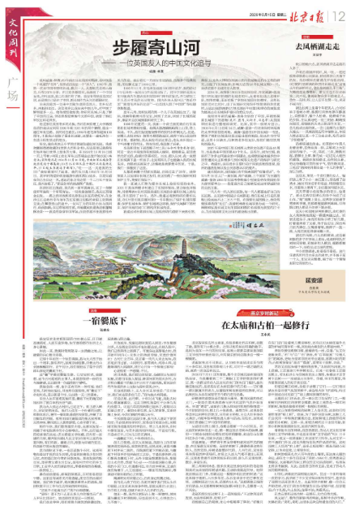
《农民日报》百姓茶坊版，投稿信箱：bxcf2204@163.com 
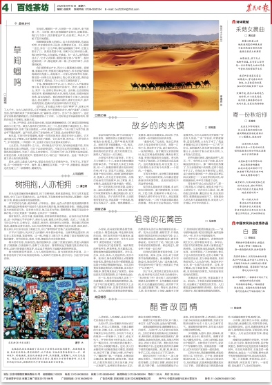
《吉林日报》副刊，东北风周刊，投稿信箱：jlrbdbf@163.com
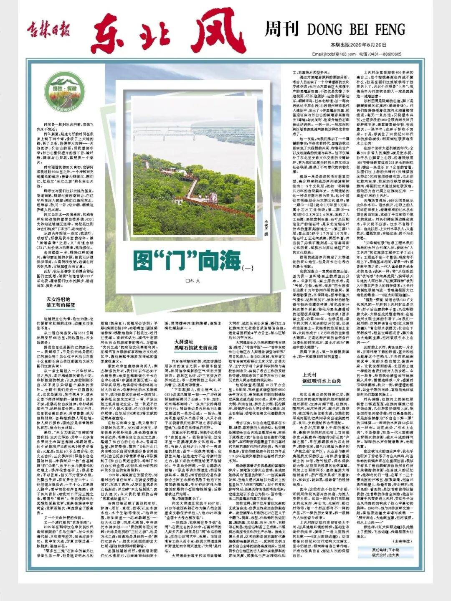
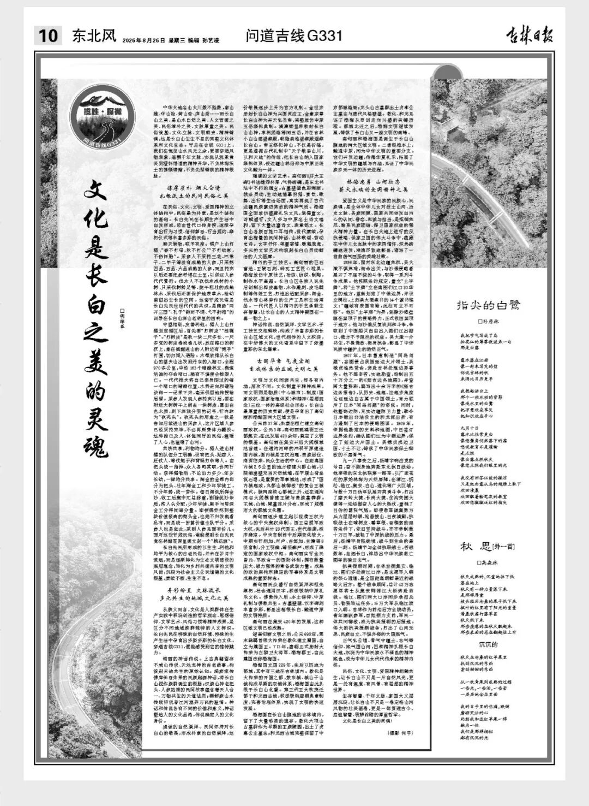
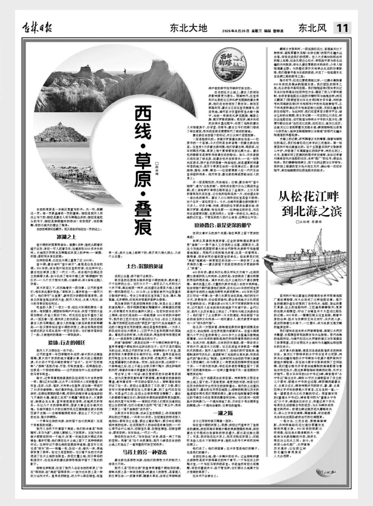
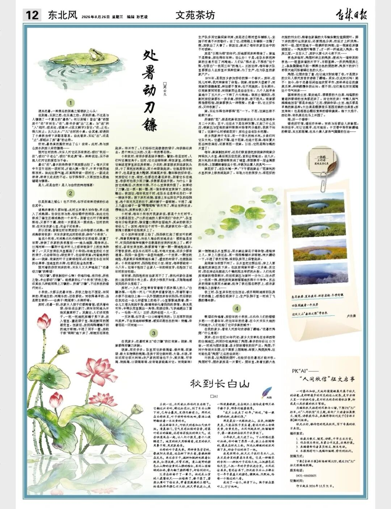
《三明日报》副刊，杜鹃园，编辑王艳蓉，投稿信箱：961400688@qq.com
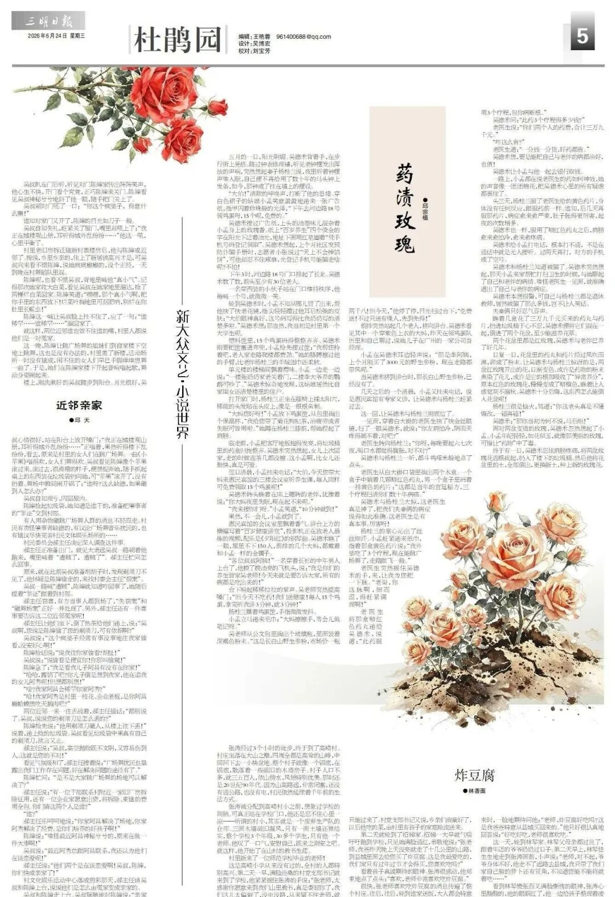
《淄博晚报》副刊齐风，投稿信箱：zbwbfk@163.com 
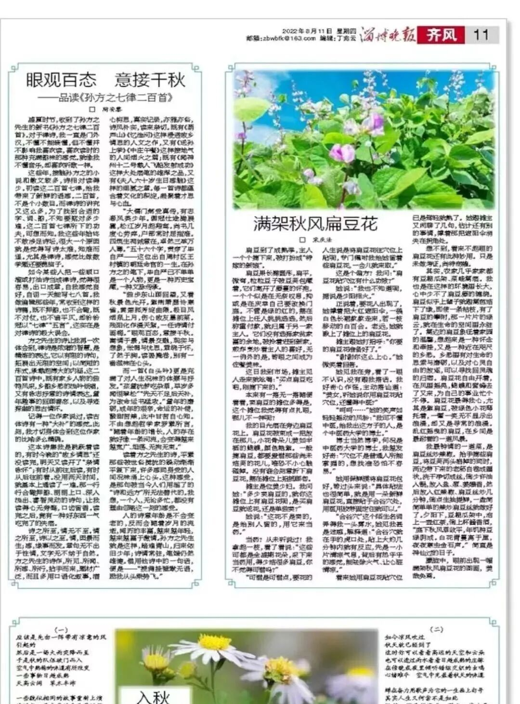
《浙江教育报》教育叙事版，投稿信箱：bbsteacher@126.com 
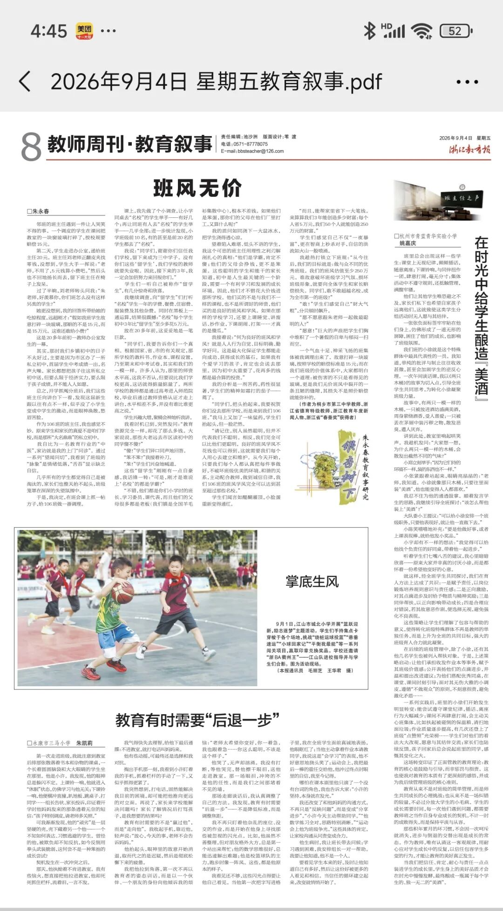
《现代家庭报》悦读时光版，投稿信箱：jjzbxizuo@163.com
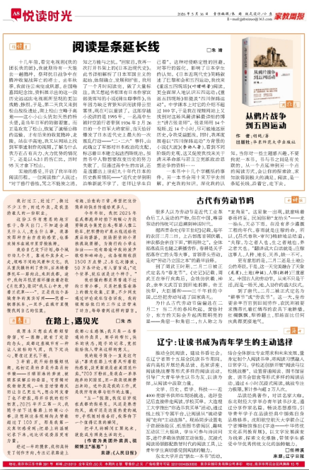
《现代家庭报》记忆版，投稿信箱：1185458447@qq.com
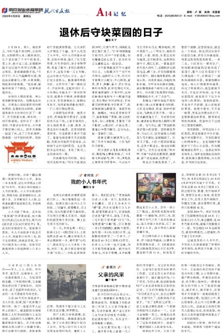
《天津工人报》海河潮副刊，投稿信箱：tjgrbwx@sina.com 
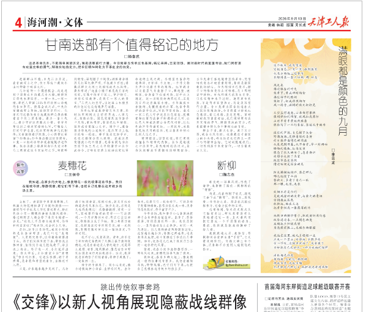
《今晚报》副刊投稿信箱：jwbfkb@163.com
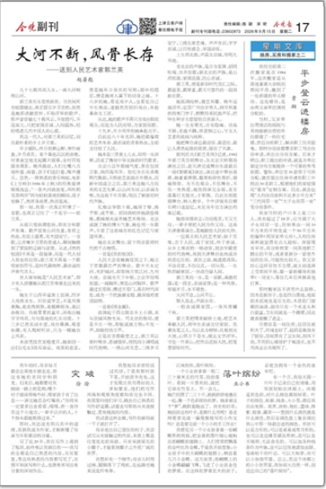
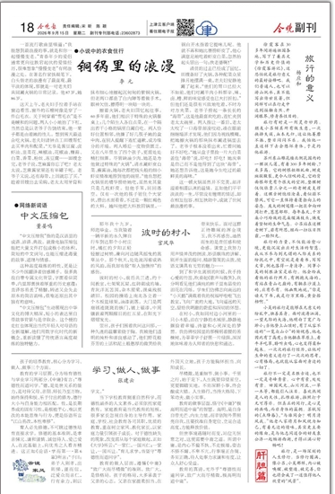
《齐鲁晚报》青未了副刊，今年专门增加了新人版面，要求800—3000字，投稿信箱：qlwb12@126.com 
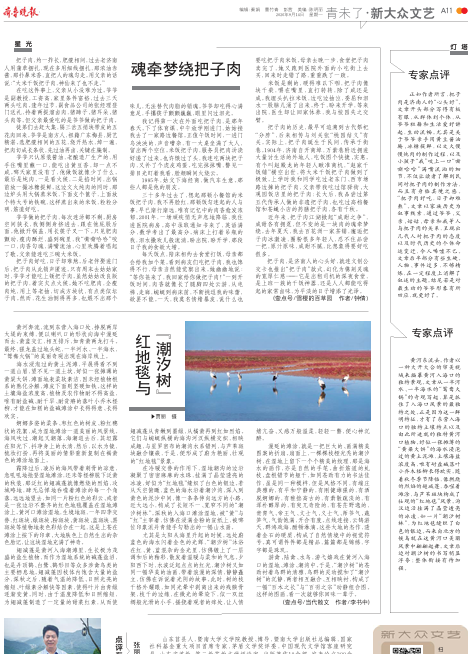
《农村大众报》副刊沃土版，写乡村风物和农耕记忆散文随笔最佳，1000—2000字为宜，投稿信箱：ncdzzbs@163.com 
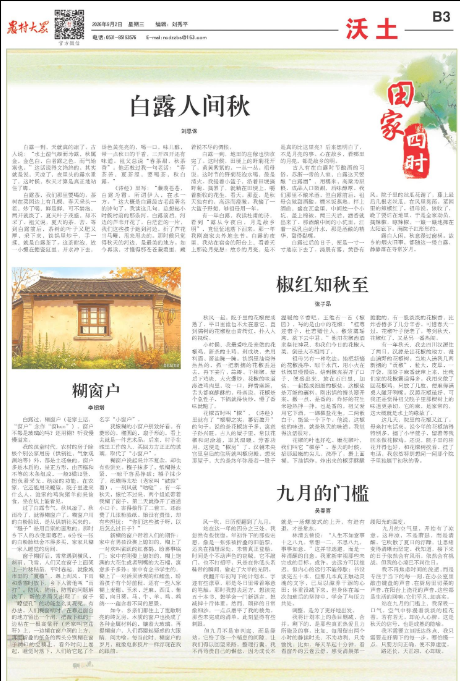
《绿原报》副刊，投稿信箱：lybshf@163.com 
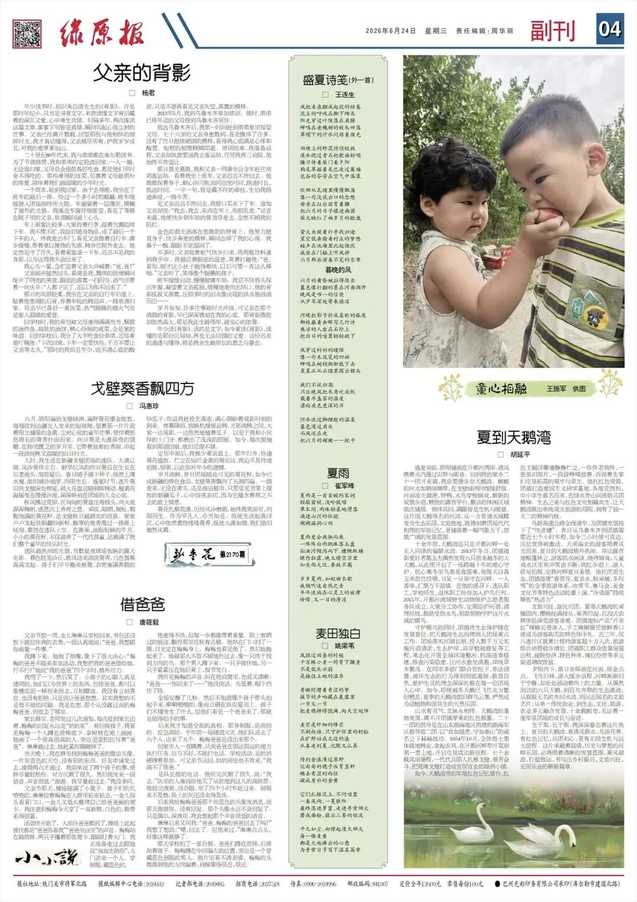
《黄石日报》副刊西塞山，投稿信箱：hsrbfkb@163.com 
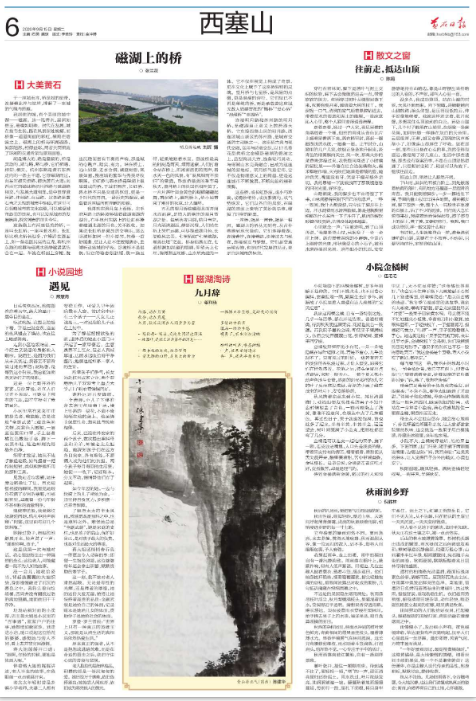
《菏泽日报》副刊，文学副刊版，投稿信箱：hzrb1203@163.com 
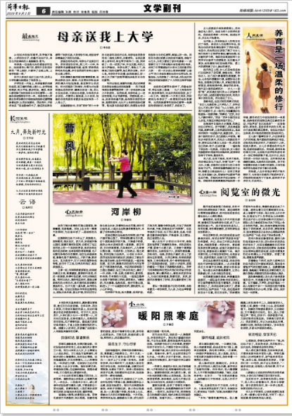
《重庆晨报》副刊，黄葛树，投稿信箱见图片中标识。这个可能没稿费，投稿时自己决定哈。
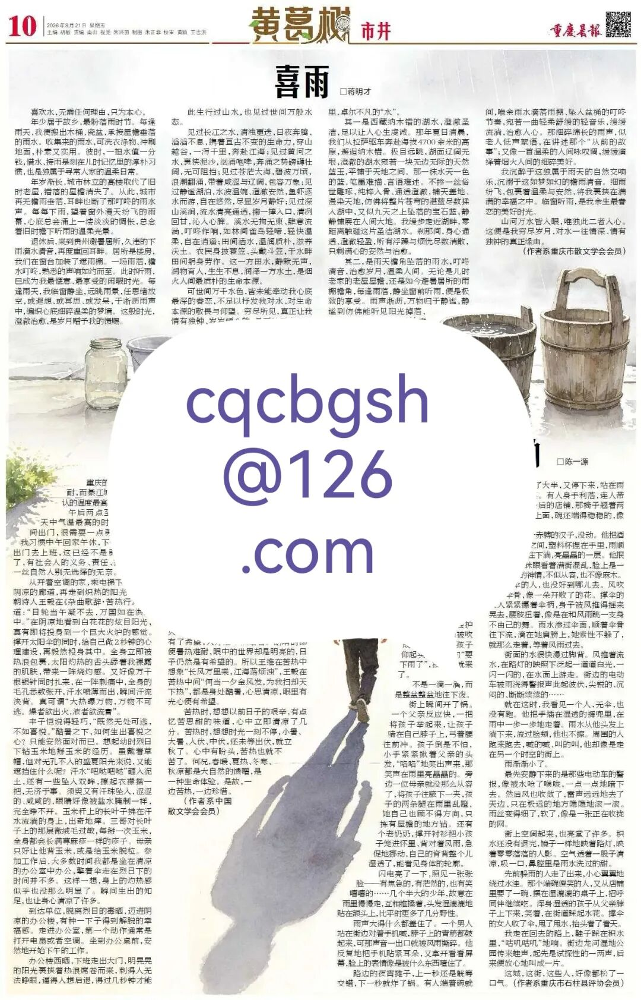
《牡丹晚报》牡丹园副刊，投稿信箱：mdwb09@sina.com ,这个也可能没稿费，请参考投稿。

《粮油市场报》粟语副刊，投稿信箱：lyscbs@vip.sina.com ，这个可能没有稿费，参考投稿。

《劳动时报》书香影花版，投稿信箱：1457523609@qq.com 可能没稿费，供参考。

[11个高稿酬大报副刊投稿方式](https://mp.weixin.qq.com/s?__biz=Mzg5Mjg3ODIzOA%3D%3D&mid=2247485911&idx=1&sn=9a476338a4a59d04773974b20be9a3c4&scene=21#wechat_redirect)
[再来五个省市级大报副刊的投稿信箱](https://mp.weixin.qq.com/s?__biz=Mzg5Mjg3ODIzOA%3D%3D&mid=2247485892&idx=1&sn=a8e0c26fbabd17a5903356f83dded4b9&scene=21#wechat_redirect)
[再分享9个不重样的有稿酬报纸副刊投稿信箱](https://mp.weixin.qq.com/s?__biz=Mzg5Mjg3ODIzOA%3D%3D&mid=2247486023&idx=1&sn=b85735a7ecc89a774cb49981b6425be6&scene=21#wechat_redirect)
[再分享12个国家省市级报纸副刊的投稿信箱](https://mp.weixin.qq.com/s?__biz=Mzg5Mjg3ODIzOA%3D%3D&mid=2247486007&idx=1&sn=0707ab4711d63d1bd2298a34e63841e0&scene=21#wechat_redirect)
[这次是五个小众报纸副刊投稿方式](https://mp.weixin.qq.com/s?__biz=Mzg5Mjg3ODIzOA%3D%3D&mid=2247485976&idx=1&sn=57ba9612e85b1e6dae22e9504af13d74&scene=21#wechat_redirect)
[五个省级大报副刊的投稿信箱](https://mp.weixin.qq.com/s?__biz=Mzg5Mjg3ODIzOA%3D%3D&mid=2247485848&idx=1&sn=5a1e0e87352b341013cc2096ca96f1c7&scene=21#wechat_redirect)

## 摘要

（待补充）

## 我的笔记

（待补充）
