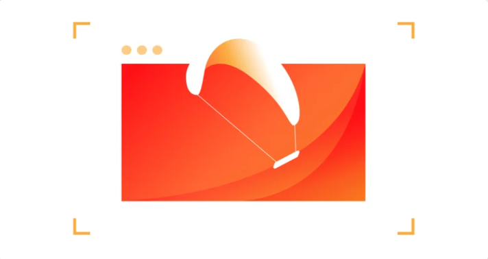
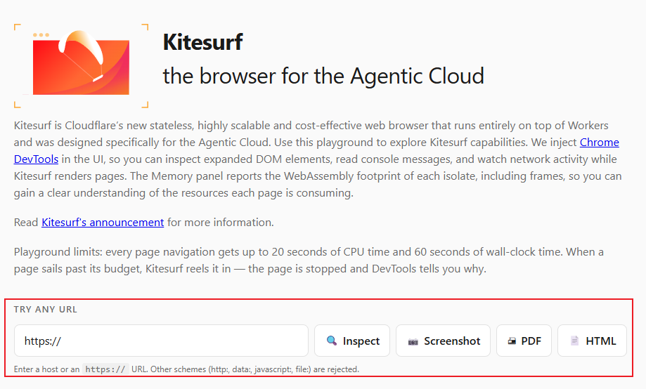
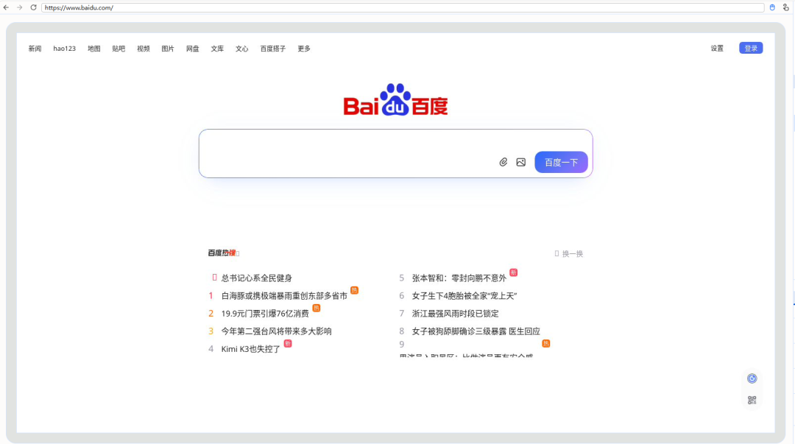
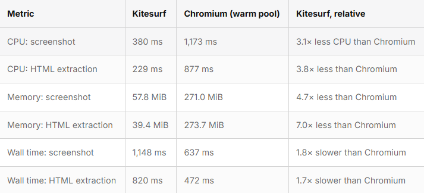
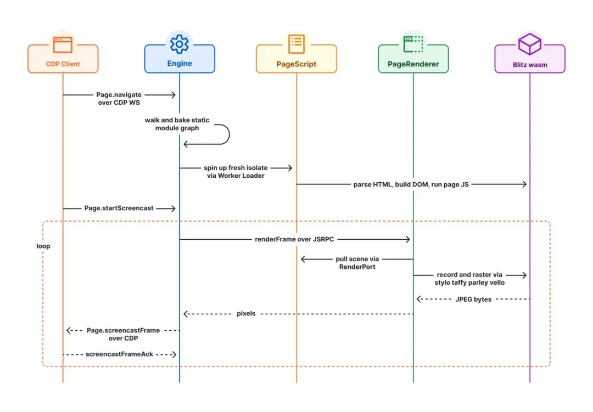
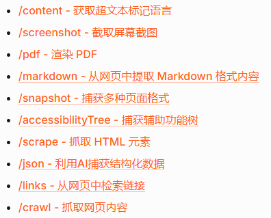

# 专为AI而生！Cloudflare推出轻量化浏览器Kitesurf
> 💡 备注属性未写入，可能是备注属性名称或者类型被修改了，建议将字段类型设置为 rich_text，可以在小程序-操作-修改文章数据库页面进行调整
> 💡 原文链接:[https://mp.weixin.qq.com/s?__biz=Mzk1Nzg5MzY4Mw==&mid=2247486191&idx=1&sn=bab8df1489b0640005ccd441c2315c9e&chksm=c2afa85768ea72ae40eace8571a4f56337d7eefa653a5d0273098ed4b8a306dc54cbd9e4b777#rd](https://mp.weixin.qq.com/s?__biz=Mzk1Nzg5MzY4Mw%3D%3D&mid=2247486191&idx=1&sn=bab8df1489b0640005ccd441c2315c9e&chksm=c2afa85768ea72ae40eace8571a4f56337d7eefa653a5d0273098ed4b8a306dc54cbd9e4b777#rd)

### 一、传统浏览器，根本不适合AI代理
现在很多AI智能体、网页自动化工具，都需要浏览器访问网页。 但我们常用的Chromium是给人类设计的，自带大量冗余功能：标签页、插件、高清渲染、动画优化。
AI根本用不上这些，反而会带来两大难题：
1. 资源消耗巨大，内存、CPU占用极高，批量运行成本昂贵
1. 安全风险突出，容易出现提示注入、跨页面数据泄露
Cloudflare发现这个痛点后，仅用12周从零打造了全新浏览器——Kitesurf。
### 二、Kitesurf：跑在云端Workers上的AI专用浏览器
Kitesurf完全运行在Cloudflare Workers的V8隔离环境，底层基于Rust+WebAssembly开发，砍掉所有人性化功能，只保留AI需要的能力。
它的核心设计思路： 
✅ 无多余UI，不追求像素级渲染，优先输出机器可读结构化网页内容 
✅ 全隔离会话，每次页面加载都是全新环境，杜绝数据泄露 
✅ 尽可能无状态，任务结束直接销毁，应对突发批量任务更灵活 
✅ 内置安全沙箱，统一管控网络请求，拦截风险访问
目前可以通过访问：https://kitesurf.cloudflare.app/ 进行体验，包括浏览网页，网页截图，网页渲染为PDF, HTML 样式网页

inspect ：https// www.baidu.com

### 三、性能碾压Chromium，资源最高省7倍
官方实测对比数据非常亮眼：
- 网页截图：CPU占用减少3.1倍，内存仅57.8MiB（Chromium271MiB）
- 网页文本提取：CPU减少3.8倍，内存低至39.4MiB，差距达7倍
唯一短板是页面渲染耗时略长1.7~1.8倍，但对AI爬虫、内容提取、截图任务完全不影响，还能大幅降低服务器开销。
目前Kitesurf已通过21.5万+网页标准测试，主流网站、前端框架都能正常解析，甚至可以运行经典游戏Doom。

### 四、三层核心架构，兼容现有自动化工具
整套系统分为三大模块，依托Workers RPC通信：

1. Engine：对外入口，兼容CDP协议，Puppeteer、Playwright开箱即用，无需改代码
1. PageScript：解析HTML、CSS、JS，内置Boa引擎处理eval代码
1. PageRenderer：生成截图、PDF，用完即销毁，支持重试
接入方式极其简单，调用Browser Run接口（https://developers.cloudflare.com/browser-run/quick-actions/）时，仅需增加`browser=kitesurf`参数即可切换引擎，还提供在线调试可视化面板，查看内存消耗，有两种使用kitesurf 的方式
**1. 在opencode 等agent 中接入 MCP 服务**
```swift
{
  "mcp": {
    "kitesurf": {
      "type": "local",
      "command": [
        "npx",
        "-y",
        "chrome-devtools-mcp@latest",
        "--wsEndpoint=wss://api.cloudflare.com/client/v4/accounts/<ACCOUNT_ID>/browser-run/devtools/browser?browser=kitesurf",
        "--wsHeaders={\"Authorization\":\"Bearer <API_TOKEN>\"}"
      ],
      "enabled": true
    }
  }
}
```
**2. 通过Restful API调用**
另一种使用 Kitesurf 的方式是通过Browser Run 的快速操作。同样，只需在快速操作端点中添加`browser=kitesurf`即可生效。例如，如果你需要从维基百科快速截取屏幕截图，这样操作完全可行：
```
curl -X POST 'https://api.cloudflare.com/client/v4/accounts/<accountId>/browser-run/screenshot?browser=kitesurf' \
  -H 'Authorization: Bearer <apiToken>' \
  -H 'Content-Type: application/json' \
  -d '{
    "url": "https://example.com"
  }' \
  --output "screenshot.png"
```
可以调用的API 接口

### 五、哪些场景优先选Kitesurf？
适合：
- AI智能体网页信息抓取、批量网页摘要提取
- 一次性网页截图、PDF导出自动化任务
- 高并发、突发流量爬虫，希望控制云服务成本
- 需要强隔离、防提示注入的AI工具开发
不适合（现阶段短板）：
- WebGL、视频播放类页面
- 需要完整浏览器指纹绕过人机验证
- 长时间登录、多步骤持久会话
### 六、公测信息与未来规划
1. 当前免费Beta公测，集成在Cloudflare Browser Run，账号有调用限额
1. 官方后续计划开源，开发者可自主部署私有版本
1. 持续迭代：完善CDP协议、提升渲染精度、进一步压缩资源占用
### 结语
AI时代，浏览器不再只服务人类。 Kitesurf重新定义了自动化网页引擎，用轻量化、低成本、高隔离的方案，解决AI代理上网的资源与安全痛点。 做爬虫、AI工具的开发者，不妨去官方在线演示站点体验测试。

## 摘要

（待补充）

## 我的笔记

（待补充）
