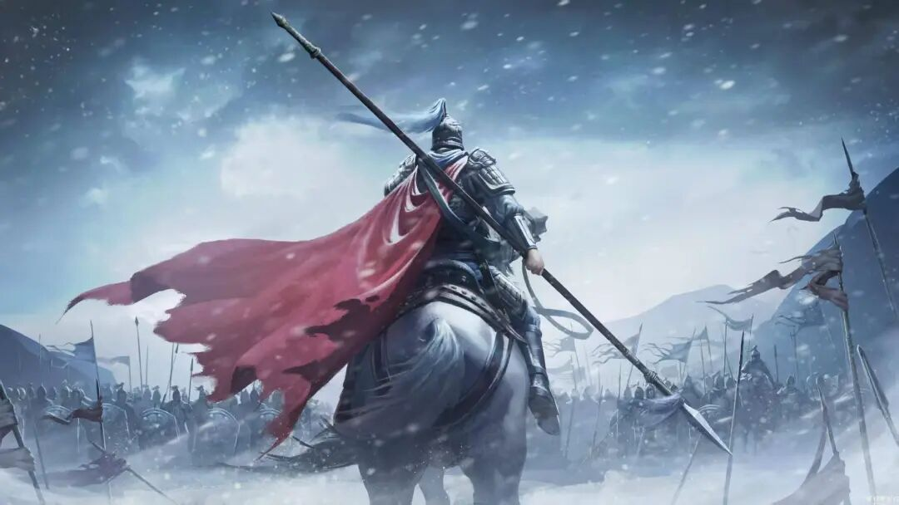

# 中国历史十大悲情名将
> 💡 备注属性未写入，可能是备注属性名称或者类型被修改了，建议将字段类型设置为 rich_text，可以在小程序-操作-修改文章数据库页面进行调整
> 💡 原文链接:[https://mp.weixin.qq.com/s?__biz=MzIzNzIyMjA0NQ==&mid=2650641708&idx=1&sn=68eaeb438037cd4580999fe6f695df98&chksm=f118d60da65558abf051cf1ef14a077de450fcb8f254f025e44bbce2d3b4386afaeda38f384b#rd](https://mp.weixin.qq.com/s?__biz=MzIzNzIyMjA0NQ%3D%3D&mid=2650641708&idx=1&sn=68eaeb438037cd4580999fe6f695df98&chksm=f118d60da65558abf051cf1ef14a077de450fcb8f254f025e44bbce2d3b4386afaeda38f384b#rd)
一将功成万骨枯，这句诗写尽了名将的荣耀。但历史往往更残酷的另一面是：名将的结局，常常比他们的战功更令人扼腕。
他们中有人战无不胜却不得善终，有人力挽狂澜却被自己效忠的王朝处死，有人一生征战却连一个侯爵都封不上。
以下十位，是中国历史上最令人心碎的悲情名将。他们用生命诠释了什么叫功高震主，什么叫忠而被谤。
**1.韩信**
**“飞鸟尽，良弓藏；狡兔死，走狗烹。”**这句话简直就是为韩信量身定做的。
他是“汉初三杰”之一，被后人奉为“兵仙”“神帅”。暗度陈仓、背水一战、十面埋伏，他几乎以一己之力打下了汉朝半壁江山。垓下一战，他终结了不可一世的项羽，为刘邦铺平了通往皇位的最后一段路。
但功高震主的结局，从来只有一个。项羽死后，韩信的兵权被一再削弱，从齐王徙为楚王，再贬为淮阴侯。最终，吕后与萧何合谋，将他骗入长乐宫钟室，处死于钟下，死后被诛三族。临死前，韩信叹道：“悔不听蒯彻之计。”但他真的后悔吗？或许他后悔的，是始终相信刘邦会念及旧情。
一个能击败天下所有对手的人，唯独败给了自己的天真。
**2.吴起**
吴起是兵家“亚圣”，一生“与诸侯大战七十六，全胜六十四”。他在鲁国退齐军，在魏国“辟土四面，拓地千里”，在楚国主持变法，“南平百越，北并陈蔡”。
但他每到一国，都因才能太强而遭猜忌。在鲁国，为表忠心杀妻求将；在魏国，被公叔痤排挤；在楚国，变法触动了贵族利益。楚悼王死后，贵族们在葬礼上发动叛乱，用箭射杀吴起。吴起临死前伏在楚悼王尸体上，让贵族的箭也射中了王尸。按楚律，“丽兵于王尸者，尽加重罪，逮三族”，七十余家贵族因此被灭族。但吴起自己，也被车裂肢解。
一个用生命完成最后一次算计的人。
**3.岳飞**
岳飞之死，是中国历史上最著名的冤案，也是最能刺痛人心的悲剧。
他率领岳家军北伐，打得金人发出“撼山易，撼岳家军难”的哀叹。他立志“直捣黄龙，迎回二圣”，收复故土。但正是这句口号，埋下了杀身之祸。“二圣”是宋高宗的父亲和哥哥，如果他们都回来了，现任皇帝往哪里放？
宋高宗不仅不信任武将，更害怕岳飞真的打赢。宋金战事稍停，高宗便开始密谋处置武将，夺了张俊、韩世忠和岳飞的兵权。张俊、韩世忠懂得巧妙脱身，唯独岳飞，始终不肯低头。
秦桧等人编造罪证，诬陷岳飞谋反，最终在风波亭将其杀害。后世常说秦桧是元凶，但若无宋高宗默许，岳飞很难被处死。
一个用“莫须有”三个字杀人的时代，配不上岳飞这样的将军。
**4.袁崇焕**
袁崇焕的悲剧，比岳飞更惨烈，他是被自己拼死保卫的百姓，一口一口吃掉的。
明末，他是唯一能与八旗铁骑抗衡的统帅。宁远大捷、宁锦大捷，他让皇太极屡屡碰壁。崇祯皇帝重新启用他时，他许下五年复辽的承诺。但崇祯的多疑、朝堂的党争、皇太极的反间计，共同编织了一张致命的网。
1630年，皇太极兵临北京城下。袁崇焕率军回援，击退清军。但等待他的，不是嘉奖，而是通敌叛国的罪名。袁崇焕被凌迟处死，北京百姓争相围观、唾骂，甚至有人争食其肉。
他守住了国门，却守不住人心。明朝自毁长城后，再无人能抵挡八旗铁骑，十四年后，明朝灭亡。
**5.于谦**
**“粉骨碎身浑不怕，要留清白在人间。”**于谦用一生践行了这句诗，也用死亡完成了它。
土木堡之变，明英宗被俘，五十万明军全军覆没。京城人心惶惶，有人主张南迁。于谦站出来，喝止了南迁之议，拥立新帝，亲自指挥北京保卫战。五战五胜，击退瓦剌，挽救了整个明朝。
但于谦犯了一个致命的错误：他救了国家，却得罪了皇权。他拥立景泰帝，意味着如果英宗回来了，皇位就尴尬了。
七年后，英宗通过夺门之变复辟。复辟后的第一件事，就是以谋逆罪将于谦处死。
于谦之死，不是因为谋逆，而是因为皇权的合法性需要一个牺牲品。

**6.李牧**
“李牧死，赵国亡。”这六个字，几乎就是李牧一生的判词。
他是战国四大名将之一，长期镇守赵国北境，先破匈奴，后屡败秦军。秦军一度不敢轻易出函谷关，赵国也因他而苟延残喘。但李牧的军事才能越强，赵王迁就越恐惧。
秦国使反间计，重金收买赵王宠臣郭开，诬陷李牧谋反。赵王迁听信谗言，夺其兵权，将其杀害。李牧死后仅三个月，秦军攻破邯郸，赵国灭亡。
他不是败给敌人，而是败给了自己效忠的君主。一个守住了边疆的人，最终倒在了朝堂之上。
**7.蒙恬**
蒙恬出身将门，率三十万秦军北击匈奴，“却匈奴七百余里”，使“胡人不敢南下而牧马”。他被誉为中华第一勇士，是秦帝国北方最坚固的屏障。
秦始皇病死后，赵高、李斯、胡亥合谋篡改遗诏，赐死扶苏，并赐蒙恬死罪。蒙恬不服，自认无罪。使者将他囚禁。最终，蒙恬喟然长叹：“我何罪于天，无过而死乎？”良久，又自语道：“恬罪固当死矣。起临洮属之辽东，城堑万余里，此其中不能无绝地脉哉？此乃恬之罪也。”于是吞药自杀。
一个为帝国修筑长城的将军，最后用修长城可能断了地脉来为自己的“罪”开脱。这不是忏悔，是绝望。
**8.高仙芝**
高仙芝是唐朝安西名将，曾击败吐蕃、取小勃律，威震西域。安史之乱爆发后，他退守潼关，采取坚守不出的策略，等待时机。但监军宦官边令诚因私怨，向唐玄宗诬陷高仙芝“畏敌不前、贪污军粮”。
唐玄宗听信谗言，下诏处斩高仙芝。行刑前，高仙芝对边令诚说：“我退守潼关，是因为贼兵锋锐，暂避其锋。说我贪污军粮，更是无稽之谈。上有天，下有地，你难道不知道吗？”但他终究难逃一死。将士们齐声喊冤，声震四野。
他不是死于敌人的刀剑，是死于自己人的诬陷。潼关失守后，长安门户洞开。
**9.斛律光**
斛律光，北齐名将，他治军严明，多次击败北周军队，拜左丞相、咸阳王。他的存在，是北齐能在北周压力下存续的关键。
但北齐后主高纬性怯懦多疑。祖珽、穆提婆等人因私怨构陷斛律光，散布谣言，最终在后主面前诬告其谋反。572年，斛律光被诱杀于凉风堂，诏称其谋反，尽灭其族。
抄家时，抄出的家产只有“弓十五，宴射箭百，刀七，赐稍二”，抄家的人都说这是贤宰相。北周武帝宇文邕听说斛律光已死，大喜，下令大赦。灭北齐后，他追赠斛律光为上柱国，感叹道：“此人若在，朕岂能至邺！”
斛律光的悲剧在于：他保卫的国家，亲手杀死了他。而杀死他的敌人，却给了他最高的敬意。
**10.李广**
**“冯唐易老，李广难封。”**王勃在《滕王阁序》里写下的这八个字，成了李广一生的注脚。
他戍守边关四十余年，与匈奴大小七十余战，骁勇善射，被匈奴称为飞将军，闻其名则远避。他爱兵如子，行军缺水断食时，“士兵不全喝到水，他不近水边；士兵不全吃遍，他不尝饭食”。
他战功不少，却常因迷路、失期、政治资源不足而错过封侯机会。最后随卫青伐匈奴时，因迷失道路，被卫青问责。李广不愿受刀笔吏之辱，拔刀自刎。
他打了一辈子仗，却连一个侯爵都没换来。不是他不够强，是命运从未站在他这边。
**同样不该被遗忘的悲情名将**
**檀道济：**南朝刘宋名将，北府军最后的硕果，北魏对他忌惮至极。宋文帝病重时，执政的刘义康担心檀道济在皇帝死后无人能制，便召他入京，以谋反罪将其杀害。他死后，北魏再无顾忌。宋文帝后来北伐失败，登石头城北望，叹道：“假如檀道济还在，怎么会到这个地步！”
**邓艾：**灭蜀首功，率军偷渡阴平，直取成都，终结三国鼎立。但灭蜀后遭钟会、卫瓘构陷，被诬谋反，最终被杀。一个打下蜀汉的人，死在了胜利之后。
**高长恭（兰陵王）：**北齐宗室名将，邙山之战兰陵入阵，威名太盛。后主高纬问他“入阵太深，失利悔无所及”，他答“家事亲切，不觉遂然”，被猜忌，赐鸩酒而死。
**杨业（杨继业）**：北宋初年名将，陈家谷之战中因监军王侁逼迫出战，又遭主帅潘美背约不援，力竭被俘。绝食三日而死，临终叹“上遇我厚，期讨贼捍边以报，而反为奸臣所迫，致王师败绩，何面目求活耶！”
**伍子胥：**春秋名将，助吴王阖闾破楚。夫差时因主张灭越、反对伐齐，被伯嚭谗害，夫差赐剑自尽。死前说“必树吾墓上以梓，令可以为器；而抉吾眼悬吴东门之上，以观越寇之入灭吴也”。
**周亚夫：**平定七国之乱，有救汉之功。因反对景帝封王信为侯、席间失礼等琐事被疏远。其子为其购置陪葬甲盾，被人告发谋反，下狱后绝食呕血而死。
这十位名将，命运各不相同，但悲剧的根源惊人地相似：他们效忠的君主，把他们当成了威胁而非栋梁。
韩信被诛三族，吴起被车裂，岳飞死于“莫须有”，袁崇焕被凌迟处死，于谦被复辟的皇帝处死，李牧被赵王冤杀，高仙芝被监军诬陷……他们不是败给了敌人，是败给了自己人。
中国古代的名将，往往面临一个无解的死局：功不够高，无法建功立业；功太高，又难逃震主的猜忌。
但历史是公正的：杀他们的人，在史书里留下了骂名；而他们，成了千古传诵的英雄。
**他们没能赢过自己的时代，却赢过了时间。**

## 摘要

（待补充）

## 我的笔记

（待补充）
