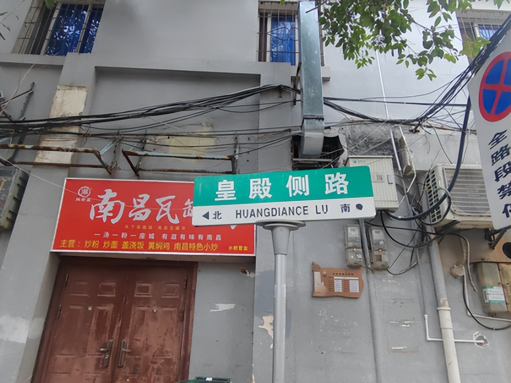
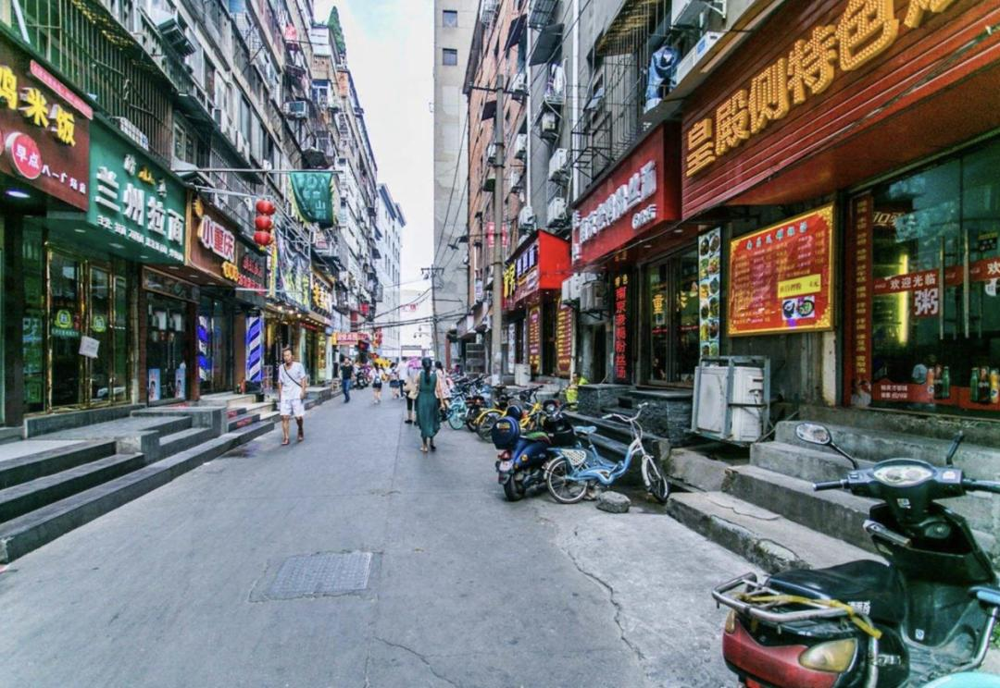

# 南昌只做过97天的都城,如今还有一条皇殿侧路
> 💡 备注属性未写入，可能是备注属性名称或者类型被修改了，建议将字段类型设置为 rich_text，可以在小程序-操作-修改文章数据库页面进行调整
> 💡 原文链接:[https://mp.weixin.qq.com/s?__biz=MzI1NzA0ODYwNQ==&mid=2648448699&idx=1&sn=66e899c65baf1796bd7f240a97c4110f&chksm=f3efe733ea4af963da7ca427cfb06eca64505ae264ec1c1842bbc86a1b11927c46ba2a253ea0#rd](https://mp.weixin.qq.com/s?__biz=MzI1NzA0ODYwNQ%3D%3D&mid=2648448699&idx=1&sn=66e899c65baf1796bd7f240a97c4110f&chksm=f3efe733ea4af963da7ca427cfb06eca64505ae264ec1c1842bbc86a1b11927c46ba2a253ea0#rd)
江西有着割据的资源却没有割据的命,东西南三面环山,中部丘陵,北部平原,再往北是中国最大的淡水湖鄱阳湖,湖泊联结长江,流通东西、勾连南北。赣江一路向北入长江，在省内也形成了非常便利的交通优势。江西省物产丰盈，山货、水货都很多，还有全国知名的米市、药都、瓷都，可以说民生经济、商业经济都不错，理论上割据条件不错。
可惜的是，从没有势力真正想立足江西割据一方或者说雄踞天下。最大的原因就是江西的北部，那奔腾不息的长江是天险，也是可以随意入侵的风险，北部平地千里意味着外部力量跨国长江一进入江西就进入了腹地。
历史上，江西有三个地方短暂的做过都城。陈友谅的大汉政权短暂的把九江作为都城，期待通过江西的资源顺流下江南，可是事与愿违退回武昌。再有就是南昌也更短暂的做了下南唐逃亡时期的都城，时间只有97天，这次之后就把南昌作为都城的可能性彻底毁灭了。九江在北，南昌在中；在南，赣州的瑞金做过中华苏维埃共和国临时中央政府首都，时间只有三年，距今最近，历史意义却是最大，以至于瑞金现在还是被誉为“红色故都”。不过今天主要谈南昌。
八一广场是南昌的市中心，每年的8月1日，人山人海，来自五湖四海的朋友只是为了在“军旗升起的地方”看一眼红旗冉冉升起。八一广场西北有一条中山路，曾经是南昌最繁华的地方，现在依然是本地人和外地游客经常光顾的街道。进入中山路的右属第二条路有一条特别不起眼的巷子叫做皇殿侧路。我路过很多次，都没有细心留意过。这条路真的太不起眼了，它只是一条220米的老巷，紧促在居民楼中，车不能行，两侧也普普通通。
不过这个名字给我留下很深的印象，因为皇殿自然是和皇帝宫殿有关系，可在我的记忆里，南昌能和皇帝有关系的也就是个西汉的刘贺，而刘贺来到南昌的时候是个废帝，有皇帝仪仗却不敢用皇帝的身份。恰巧这周看书看到了大宋的建立史，我才对这条路有了清晰的认识。

五代十国的南唐初期还是锐意进取，在江南是霸主的存在，虽不敢逐鹿中原，却不断蚕食南边邻国。到了后周时期，柴荣在军事上追南逐北，所向披靡，北打北汉、契丹，南边见着一个偌大的南唐当然不能放过。于是周世宗柴荣不断发动对南战争，把南唐长江以北土地全部收入囊中，兵锋直指南唐都城南京（当时叫金陵）。当时南唐是李璟执政，他不敢直面后周。而江西是南唐重要粮仓，又有鄱阳湖天险。于是李璟在959年升洪州府为南昌府，仿照金陵皇宫修建皇城，其核心大殿叫长春殿。
两年后，皇宫建立。961 年二月，李璟留太子李煜在金陵监国，自己带着文武百官，沿长江上溯，迁都南昌府，南昌便正式成为南唐国都。抵达南昌之后，现实却很残酷，南昌城小人少，新建的皇宫和官衙也很简陋，很多官员侍从都没地方办公和居住，再加上气候湿热，百官怨声载道。这个时候后周正朔替换成宋朝，北边军事压力减轻。李璟也想迁回金陵，愿望没有实现就在六月病逝。于是李煜继位，继承遗志，他把李璟灵柩运回金陵安葬。朝廷原班人马，迁回南京，南昌的97天国都身份就此结束，南昌也降为留守府。
南唐的朝廷人员走了，哪怕皇宫已经消失无存，可南昌毕竟做了一回都城，南昌人民的记忆却还在。时皇宫东侧，是百官上朝的通道，大家习惯叫皇殿侧。一千年来的风雨变幻，这个名称保留到现在。

公元975年，北宋灭南唐，南昌再次更名为洪州。
不过，自汉高祖派灌婴修复江南，筑灌婴城，以“昌大南疆、南方昌盛”之意，取名南昌，隋唐后更名洪州，南昌在南唐时期恢复旧名，并第一次以南昌的名字作为府级建制，这为后来明代最后定南昌之名留下重要历史参考。可以说，南昌给南唐君臣没有留下好印象，南唐对南昌这个名字却留下了大功劳。

## 摘要

（待补充）

## 我的笔记

（待补充）
