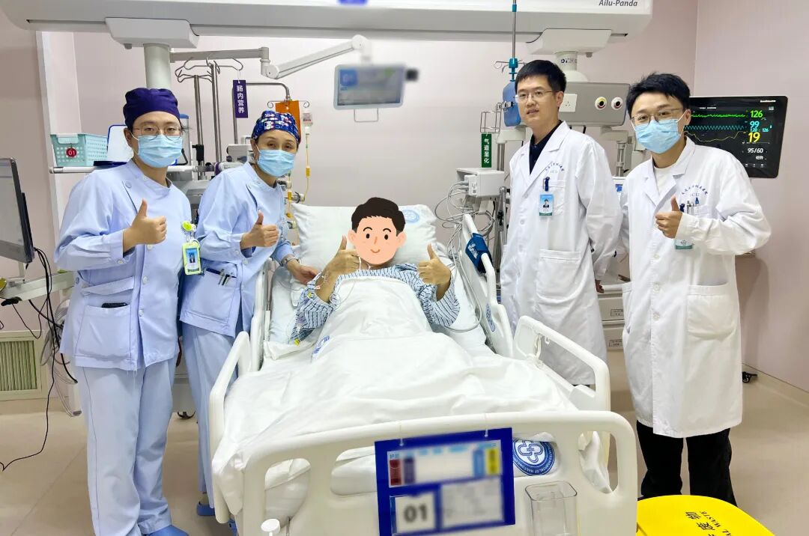
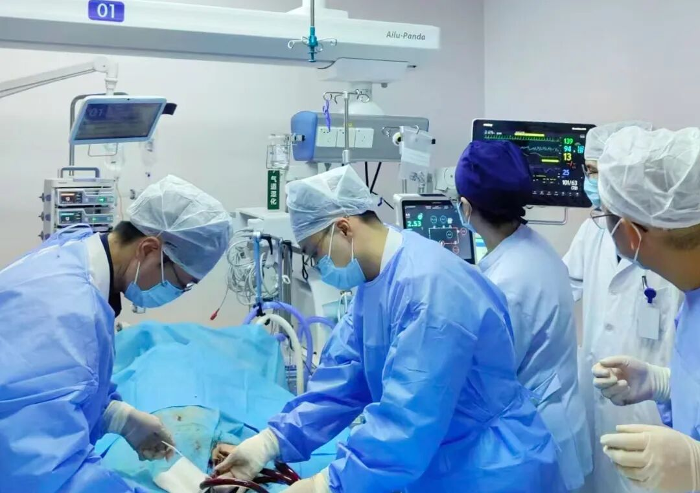
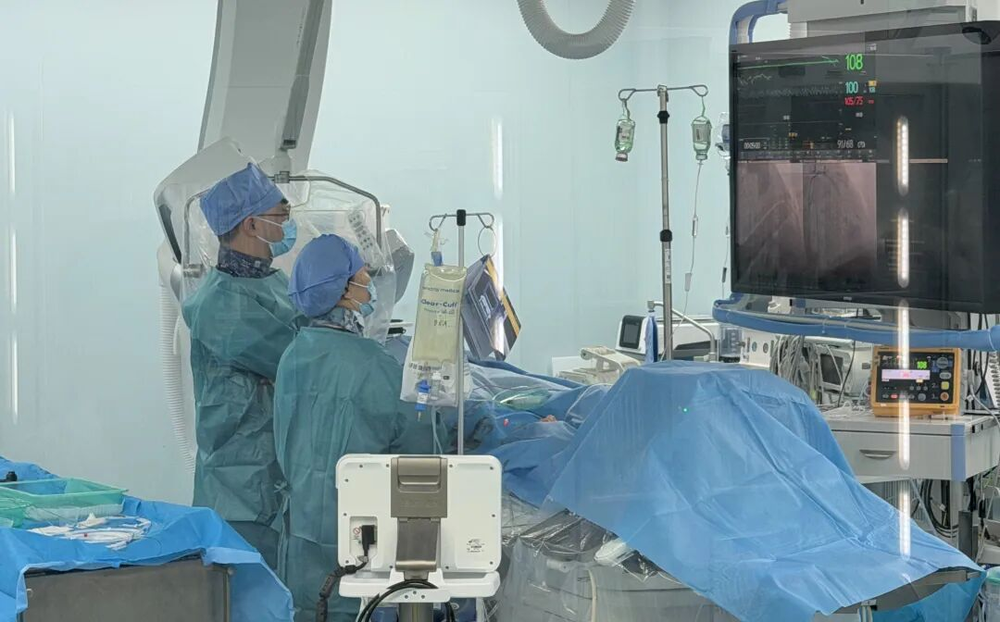

# 南通一名39岁医生突发心梗！整颗心脏处于“全面缺血”的绝境状态，发病前1周出现左侧后背隐痛未重视
> 💡 备注属性未写入，可能是备注属性名称或者类型被修改了，建议将字段类型设置为 rich_text，可以在小程序-操作-修改文章数据库页面进行调整
> 💡 原文链接:[https://mp.weixin.qq.com/s?__biz=MjM5NDU3MzM4Nw==&mid=2657276265&idx=1&sn=0e8d89316525193ef026f8ad177eec50&chksm=bc18622fef475d4d014dd1ca5b58769e6cdd81428b754c4025ba514f2ec29ffc6164511a34b4#rd](https://mp.weixin.qq.com/s?__biz=MjM5NDU3MzM4Nw%3D%3D&mid=2657276265&idx=1&sn=0e8d89316525193ef026f8ad177eec50&chksm=bc18622fef475d4d014dd1ca5b58769e6cdd81428b754c4025ba514f2ec29ffc6164511a34b4#rd)
近日，南通大学附属医院重症医学科联合心血管内科团队历经十余天，**成功挽救一名突发急性心梗、冠脉三支严重病变的39岁同行医生**。

39岁的孙老师（化名）是一名扎根临床一线的医生，**发病1周前，他就出现左侧后背隐隐疼痛但并未重视，发病当天压榨样胸闷胸痛再也无法忍受**，紧急前往通大附院东院区急诊就诊。
入院时孙老师血压已低至60/40mmHg，抽血结果肌钙蛋白高达21μg/L，远超0.034μg/L的正常数值，高度怀疑心肌梗死的同时已出现心源性休克。争分夺秒之下，心血管内科副主任医师苏亚民急诊上台手术，为其行冠脉造影，结果显示：前降支开口至中段长病变，最重狭窄90%；回旋支、右冠中段以远完全闭塞。
通俗来说，心脏共有三根主要供血血管，冠脉三支全部严重病变，意味着心脏所有主力供血通道近乎全部瘫痪，**整颗心脏处于“全面缺血”的绝境状态**。
“普通心梗大多只是单根血管狭窄或堵塞，**三根血管同时出现重度狭窄、闭塞，属于心血管疾病最高等级危重症，随时人就没了**。”苏亚民说道。术中，苏亚民精准锁定“罪犯”血管，优先开通闭塞的右冠血管，植入药物支架，同时术中置入主动脉球囊反搏(IABP)，暂时稳住摇摇欲坠的生命体征，为后续救治争取宝贵窗口。
术后孙老师转入重症医学科，持续呼吸困难、血压波动剧烈，重症医学科主任、主任医师陆洋团队时刻关注病情变化，在数次病情急剧恶化时果断气管插管、呼吸机辅助呼吸，启用体外膜肺氧合（ECMO）维持循环，为生命托底。

“仅开通右冠单支血管无法逆转病情，前降支、回旋支两根血管依旧是致命隐患，”陆洋和心血管内科联合会诊评估，“若不再次手术，患者几乎没有生还希望。”
时间不等人，当晚，心血管内科主任、主任医师盛红专教授连夜赶赴东院区，在ECMO、IABP双重生命支持下，实施第二次介入手术。术中造影复查，右冠原支架通畅，随即对左冠系统进行介入治疗，先后在回旋支、前降支植入多枚药物支架，成功完成剩余两根血管的血运重建，彻底解除致命病因。

十余天日夜坚守，一次次闯关、一次次微调、一次次逆转危情，如今孙老师全身管路全部拔除，生命体征平稳，精神状态良好，顺利迎来康复。

**新闻链接**
## 医生提醒：
## 这7种疼痛是心脏在求救
事实上，很多人在心梗发生前的几天甚至几周内会经历一系列先兆症状。武汉协和医院心血管内科副主任医师苏冠华2024年在医院微信公号刊文介绍，7种疼痛可能是心梗前兆，一定要及时就医。
**1. 胸痛胸闷+大汗**
**胸部正中，或者在胸部中间偏左部位出现疼痛**，范围至少一个巴掌大小。这种胸痛、胸闷像胸口放了块大石或用胶带缠了几圈，还常伴有莫名的恐惧、焦虑感。
**2. 长时间恶心呕吐**
心梗发作时，**心肌缺血可能导致胃肠道功能异常，出现恶心和呕吐**。这种恶心和呕吐通常会持续一段时间，不会因为进食或休息而缓解。有些人还可能会出现腹部不适或胃酸倒流的感觉。
**3. 嗓子发紧难受**
**咽喉部烧灼痛，感觉喉部发紧**，可能伴有胸闷、憋气、大汗症状。
**4. 上肢和左肩痛**
一般为**左侧肩膀或者左侧手臂内侧出现钝痛**，可能放射到小指和无名指。
**5. 持续背部疼痛**
有些心梗患者的**疼痛会放射到后背**，出现持续的后背疼痛。女性相比男性更多见。

**6. 上腹部疼痛**
**感觉“胃痛”或上腹痛**，服用护胃或者解痉药物无效，且疼痛与活动或劳力有关时，也应警惕急性心梗的可能。
**7. 牙痛或下颌痛**
少数情况下，心梗患者会**出现牙痛、下颌痛，且伴随胸痛、肩膀痛、冒冷汗、濒死感等**症状。这类牙痛与运动相关，患者处于静止状态时不痛，一运动就疼或疼痛不止。
**预防心梗，这6件事千万要少做！**
**1. 熬夜：心脏过劳**
浙江医院心血管内科主任医师杜常青2025年在医院微信公号刊文指出，无数个熬夜的夜晚，持续压缩着心脏的休息时间。长期熬夜打乱生物钟，导致血压波动、炎症反应加剧、血管内皮功能受损，如同在心脏中埋下无数微小裂痕。
**2. “三高”饮食：脂质沉积**
高油、高盐、高糖的饮食，加上烟酒刺激，促使血液中“坏胆固醇”（低密度脂蛋白胆固醇）飙升。这些物质在血管壁上沉积，逐渐形成动脉粥样硬化斑块——这正是心梗的病理基础。
**3. 久坐：血管变硬**
缺乏运动使血液循环变缓，代谢废物堆积，血管弹性下降，为血栓形成创造了温床。
**4. 情绪：血管破裂**
湖南省中西医结合医院心血管内一科主任医师李志2025年在医院微信公号刊文介绍，生活中要学会管理情绪，否则“气到心梗”“气到脑梗”并非夸张！
愤怒时交感神经兴奋，肾上腺素大量分泌，导致血压急剧升高，可能引发血管破裂，如脑出血（高血压患者尤其危险）。血压波动易使动脉粥样硬化斑块破裂，形成血栓，堵塞心脑血管，导致心梗或脑梗。情绪激动还可诱发房颤、室性心动过速，甚至心源性猝死。
**5. 吸烟：损伤血管**
湖南省长沙市第三医院心血管内科副主任医师秦辉2025年在医院微信公号刊文介绍，烟草中含有尼古丁、焦油、一氧化碳等大量有害物质。尼古丁会使心跳加快、血压升高，增加心脏负担；焦油会损伤血管内皮，让血管变得粗糙，容易形成血栓；一氧化碳则会与血红蛋白结合，降低血液的携氧能力，使心肌得不到充足的氧气供应……长期吸烟，就像在血管里埋下了一颗颗“定时炸弹”。
秦辉强调，从血管内皮的微观损伤，到急性心梗的突发风险，吸烟对心血管系统的危害贯穿始终。戒烟是一剂唯一不需要医生处方的心血管“良药”，却能带来最显著的疗效。
**6. 饮酒：诱发心梗**
**酒精会引起大脑兴奋，使心率加快，血压升高，并会诱使心律失常，对于心脑血管疾病者，会诱发冠状动脉痉挛或急性心肌梗死。**
了解这些知识，关键时刻真能救命！别让“硬扛”害了自己，也别让“误判”耽误了亲人！
来源：南通大学附属医院官微、健康时报、新华社
编辑：王佳鑫

## 摘要

（待补充）

## 我的笔记

（待补充）
