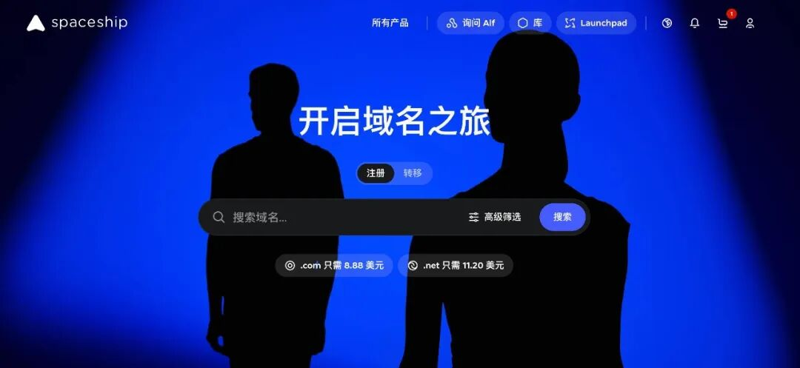
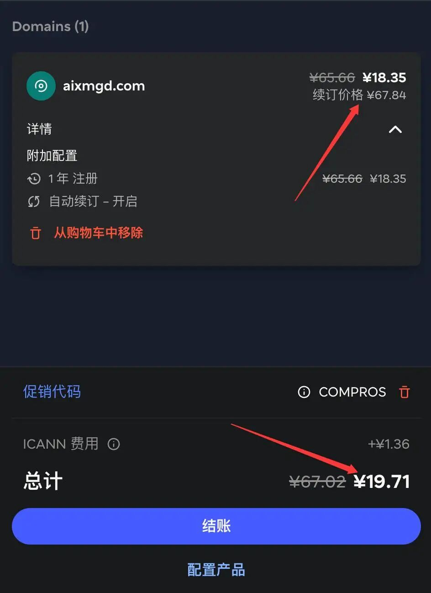
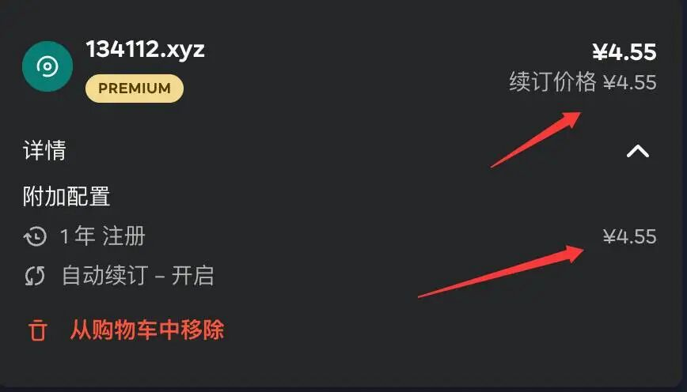

# 发现超低价域名平台！.com不到20块，xyz十年46，还能免费托管Cloudflare
> 💡 备注属性未写入，可能是备注属性名称或者类型被修改了，建议将字段类型设置为 rich_text，可以在小程序-操作-修改文章数据库页面进行调整
> 💡 原文链接:[https://mp.weixin.qq.com/s?__biz=MzIwMjUyMjQ2Ng==&mid=2247484867&idx=1&sn=7f063f0829f9e6293d13cbc5bbb8f0f1&chksm=9764542ecdc77063ddafef4c80afeca67eaddacd2776386530e680982333fe1470d37ea41f0d#rd](https://mp.weixin.qq.com/s?__biz=MzIwMjUyMjQ2Ng%3D%3D&mid=2247484867&idx=1&sn=7f063f0829f9e6293d13cbc5bbb8f0f1&chksm=9764542ecdc77063ddafef4c80afeca67eaddacd2776386530e680982333fe1470d37ea41f0d#rd)
介绍：**Spaceship** 是**海外老牌域名商** Namecheap 旗下子品牌，一站式建站服务平台，主打低价域名注册、虚拟主机、VPS 云服务器、企业邮箱，面向全球站长、开发者、个人博主，是目前国内技术圈热门的海外域名服务商。

**视频讲解：**
```javascript
https://aixmb.com/378.html
```
1. 域名注册（平台最大优势）
**价格极低**：搭配优惠码**.com**
**首年➕折扣低至 $3**，远低于国内厂家，续费60多也不溢价；
永久免费 WHOIS 隐私保护，不用每年额外付费隐藏个人信息，海外极少服务商能做到；
支持域名转入、批量管理、一键切换 Cloudflare DNS，国内解析访问稳定；
海量后缀：**.com/.net/.org/dev/xyz/tech 等建站常用后缀常年特价。**
2. 主机 / VPS 云服务器
虚拟主机：预装一键 WordPress，LiteSpeed 高速面板，自带免费 SSL 证书；
Starlight VPS 轻量云：适合搭建开源项目、工具站、代理服务，新用户优惠码直降 20%。
3. 企业邮局
购买域名即可开通免费邮箱转发，付费套餐支持独立企业邮箱，适合个人小站。
做个人博客、工具站、导航站，第一步就是注册域名。
市面上域名商溢价严重、续费杀猪、隐藏服务费层出不穷，折腾过某域名网站的站长基本都踩过坑。
今天给大家实测挖掘一家性价比碾压同行的服务商 ——Spaceship，新用户专属优惠码直接砍半，.com 首年低价，支持支付宝充值，国内访问稳定，同时附带完整注册、转移、分销拉新赚钱教程，建站新手看完直接省百元。
一、为什么站长都选 Spaceship？4 个核心优势
1. 域名价格断层低价，无隐形消费
主流后缀首年活动价（搭配优惠码）：
.com：低至 $5.87 / 年，对比其他平台便宜 30% 以上
.net/.org：常年特价，适合开源项目、技术博客
小众 dev/xyz/tech 建站后缀，批量注册有额外折扣
重点：无赎回溢价、无高价隐私保护费，域名隐私保护永久免费，不用每年额外花钱隐藏 WHOIS 信息，对个人站长极度友好。
2. 支付适配国内，充值门槛低
支持支付宝、PayPal、信用卡，最低充值 25 美元即可解锁全部新客福利，不用海外银行卡，国内用户零门槛注册。
3. 后台极简，搭配 Cloudflare 无缝使用
DNS 解析速度国内友好，一键接入 Cloudflare 代理，自带域名批量管理、自动续期、邮件转发功能，不用额外买企业邮箱，小站完全够用。

二、**2026 年 7 月实测可用 Spaceship 优惠码（亲测抵扣有效）**
官网地址：**https://www.spaceship.com/zh/**
全站通用折扣（新老用户通用，下单直接填）
**COMPROS**：全场 **35%** OFF，域名、VPS、虚拟主机通用，单次可用，折扣力度稳定
**SPSR86**：新用户首单 **75%** 大额折扣，新开域名首选，性价比最高
**SPSCOMTR**：兜底 **5%** 长期折扣，无使用门槛，活动过期可备用
.com 域名专属特价码
**M67**：.com 域名 **4** 折优惠，首年底价 $5.87，搭建个人博客刚需必用
VPS / 云服务器优惠
**VPS20OFF**：Starlight VPS 首单立减 20%，适合需要自建服务、搭建开源项目的站长
新用户大额返利推荐码
使用规则：**没有购买或者使用过优惠码即可**
三、手把手教程：用优惠码低价注册域名
打开 Spaceship 官网注册账号，填写国内收货拼音地址，时区选择 GMT+8 北京时区
顶部搜索框输入你想要的域名，加入购物车
结算页面找到「Add promo code」输入框，粘贴上方优惠码点击 Apply，实时显示减免金额
选择支付宝充值付款，完成购买，域名即时解锁，1 分钟内即可修改 DNS 解析建站
想要推广赚钱：官网底部 Affiliate Program 进入 Impact 分销平台，填写博客资料、上传站点 Logo，审核通过获取专属推广链接
四、避坑指南，新手别踩这些雷
优惠码单账户单次使用，年付套餐叠加折扣力度最大，尽量一次性注册多年更划算
不要批量虚假注册刷返利，平台风控严格，违规会清空余额封禁账号
域名到期前开启自动续期，Spaceship 赎回期收费标准透明，但逾期太久仍会溢价，建议提前续费
五、适合哪些人使用？
个人建站博主、技术分享站、导航站站长
批量搭建开源项目、工具站点，需要多域名的开发者
想靠分享域名优惠、建站教程做副业变现的创作者
嫌弃国内域名商续费贵、强制捆绑主机的海外建站玩家
同样是注册.com 域名，别家动辄十多美元一年，Spaceship 搭配优惠码直接压到 5 美元区间，免费隐私保护、国内支付、分销变现三重 buff 叠加，是目前站长圈公认性价比天花板。
**六、什么是纯数字域名？优势在哪**
一、纯数字域名指由纯阿拉伯数字组成后缀域名，例如
**124353.xyz，134数据组合**
这类，对比字母域名有 3 个不可替代优势：
记忆成本极低：数字人人看得懂，适合做短链接、流量站、工具导航；
资源存量充足：短数字域名存量远多于.com，低价就能拿下心仪号码；
用途无限制：搭建个人博客、开源项目站、API 工具箱、中转页面全都适配，没有建站门槛。
二、核心福利：**十年仅 46 元**，成本低到离谱
价格拆解（2026 年 7 月实时汇率实测）
平台基础特价：多款数字后缀单年低至 $0.7~$0.9；
一次性注册 **10 年**打包折扣，叠加优惠码折后总价仅 **$6.4 左右 **；
按实时美元汇率换算，到手合计约 **46 元**人民币，平均**一年仅 4 块 6 毛钱**。

--完--

读到这里说明你喜欢本公众号的文章，欢迎 **置顶（标星）**本公众号 **Ai星码**，这样就可以第一时间获取推送了~

## 摘要

（待补充）

## 我的笔记

（待补充）
