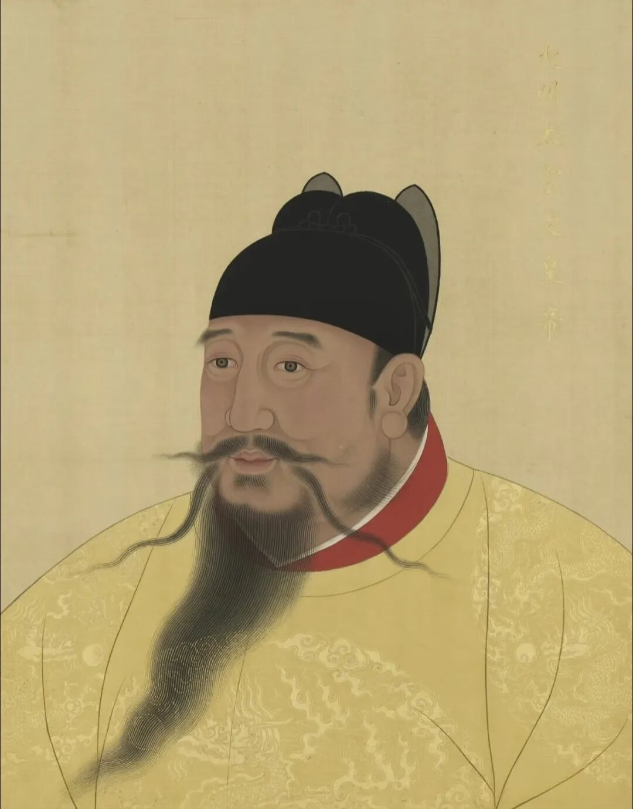
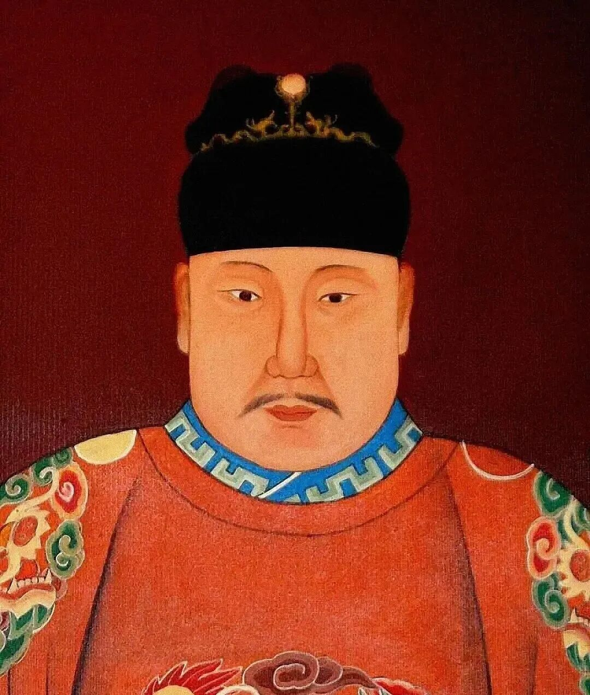
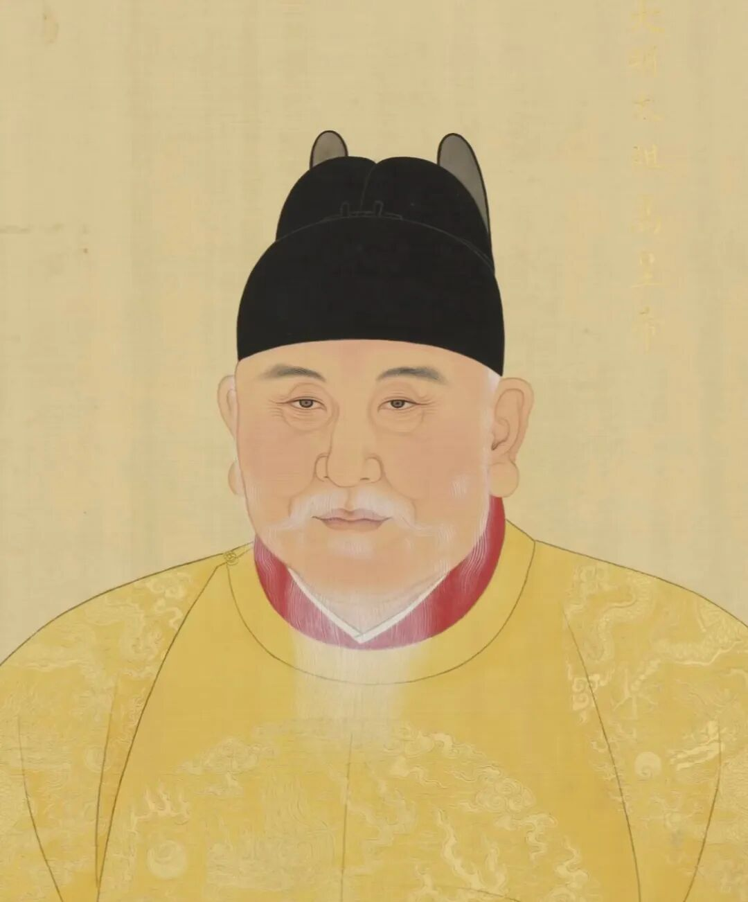

# 好色短命，绝代明君
> 💡 备注属性未写入，可能是备注属性名称或者类型被修改了，建议将字段类型设置为 rich_text，可以在小程序-操作-修改文章数据库页面进行调整
> 💡 原文链接:[https://mp.weixin.qq.com/s?__biz=MzY4MzE2MzE0Nw==&mid=2247484132&idx=1&sn=42d3bd5797438faf978343152f3931e2&chksm=f2ca128723880b9eb5753cf641653a7cff76251b898d2fa87c8896856fa1330c464bf299ae33#rd](https://mp.weixin.qq.com/s?__biz=MzY4MzE2MzE0Nw%3D%3D&mid=2247484132&idx=1&sn=42d3bd5797438faf978343152f3931e2&chksm=f2ca128723880b9eb5753cf641653a7cff76251b898d2fa87c8896856fa1330c464bf299ae33#rd)
本文参考历史文献资料并结合个人观点编写，文末已注明参考来源。

明成祖朱棣
洪武三十一年，朱棣做了一个奇怪的梦。
梦里他爹朱元璋把一块大圭塞到他手里，还说了句意味深长的话：“传世之孙，永世其昌。”
这个梦灵不灵呢，我知道您不信，但是朱棣是信了。
因为没过几日，他最喜爱的大孙子朱瞻基就呱呱坠地了。这孩子自幼聪慧过人，深得朱棣夫妇疼爱，自小就被朱棣带在身边教导。
可一转头，再看看朱瞻基他爹——朱高炽，朱棣就气不打一处来。
朱高炽，是朱棣的嫡长子，徐达的外孙，正所谓根正苗红。
明仁宗朱高炽
但朱高炽这人实在是太胖了，《明通鉴》记载：“体肥硕，行步须人扶掖。”由于太胖了，走两步得两个太监架着走，走起路来喘气还很费劲，偏偏脚上还患有重疾，走起路来一瘸一拐。
您想想，他爹朱棣什么人？死人堆里杀出的铁血帝王，能够骑马射箭、提着刀上战场的主儿，看见儿子这副模样，朱棣怎么看都不顺眼。
所以朱高炽这人打小就不讨人喜欢。
反观次子朱高煦，这小子非常骁勇善战，当年朱棣靖难之役的时候还救过几次朱棣的命，战场上的表现简直跟朱棣一个模子刻出来的。朱棣有一次甚至还拍着朱高煦的后背说了一句话：“勉之，世子多疾。”
意思就是说老大身体不好，你可要加油努力，说不定后面的世子之位就是你的了。
既然老大朱高炽又瘸又胖又不受朱棣待见，老二军功赫赫又野心勃勃，按常理，朱棣肯定要废了朱高炽的世子之位，改立老二朱高煦。但后来朱棣还是立了朱高炽为太子，那朱高炽凭什么坐上了储君之位？
民间演义里常说，全靠大才子解缙当年那句“好圣孙”，朱棣为了把皇位名正言顺地过渡给孙子朱瞻基，才咬牙决定立了朱高炽。
其实，把帝王心思看得太简单了，老朱家能当皇帝的人心眼子都贼多，一个几岁大的孩子再聪慧，也不可能成为立国储君的唯一筹码。“好圣孙”不过是压死骆驼的最后一根稻草，真正影响朱棣决定的，是他绕不开的政治现实与朱高炽深藏不露的心眼子。

明惠宗朱允炆
要知道朱棣是怎么上位的？他是从侄儿朱允炆夺位来的，所以他一直有个心病，因为他来位不正。
朱棣一辈子都在试图证明他不是无缘无故造反的，他本来就朱元璋看中的继承人，是朱允炆主动逼臣，臣不得不反，是朱允炆过于无耻，所以才夺了他的皇位。
一是想证明自己才是朱元璋选定的继承人，二是希望明朝后续传承稳定，不希望自己的后代也学他的样子造反，儿子造老子的反，循环往复，那还得了？明朝不得乱套了。
为了防患于未然，他自己得先做好榜样，立好规矩。
朱元璋亲定的“嫡长子继承制”便是他最大的合法性外衣。朱高炽又是朱元璋亲封的燕王世子，如果废长立幼，不就等于当众抽自己一大嘴巴子，动摇了大明宗法的根基。
更关键的是，朱高炽也不是个手无缚鸡之力的窝囊废。
当年靖难之役，李景隆率五十万朝廷大军围攻北平大本营，朱棣主力尽出，城中只剩五万老弱残兵。正是这位胖世子亲自登城督战，指挥若定，硬生生顶住了五十万大军的猛攻，保住了朱棣的退路与生机。
建文帝朱允炆曾秘密派人送来策反密信，许诺只要献城就封他为燕王。朱高炽也很有心眼，朱高炽连信封上的火漆都没拆，便原封不动八百里加急送给前线的朱棣。
这一战，证明了他既能挑大梁守江山，又在政治上绝顶聪明、滴水不漏。朱棣心里非常清楚：打天下需要老二冲锋陷阵，但守天下、算总账，可能真得老大不可。
就在朱棣为朱高炽和朱高煦二选一而苦恼的时候，大才子解缙称赞朱瞻基一句好圣孙，让朱棣吃了定心丸，坚定了立朱高炽为太子的决心。
大才子解缙那句“好圣孙”，其实背后就代表了文官集团的支持，朱高炽可是嫡长子，而文官们也恰恰喜欢嫡长子继承制，朱高炽的性情宽厚仁爱，非常符合文官们的口味，他们也喜欢这样的太子和皇帝。这样即使自己驾崩后发生了世子之争，争不过，也有文官们撑腰，能够保障权力过渡给自己的好圣孙朱瞻基。
明宣宗朱瞻基
永乐二十二年，朱棣驾崩，朱高炽在文官集团的拥戴下登基了，是为明仁宗，年号洪熙。
朱高炽上位之后，并没有大刀阔斧的改革，也没有什么惊天动地的政绩。他上位后其实就做了三件事，给残忍好杀的父亲善后，给雄心勃勃的儿子铺路，给吃不饱饭的百姓减赋。
仁宗上来就进行大赦，对在朱棣时期被残害的建文旧臣进行了释放和平反，悉宥为民，还其田土，还废除了诽谤朝廷这条罪，让整个社会压抑的气氛为之一振，缓和了压抑数十年的政治高压。
仁宗重用“三杨”改组内阁，任命提拔一大批有才能，有道德的文官集团核心人物，同时大量启用中下层官员，淘汰冗官，朝野为之一新。
仁宗在经济上踩停了刹车，他叫停郑和下西洋、停云南采办、停迤西市马，永乐朝多项耗资巨大的对外项目被悉数叫停，将这些原本投向外部扩张的财政资源，被转而用于国内民生。
凤阳、陈州水灾，扬州、淮安一带受灾，他积极赈济，卓有成效。丰年免赋、荒年免税，搞迁徙百姓、屯田垦荒。边防上也对兀良哈、瓦剌、鞑靼做了调整，不再穷兵黩武，使得大明百姓人人得到安居乐业。
反正他干的活儿太多了，一时半会说不完。《明史》给出了极高的赞誉：“在位一载，用人行政，善不胜书。使天假之年……岂不与文、景比隆哉。”
史书评价堪比文景之治啊。
然而天妒英才，天不假年。洪熙元年，登基仅十个月的朱高炽骤然驾崩，年仅四十八岁，传位给了儿子朱瞻基。
正史记载他无疾而终，这么一个大活人事先没有任何征兆就去世了，想想都十分不合理，引发了后人很多猜测。
有人猜测，朱高炽的是因为纵欲过度。
是的，仁宗有可能是一个很好色的人，这并不是空穴来风。
仁宗向来心宽体厚，从不与人过度争执，但偏偏有一次，仁宗和一位名为李时勉的朝中大臣发生了争执，闹得很不愉快，朱高炽勃然大怒还差点把他给打死了。
李时勉到底说了什么，能让一代仁宗瞬间破防？
李时勉说了这么一句话：“侧闻内官远自建宁选取侍女……大孝尚未终，左右侍御不可无人，则正宫尚未册，恐乖风化之原。”
翻译成大白话就是，你爹才没死多久，丧期没满，你就派宦官去建宁挑侍女入宫，这叫居丧近色，不孝不仁。
向来宽厚的朱高炽直接炸毛了，气得朱高炽命令身边的将士用金瓜捶他，捶断了李时勉的三根肋骨。
后来仁宗在临死弥留之际前他还紧紧攥着重臣夏原吉的手，还咬着牙骂：“时勉廷辱我。”
此外还有一些史料记载：
仁宗皇帝驾崩甚速，疑为雷震...予尝遇雷太监，质之，云皆不然，盖阴症也。（《病逸漫记》）
先皇帝嗣统未及期月……献金石之方以致疾也。（《明史》）
诸多线索无不佐证，仁宗是纵欲过度而死。
不过细细推敲，琢磨一下也是能说得通的。仁宗本来就胖，在朱棣传太子位到他登基时，中间过了二十年。
这二十年里，他这个太子当得可谓是提心吊胆，神经天天都是紧绑着的，一旁是看不起他的老爹，还有一旁经常给他暗中使绊子想代位称帝的弟弟，导致他长期受到压抑，身心受损。
所以他登基之后再也无需克制，一不小心就纵欲过度，沉迷酒色，让本来就很不健康的身体造成了无法弥补的伤害。
白天，是憋了半辈子的抱负，像鞭子一样抽着他没日没夜地批奏折，夜晚，是彻底失控的肉体狂欢在疯狂透支。
一边是超负荷的精神运转，一边是骤然放纵的声色犬马，因长期压抑而扭曲，因骤然释放而失控，因巨大抱负而自我鞭笞，这具原本就重度肥胖且多病的躯体，最终在冰火两重天的极端撕扯下轰然倒塌。

明太祖朱元璋
不过从历史更深层的维度来看，朱高炽的胜出与这短暂的十个月，恰恰折射了明初政权从“武治”到“文治”转型的历史必然，其中交织了明初两条路线的斗争。
明初这几十年，本质是军功集团和文官集团两大集团的斗争，一个代表开国勋贵想继续维持战时体制，维护军贵特权，而另一个代表文官主张以文驭武、恢复礼制、轻徭薄赋。两者之间在反复争夺统治主导权，明初所有的种种历史问题都是在这两条路线不断斗争下展开的。
而此时历史的趋势是什么？明初生产力刚刚恢复，百姓和国家急需休养生息，所以文官集团路线必然胜出，因为和平时期，治理比打仗更重要，这也是打天下到治天下的历史大势所趋，也是民心所向。
秦二世而亡不就是因为没有完成这个转型，宋太祖杯酒释兵权，也皆是为了扭转这个历史惯性。
所以不难理解为何朱元璋最初为何会定下“嫡长子继承”的国策，他更多要的是稳定不是内耗，他也不想搞出什么劳什子玄武门之变，所以他传位给了朱允炆而非朱棣，然而事与愿违，朱允炆的削藩政策还是动摇了军功集团的根本利益，此举间接导致了朱棣发起靖难之役，朱棣的称帝，也代表着军功集团路线的取得暂时胜利。
而历史的选择又来到朱高炽这里，他代表的是“治天下”的文官路线，而弟弟朱高煦代表的则是“军功打天下”的军功路线。
最终历史的大势所趋选择了朱高炽，选择了这位宽仁治国、休养生息的胖太子。他性情宽厚、重文轻武、恤刑省狱、与民休息——全都是文官集团最想要的那套执政纲领。
事实证明，这个选择拯救了大明。朱高炽用短短十个月便为随后的“仁宣之治”铺平了道路，他将清醒克制的仁政给了天下苍生，把性格上的扭曲放纵留给了黑暗中的自己，最后在一日又一日的巨大压力下，使得自己的人生在仓促间画上了一个不圆满句号……
参考资料：
1.《明史·仁宗本纪》　
2.《明史·李时勉传》　
3.《明通鉴》　　
4.《明宣宗实录》　　
5.《病逸漫记》（明·陆粲）　
6.《万历野获编》（明·沈德符）

## 摘要

（待补充）

## 我的笔记

（待补充）
