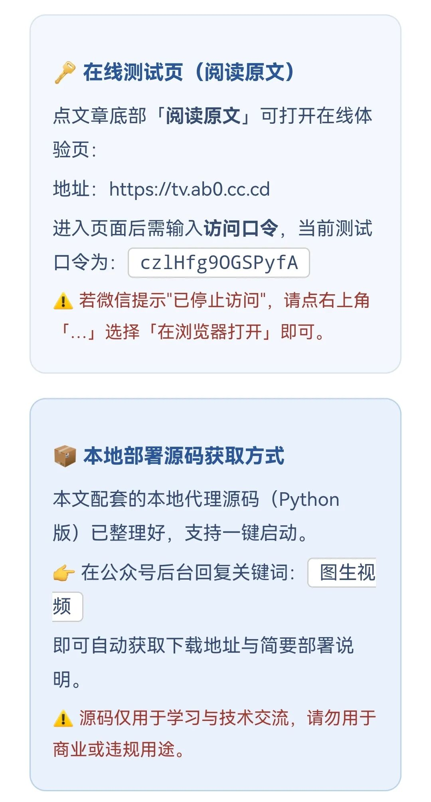

# 实测免费！3分钟搭好 Agnes AI 图生视频工具，全程免费不花一分钱
> 💡 备注属性未写入，可能是备注属性名称或者类型被修改了，建议将字段类型设置为 rich_text，可以在小程序-操作-修改文章数据库页面进行调整
> 💡 原文链接:[https://mp.weixin.qq.com/s?__biz=Mzg4NTgyNjQ5MA==&mid=2247485278&idx=1&sn=6d31567a09ed33e2d4daef67fc15fe40&chksm=ceed8cd235e8991db1361e314018e76e853fe7a7416d40c2d5e73003aeb18011f0a53999e9ec#rd](https://mp.weixin.qq.com/s?__biz=Mzg4NTgyNjQ5MA%3D%3D&mid=2247485278&idx=1&sn=6d31567a09ed33e2d4daef67fc15fe40&chksm=ceed8cd235e8991db1361e314018e76e853fe7a7416d40c2d5e73003aeb18011f0a53999e9ec#rd)
**🎬 AI 工具教程 · 免费实测**
## 免费实测！3分钟搭好 Agnes AI 图生视频工具，全程免费不花一分钱
不用绑卡 · 不用付费 · 本地部署 · 解决跨域
你有没有过这种念头——
手里一张普通的静态照片，要是能让它"活"过来：眨个眼、转个头、挥个手，甚至跳段舞，那该多酷？
以前这事儿门槛不低：要么充剪映会员，要么啃复杂的AE，要么老老实实花钱调API。
今天这篇，把这扇门直接踹开。我手把手教你用 **Agnes 免费API + imgbb 免费图床**，在本地搭一个属于你自己的 AI 视频生成工具。不用绑卡、不用付费，熟练的话 3 分钟就能跑起来。
上面这段视频，就是用这个方法生成的
为什么是这两个工具
---
核心就一句话：把本地图片变成公网地址，再丢给免费视频模型去"动"它。
**🖼 imgbb · 免费图床**
把本地图片传上去，拿到一个公网能访问的 URL。免费版每天 100 张、单张最大 32MB，个人玩完全够用。官网：https://api.imgbb.com
**🎥 Agnes AI · 免费视频模型**
目前少有的、文本 / 图像 / 视频三大模态 API 全免费开放的平台。视频模型 agnes-video-v2.0 支持图生视频、文生视频、关键帧动画——正是神器。国内官网：https://agnes-ai.cn ，API 平台：https://platform.agnes-ai.cn
**🔗 本地代理 · 串起两者**
中间需要一个本地代理服务：既解决浏览器跨域（CORS）报错，又把你的 API Key 锁在本地后端，不暴露在前端代码里。
整套链路：**上传图片到图床 → 拿到公网URL → 传给 Agnes 视频接口 → 本地代理转发 → 浏览器直接出片**。
三步上手
---
**1拿到 imgbb 图床 Key**
1. 打开 https://api.imgbb.com/
1. 点「注册/登录」，完成账号注册
1. 登录后进入控制台，找到 API 相关设置页
1. 点 "Add API key" 或 "Get API Key"，生成新 Key
1. 复制保存好，后面要用
💡 提示：免费版有每日上传额度，但个人使用绰绰有余。
**2拿到 Agnes API Key**
1. 打开 https://platform.agnes-ai.cn/
1. 用邮箱或手机号注册、验证——不绑定任何支付信息
1. 登录后，左侧菜单找「API密钥 / API Keys」栏目
1. 点「创建新的密钥」，随便起个名字
1. 密钥生成后只展示这一次！立刻复制保存
⚠️ 重点：Agnes 的 Key 通常以 sk- 开头，只显示一次，关掉页面就再也看不见了，务必第一时间存好！
**3替换 Key，启动服务**
两个 Key 到手，只改代码里的两个地方就行。找到 `agnes_proxy_server.py`（和 `deepseek_html_20260727_b468b9.html`在同一目录），用记事本、VS Code、Sublime 等任意编辑器打开。
定位这段配置（大约第 29–33 行）：
CONFIG = {     "PORT": int(os.environ.get("PORT", "3000")),     "AGNES_API_KEY": os.environ.get("AGNES_API_KEY", "在此填入你的Agnes密钥"),     "AGNES_BASE": "https://api.agnes-ai.cn/v1",     "IMGBB_API_KEY": os.environ.get("IMGBB_API_KEY", "在此填入你的imgbb密钥"),     # ... }
只动两处：
1. 🔄 把 AGNES_API_KEY 后面那串默认字，换成你第二步拿到的 Agnes Key
1. 🔄 把 IMGBB_API_KEY 后面那串默认字，换成你第一步拿到的 imgbb Key
保存文件，运行：
python agnes_proxy_server.py # macOS / Linux 用 python3 agnes_proxy_server.py
看到控制台输出「代理服务已启动: http://localhost:3000」就成功了！
打开这个地址，上传图片、填动作描述、点生成——搞定 🎉
这套方案好在哪
---
**✅ 完全免费**
Agnes API 和 imgbb 图床都是免费服务
**✅ 无需绑卡**
注册即用，没有任何付费门槛
**✅ 解决跨域**
本地代理转发，浏览器不再报 CORS 错误
**✅ Key 保密**
密钥留在本地后端，不会暴露在前端代码里

**整个过程，熟练了 3 分钟就能搞定。**
与其眼红别人家的动图视频，不如自己动手，让你手机相册里那些静态照片全部"活"过来。
教程就到这儿，去试试吧！
如果这篇对你有用，欢迎 **【点赞】【在看】【转发】**，让更多朋友一起用上这个免费好工具 🚀

## 摘要

（待补充）

## 我的笔记

（待补充）
