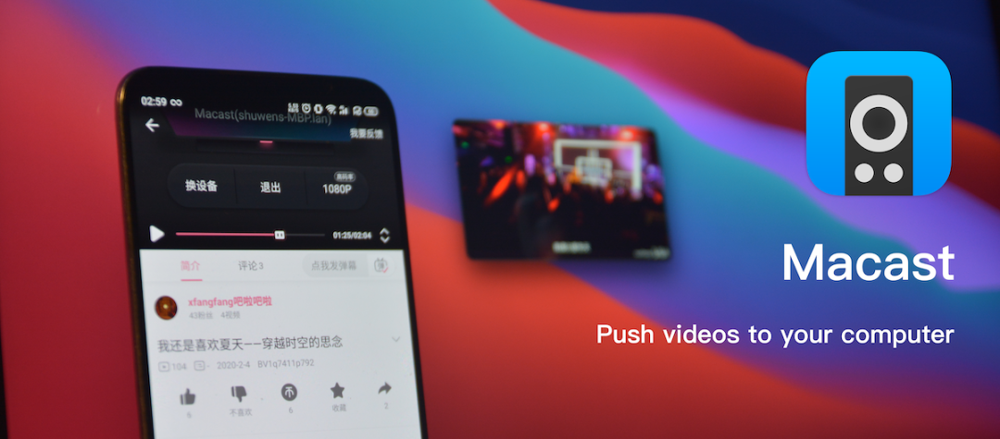
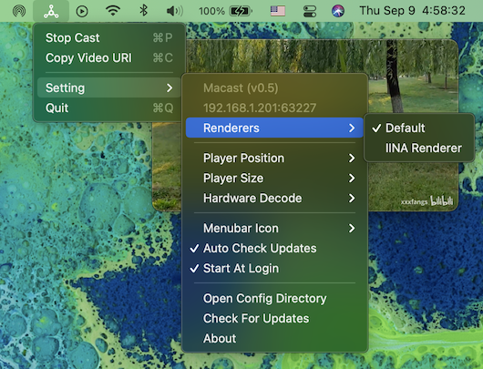
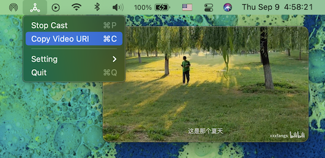

# 幕映MuCast：开源免费投屏软件（ 无广告 | 无水印 | 不限投屏时长）
> 💡 备注属性未写入，可能是备注属性名称或者类型被修改了，建议将字段类型设置为 rich_text，可以在小程序-操作-修改文章数据库页面进行调整
> 💡 原文链接:[https://mp.weixin.qq.com/s?__biz=MzY4MTM2MDQ0Mg==&mid=2247484614&idx=1&sn=f2e21e83230dee9b2c5bdac088e10977&chksm=f2db5121260fde696ab1901e38b50c29917508fac98f851fb0d1a1c1ec2824fe2cd842ca77be#rd](https://mp.weixin.qq.com/s?__biz=MzY4MTM2MDQ0Mg%3D%3D&mid=2247484614&idx=1&sn=f2e21e83230dee9b2c5bdac088e10977&chksm=f2db5121260fde696ab1901e38b50c29917508fac98f851fb0d1a1c1ec2824fe2cd842ca77be#rd)
Macast 开源项目推荐：把手机媒体无缝投屏到电脑的轻量方案
### 项目定位
Macast 是一款基于 **DLNA / UPnP 协议**的跨平台媒体投屏开源工具，由开发者 xfangfang 在 GitHub 上维护。它用轻量的 mpv 播放器作为媒体渲染内核，让用户能够把手机上的视频、图片和音乐，一键推送显示在电脑屏幕或任务栏上，全程无需付费、无需广告、无需账号绑定。

项目已获得 **6.9k 的 star**，社区与作者仍在持续迭代，是桌面投屏场景中口碑稳定的代表性开源作品。
### 核心特性
Macast 主要解决一个真实痛点，就是**手机端资源往电脑屏幕投**。相比传统投屏，它有几点优势值得关注。
**跨平台支持。** 官方为 macOS、Windows、Linux 三个主流桌面平台提供编译好的安装包，安装后会在菜单栏或任务栏显示常驻图标，调用路径清晰。

投屏原理示意
**插件扩展第三方播放器。** 默认由 mpv 渲染，同时通过官方插件体系，可接入 PotPlayer、IINA 等第三方播放器。播放速度、字幕、快捷键等参数均支持自定义，满足进阶用户的个性化需求。
**开发者友好。** 项目开放自定义渲染器接口，支持在播放同时下载媒体资源等二次开发能力。这一点为有定制需求的开发团队与个人爱好者，保留了充分的动手空间。

选择第三方播放器插件
### 快速上手
Macast 提供两条低门槛的接入路径。对于习惯命令行的开发者，可通过包管理器直接安装并启动。
pip install macast
macast-gui
对于普通用户，则可以直接前往项目的 Release 页面下载当前平台对应的安装包，双击完成后即可使用。整体从安装到首投成功，通常在数分钟以内。
项目主要语言为 Python，占比超过八成，另有部分 HTML 界面代码，技术栈轻量、易读，便于二次开发。

投屏完成效果
### 仓库信息
·**项目名称**：Macast
·**授权协议**：GPL-3.0
·**主要语言**：Python、HTML
·**Star 数量**：约 6900
·**兼容平台**：macOS、Windows、Linux
GitHub 仓库地址如下，欢迎通过 issue 反馈问题，或通过 Pull Request 参与共建。
https://github.com/xfangfang/Macast
### 总结
如果你正在寻找一个免订阅、免广告、能跨平台使用的手机投屏方案，Macast 是一个值得投入少量学习成本的开源选择。它用克制的设计守住”投屏”这一件事，把复杂留给协议层，把简洁交还给用户。对于技术选型团队与桌面效率爱好者而言，这是一份可以放心收藏的工具清单项。

## 摘要

（待补充）

## 我的笔记

（待补充）
