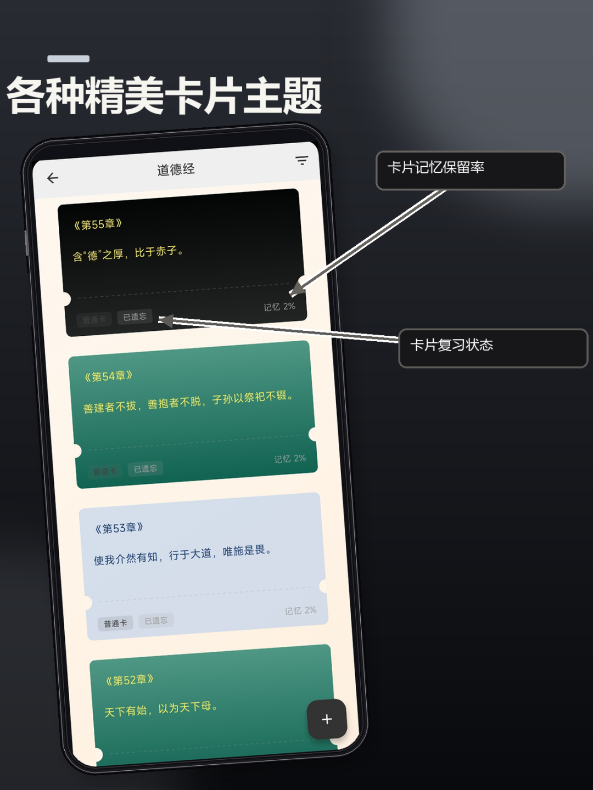
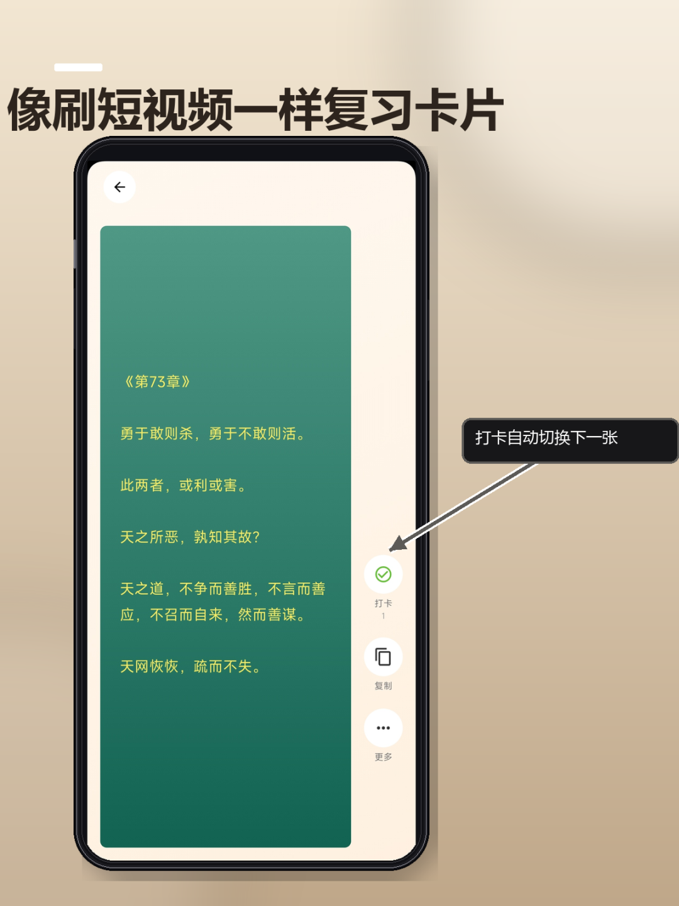

# 把记忆装进盒子，再用刷视频的方式复习：这款卡片工具让学习更轻松
> 💡 备注属性未写入，可能是备注属性名称或者类型被修改了，建议将字段类型设置为 rich_text，可以在小程序-操作-修改文章数据库页面进行调整
> 💡 原文链接:[https://mp.weixin.qq.com/s?__biz=MzI4MTM0Njk4Mg==&mid=2247483889&idx=1&sn=e2ef5804bb604d660065877908c98840&chksm=ea07702c7433f91c6ab0599ba30e403f150219a5a365325797935b6cc7fc6d8fcbc64e64e437#rd](https://mp.weixin.qq.com/s?__biz=MzI4MTM0Njk4Mg%3D%3D&mid=2247483889&idx=1&sn=e2ef5804bb604d660065877908c98840&chksm=ea07702c7433f91c6ab0599ba30e403f150219a5a365325797935b6cc7fc6d8fcbc64e64e437#rd)
你有没有过这样的时刻：想复习某个考试知识点，翻遍笔记却找不到重点；想整理读书笔记，却散落在各个App里；想记录生活杂记，却总是没有头绪。
记忆本来应该是井然有序的，只是我们缺少一个合适的容器来安放它。
### 一、创建你的专属盒子，让内容各归其位
卡片盒子管理就像为你的记忆准备了一个个精致的收纳盒。你可以根据主题创建不同的盒子，比如“考研知识点”集中存放高数公式、英语单词；“读书笔记”收录书摘和随想；“待办事项”放入近期要做的事情。
每个盒子都能自定义封面，你可以用不同的颜色、图案去区分它们。看起来更有个性，翻找时也能一眼认出。
这种归类方式最大的好处是结构清晰：当你需要复习某一类内容时，直接打开对应盒子就能看到所有相关卡片，不必在混乱的信息里大海捞针。

### 二、复习像刷短视频，越刷越上瘾
有了盒子只是第一步，更关键的是怎么复习。传统的复习方式常常让人感到枯燥，而这款工具把复习做成了短视频的体验。
在手机端，你只需上下滑动就能逐张浏览卡片；在电脑端，则是左右沉浸式滑动。每滑到下一张卡片，都是一次快速回忆。
更贴心的是，系统会根据遗忘曲线的原理，为每张卡片计算当前的记忆保留率，并给出具体百分比。你可以选择“急需复习优先”，让那些即将遗忘的内容先出现在眼前，把宝贵的复习时间用在最需要的地方。
复习时，每张卡片都显示复习次数和记忆状态：是“已遗忘”还是“记忆犹新”，一目了然。

### 三、数据驱动复习，告别盲目刷卡
很多人复习靠感觉，觉得“差不多记住了”就跳过。但这款工具用数据告诉你真相：记忆保留率下降到20%的卡片，才是你最该关注的。
每晚下班后，像刷短视频一样快速过一叠卡片，不仅不累，反而有点解压。考试前，选择“急需复习优先”，集中攻克那些已经遗忘的卡片，效率大大提升。
当然，遗忘曲线的效果需要你的配合。在复习模式中，每完成一张卡片的复习，记得点击“复习完成”按钮，系统才会继续更新遗忘曲线和复习数据，让整个机制持续为你服务。
如果你也想让记忆变得有条理，让复习变成一种习惯，不妨试试这种“盒子+刷视频”的组合方式。也许你会重新爱上整理与学习的过程。

## 摘要

（待补充）

## 我的笔记

（待补充）
