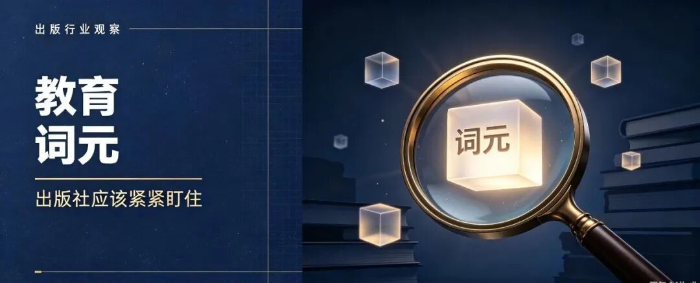

# 教材被拆成词元，出版社还靠码洋吗
> 💡 备注属性未写入，可能是备注属性名称或者类型被修改了，建议将字段类型设置为 rich_text，可以在小程序-操作-修改文章数据库页面进行调整
> 💡 原文链接:[https://mp.weixin.qq.com/s?__biz=MzY4NjQzNzI5Ng==&mid=2247483934&idx=1&sn=40d096223bd2890f81b68fb65f9dd3b2&chksm=f27558f47e57e5805275a6087838c04a770805581be8c117d276e96ac17931f304c0c671feb2#rd](https://mp.weixin.qq.com/s?__biz=MzY4NjQzNzI5Ng%3D%3D&mid=2247483934&idx=1&sn=40d096223bd2890f81b68fb65f9dd3b2&chksm=f27558f47e57e5805275a6087838c04a770805581be8c117d276e96ac17931f304c0c671feb2#rd)

## 教材被拆成词元，出版社还靠码洋吗
当教育 AI 开始按词元计量，出版的账该怎么算
先看三件事。
第一件，某出版社的经营会："今年秋季教材，印多少册？码洋能做到多少？"——这是出版业几十年没变过的收入语言：**册、码洋、授权次数。**
第二件，9 月 11 日北京一场发布会："教育词元（Token）公共供给平台，正式发布。"——这是教育 AI 的供给侧，第一次把算力按"词元"这个单位，摆到台面上公开计量、公开供给。
第三件，一张未来的结算单：将来某天，一家把教材内容接进教育 AI 的出版单位，收到的可能不是"印数×单价"，而是"被调用了多少词元×单价"。
看懂了吗？**内容的计价单位，正在从"一本一本"变成"一个一个词元"。** 如果你还停留着"印数×单价"的时代，可能会被淘汰掉。
### 一、教育词元是什么：不是通用的词元，是教育专属的
9 月 11 日，国家人工智能应用中试基地（教育领域基础教育方向）在北京数据产业生态交流会上，发布了教育词元（Token）公共供给平台。第二天（9 月 12 日），这个中试基地正式启动建设，是本届服贸会教育服务专题"教育强国，智创未来"的一项核心成果。

说它是"国家级"，有白纸黑字：央视网报道明确，这是**基础教育领域唯一一个国家级人工智能应用中试基地，落户北京**。共建单位里，有北京数据集团、中国移动北京公司、人民教育出版社、北京工业发展投资管理有限公司、智谱、科大讯飞北京公司等。

那么"教育词元"到底指什么？人民网原文给了一个清楚的定义——
教育词元，是教育领域人工智能算力的度量单位，区别于通用词元服务，**专为教育场景深度优化**：深度理解教育术语与学情数据，遵循教育规律输出合规内容，支持多学段多学科适配，以普惠成本助力教育人工智能应用快速落地。

说人话，其实就是三点：
· **它认教育的事。** 通用词元把一个字、一个词都当成差不多的"信息块"；教育词元要能听懂"韦达定理""光合作用""记叙文六要素"这类术语，也要看得懂学情数据。
· **它守教育的规矩。** 输出要合规，要符合教育规律，不是什么都能生成。
· **它跨学段、跨学科。** 小学到初中、语文到物理，一套标准尽量通吃。
平台的链路也讲明白了：老师、学生或业务平台发起调用需求 → 统一接入教育云算力底座 → 教育垂类模型协同知识图谱、高质量数据集做增强处理 → 安全治理与计量 → 生成合规、可追溯的教育专属词元。平台支持权限控制和调用计量追溯，"让每一份词元消耗清晰可见"。

基地的打法，是"1 个中试服务门户 + 3 套教育词元、评测、智能云能力"的"前店后厂"模式；目前已经初步建成清启教育垂类大模型、人工智能+教育中试验证平台和人工智能+教育评测场。

| 维度 | 通用词元 | 教育词元 |
| 计量对象 | 任意文本/信息块 | 教育场景下的专属算力 |
| 懂不懂术语 | 不保证 | 深度理解教育术语与学情数据 |
| 输出约束 | 看模型 | 遵循教育规律、合规 |
| 适配范围 | 通用 | 多学段、多学科 |
| 成本定位 | 市场价 | 普惠供给 |
### 二、为什么出版社要关心：内容进了 AI 链路，账就重算了
出版单位过去卖的是"成品"——一本书，收一次码洋；授权一次，收一笔授权费。收入的语言，是开头那三个词：**册、码洋、授权次数。**
教育词元的提出，却把这件事换了个算法。
当你的教材、教参、题库变成教育 AI 的"原料"，被切成一个个可独立调用的知识点、讲解、题目，再经由垂类模型和知识图谱增强，最后以"词元"的形式被老师和学生在课堂里反复调用——这时候，内容的价值就不再只发生在"卖出一本"的那一刻，而分布在"被调用一次"的每一次里。
基地自己也点明了这件事的底层逻辑：它通过统一的词元供给标准，把分散的教育数据资源、算力资源和模型能力，"整合为可计量、可调度、可审计的公共品"。

换句话说，**教育词元要计量的，不只是算力，也包括喂进去的内容。** 而出版社手里最值钱的，恰恰就是经过几十年专业编辑筛选、对齐课标、分层分科的内容。这部分内容，过去躺在版权库里，只有在"再版"或"授权"时才产生一次收入；进了词元链路，它有可能变成一种被持续调用的资产。
这要求出版社要赶快转变思维了，传统的算账模板要换了。计价单位一变，出版社对自己家底"值多少钱、怎么收钱"的判断，也得跟着变。
### 三、出版社该高兴还是该恐慌？
坐下来，好好分析一下，可以发现：
**第一：普惠，意味着单价可能不会高。**
平台明确定位"普惠成本"，目标是让教育 AI 应用快速落地。逻辑上，普惠供给会把单价压得较低。所以对内容方来说，按词元结算的收入天花板，很可能一开始就摆在那——它不是"卖一本赚一笔"的替代，更像是一笔细水长流、但单价不高的流量钱。别指望靠它一夜补齐码洋。
**第二：这个底座目前只管基础教育。**
中试基地写得很清楚，方向是"基础教育"，人民网说它"面向基础教育全行业"。也就是说，义务教育阶段的教材、教参、题库，是它直接相关的地盘；高等教育、职业教育、专业出版，目前还没有对应的国家级平台。出版社里做高教、做专业图书的那一块，暂时还不在这一轮基础设施的覆盖范围内。
**第三：标准在别人手里。**
基地明确说"不做面向市场的终端产品"，攻的是单个企业做不了、不愿做、重复建设成本高的共性环节。所以短期看，它不会直接来抢你的终端。但内容怎么被切成词元、怎么被计量、怎么被定价，这些"秤"在基础设施方那边。出版社如果不参与早期的规则和标准对话，将来就可能只是被动接受一套别人的计量方式。这恰恰是该"盯住"这个词的原因。
### 四、不要等了，要行动了
又要唠叨一下，继续之前的话题，首先得盘家底。前面都是判断，这里得马上行动了。
### 
教育词元要的是"合规、可追溯"的内容，要的是能被垂类模型和知识图谱调用的素材。出版社很多内容，今天还停留在"整本书"的形态，颗粒太粗、标注太薄、出处太模糊，直接喂不进这条链路。所以最该做的，是按"可被词元化"的标准清一遍，抓紧给自家内容资产做一场"入场体检"，三张表：
**第一张：颗粒度。**词元化需要内容能被拆到可独立调用的单元——一个知识点、一道例题、一段讲解、一张导图，而不是"整本书"。先把库存里哪些内容能拆、拆到多细，摸清楚。拆得动的，才进得去。
**第二张：标注。**学科、学段、知识点、难度、对应课标哪一条——没有这套标注，模型不知道这段内容是什么、适合谁用。出版社的编辑最懂这套分类，这本是看家本领，现在该把它从"脑子里的经验"变成"系统里的字段"。
**第三张：溯源。**词元要"合规、可追溯"，内容出处、权属、版本必须清楚。出版社的内容有版权底子，但历史合同里"授权范围"是否覆盖"AI 训练与调用"，得重新审一遍。溯源不清的内容，进了链路也是带病资产。
我觉得，这三张表，就是出版社对接教育词元之前的底账，也是底气。哪怕最后不接任何 AI，它也是一笔迟早要做的数字资产清产。
### 五、给三条建议
**第一条：早做内容资产的结构化体检。**就是上面三张表。别等平台找上门才翻库——那时你手里能用的，可能只是很小一部分，甚至是没有可用的。提前筹备，有备无患。
**第二条：盯住"教育词元标准"的成形。**基地说要通过统一标准，把数据、算力、模型整成"可计量、可调度、可审计的公共品"。标准决定你怎么被计量、被定价。标准的话语权在早期，参与共建或至少对标跟进，都比事后被动接受划算。人教社进入共建单位名单，本身就是内容方入局的一个信号。你还在等什么？不入局就会出局。

**第三条：把授权从"整本"往"可计量"设计。**新签的合同里，为"按调用量结算"预留接口：权项拆细一点，结算方式留活口。别让今天一份笼统的整本授权，把明天的词元收入提前锁死。传统的思维、传统的合同，是时候需要更新换代了。
### 六、小结一下
写这篇文章，小编其实内心是很紧张，也很忐忑的。本身做过出版，懂出版的难，前有虎，后有狼，新事物、新技术、新产品接连不断冲击我们的大脑。不用说去理解，好多能接收到，做到接受就已经不易了，更别说真正放下顾虑，大胆去做了。尤其是元老级别的出版人，之前的积累的经验和技能，慢慢地可能跟现在的技术发展的交集越来越少，甚至到英雄无用武之地的地步。
扯远了。回到开头那件事。
出版单位的收入语言（册、码洋、授权次数），几十年都没换过。教育词元把"词元"推到台前，是第一次有人试图给教育内容的中文能力，定一个公开、可计量的价。这件事的意义，不在它今天能结多少钱，而在它改写了"内容怎么算钱"的提问方式。
出版社不必慌，也不必冲。慌，是因为账本本来就该重算；冲，是因为现在还没有单价、也没有覆盖高教专业的平台，冲进去容易空转。
该做的，是先把家里的"内容矿"按新标准勘探一遍。
技术不会替出版社定价，但标准会。谁先把自己的内容变成"可被计量、可被追溯"的资产，谁的姓名就会出现在下一张结算单上。
**【数据出处】**
1. 人民网（北京频道），2026-09-12，《国家人工智能应用中试基地（教育领域基础教育方向）启动建设》：中试基地 9 月 12 日启动建设、9 月 11 日发布教育词元公共供给平台；共建单位含人民教育出版社；教育词元定义（深度理解教育术语与学情数据、遵循教育规律、多学段多学科适配、普惠成本）；链路与计量追溯；"1 个门户 + 3 套能力"模式；已建成清启教育垂类大模型等载体；整合为可计量、可调度、可审计的公共品。
2. 央视网，2026-09-11，服贸会教育服务专题报道：该中试基地为"基础教育领域唯一一个国家级人工智能应用中试基地，落户北京"。
3. 证券时报，2026-09-11，《2026 北京数据产业生态交流会于服贸会期间举办》：教育词元公共供给平台为中试基地面向基础教育行业的首个国家级 AI 算力普惠供给平台，链路与定位一致。
**本文所引事实均来自上述公开报道；教育词元单价与结算价格平台尚未公布，文中相关判断为基于"普惠供给"定位的逻辑推断，非官方数据，不作为引用依据；全文为第三方行业观察，不对其余出版单位作优劣比对。

## 摘要

（待补充）

## 我的笔记

（待补充）
