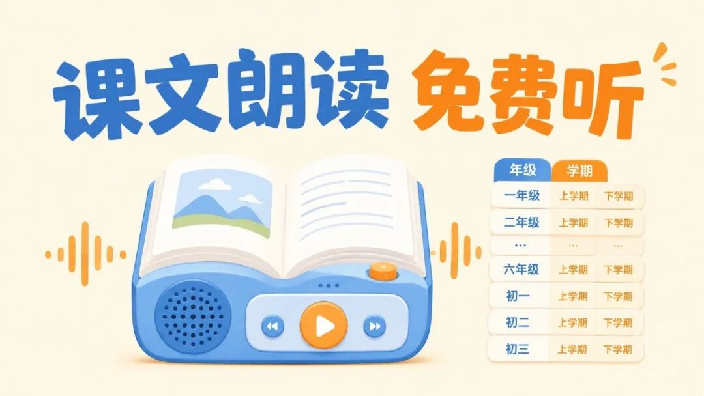

# 有声书免费听：中小学课文朗读，按年级学期直接找
> 💡 备注属性未写入，可能是备注属性名称或者类型被修改了，建议将字段类型设置为 rich_text，可以在小程序-操作-修改文章数据库页面进行调整
> 💡 原文链接:[https://mp.weixin.qq.com/s?__biz=Mzg3NTI1MjUwMA==&mid=2247489665&idx=1&sn=217795a37db4cd3aa4b339488e82b29b&chksm=cf9a109061f671391bd7894fd50b3bcbbd11f4f968f25d684b272ff037c4721e5b34b07f5a90#rd](https://mp.weixin.qq.com/s?__biz=Mzg3NTI1MjUwMA%3D%3D&mid=2247489665&idx=1&sn=217795a37db4cd3aa4b339488e82b29b&chksm=cf9a109061f671391bd7894fd50b3bcbbd11f4f968f25d684b272ff037c4721e5b34b07f5a90#rd)

很多家长陪孩子读语文，卡住的不是不会读，而是不知道该怎么读。
课文看着都会念，真正读起来却总差点意思：停顿不对，重音乱放，古诗像赶路，散文像报菜名。让家长现场示范，也挺为难——语文老师的活，突然落到了餐桌边。
朗读不是把字读出来，而是让孩子知道一句话该怎么呼吸。
这里有个很实用的免费资源：中小学语文示范诵读库。
它不是花里胡哨的学习软件，也不让你注册、打卡、看广告。打开网页后，按孩子所在年级和学期找课文，点一下就能在线播放对应朗读音频。
入口可以直接保存：
ZedeX.github.io/mandarin-reading-resource/
这个资源把中小学语文课文朗读音频整理成了一个网页库，音频来源标明为中央人民广播电台中小学语文示范诵读库。家长不需要在各个平台里反复搜课名，也不用给孩子找来路不明的“名师朗读”。
## 它最省心的地方，是找得快
很多音频资源的问题，不是没有，而是像把袜子全扔进一个抽屉。
想找一篇课文，得在一堆古诗、故事、作文朗读里翻半天。孩子的耐心通常比加载条还短，翻几下就跑了。
这个网页库把内容按年级、学期整理，也支持按课文标题搜索。
比如孩子刚学到一篇课文，家长不必先判断它属于哪个单元，也不用拿着课本到处问。直接搜课名，找到后播放即可。
好的学习资源，不是功能多，而是孩子需要时能立刻用上。
网页还会保留播放进度。听到一半有事离开，下次打开不用从头猜位置。对需要反复跟读的孩子来说，这个细节比一堆“智能功能”更实际。
## 怎么用，家长照着做就行
先把上面的网页地址收藏到手机浏览器。
打开后，可以按孩子的年级和学期筛选；如果手边正好有课本，直接在搜索框输入课文标题会更快。
找到目标课文后，先让孩子完整听一遍，不急着跟读。
完整听的作用，是先建立“这篇文章原来应该这样读”的感觉。哪里放慢，哪里停顿，哪里语气上扬，孩子先听明白，后面模仿才不会只是在机械念字。
接着再让孩子一句一句跟。
别一上来就要求像播音员。先把节奏读顺，再管感情。孩子读得磕磕绊绊时，最有用的一句话不是“你怎么又读错了”，而是“这一句我们再听一遍，看看声音在哪里停下来”。
孩子需要的不是一个随时纠错的人，而是一把能帮他找到节奏的尺子。
听完后，可以让孩子自己选一小段录音，对照原音回听。很多问题，家长说十遍不如孩子自己听一遍来得直接。
## 这类资源，适合用在什么地方
| **场景** | **可以怎么用** |
| 预习课文 | 先听完整朗读，再看课文内容 |
| 课后复习 | 找到当天学过的篇目，跟读重点段落 |
| 古诗词背诵 | 先模仿停顿和语气，再开始背 |
| 朗读作业 | 录音前先听参考，减少反复重录 |
| 亲子共读 | 家长和孩子轮流读，再一起听原音对照 |
不少家长把朗读当成语文里的“小作业”，觉得读完就行。
其实朗读是很低成本的语感训练。孩子听得多、读得顺，遇到陌生句子时，更容易知道哪里该停，哪里该连，句子意思也更容易进脑子。
尤其是低年级阶段，孩子对语言的感受还在慢慢长出来。让他接触稳定、清楚的示范，比反复催“读熟一点”有效得多。
## 别把它当成万能老师
这个资源适合解决“课文怎么读”的问题，不替代理解课文。
听得好，不等于读懂了；读得流利，也不等于会分析。它最合适的位置，是给孩子一个可靠的参照。
用法也不用搞得太重。选一篇正在学的课文，听一遍，跟一遍，把自己最不确定的一段再听一遍，就够了。
学习最怕的不是资源少，而是资源一多，孩子还没开始，家长已经累了。
真正能长期坚持的方法，往往不是最复杂的，而是打开就能用的。
这个中小学语文示范诵读库，建议家长先收藏。等孩子遇到朗读作业、古诗背诵，或者只是想把课文读得更顺时，就不用临时满网找音频了。
觉得这类免费资源有用，可以星标一下，免得下次找课文朗读入口又翻半天。
点个关注，下次找免费资源不用再到处搜了，我帮你整理好了。
更多推荐：
[免费阅读器软件：跨平台看书，不必再为阅读器付费](https://mp.weixin.qq.com/s?__biz=Mzg3NTI1MjUwMA%3D%3D&mid=2247488831&idx=1&sn=daeeb0f87519dde6fd9c0fef6b291ced&scene=21#wechat_redirect)
[留学不等于烧钱：欧洲一批公立大学免学费，还不用学小语种](https://mp.weixin.qq.com/s?__biz=Mzg3NTI1MjUwMA%3D%3D&mid=2247488523&idx=1&sn=0a29141efaf75d2006b2ce161636f852&scene=21#wechat_redirect)
[语言学习最大的误区：一个加拿大老头会20种语言，靠的不是天赋](https://mp.weixin.qq.com/s?__biz=Mzg3NTI1MjUwMA%3D%3D&mid=2247488421&idx=1&sn=e4dc1030aa00d73713af7496786f4ca3&scene=21#wechat_redirect)
[买编程书花了五千块才发现，GitHub上这11万星的中文书单全是免费的](https://mp.weixin.qq.com/s?__biz=Mzg3NTI1MjUwMA%3D%3D&mid=2247487919&idx=1&sn=f08b16f48b92c328d4d364518f70624d&scene=21#wechat_redirect)
[这些免费学习App，我让孩子用了一个学期，效果比报班好](https://mp.weixin.qq.com/s?__biz=Mzg3NTI1MjUwMA%3D%3D&mid=2247487735&idx=1&sn=5991e2641c98e9de8eafc81baf376c61&scene=21#wechat_redirect)
[一年花两千买书？这6个免费渠道让你一分不花读到饱](https://mp.weixin.qq.com/s?__biz=Mzg3NTI1MjUwMA%3D%3D&mid=2247487799&idx=1&sn=8c46a4d4db80e917253ce2f2f23787cb&scene=21#wechat_redirect)
[ebook-treasure-chest：一个藏了上万本电子书的「海盗宝箱」](https://mp.weixin.qq.com/s?__biz=Mzg3NTI1MjUwMA%3D%3D&mid=2247487578&idx=1&sn=950079c173204ea10f7afbef52485508&scene=21#wechat_redirect)
[B站上有个叫3Blue1Brown的数学频道，每期视频几百万播放，动画讲数学绝](https://mp.weixin.qq.com/s?__biz=Mzg3NTI1MjUwMA%3D%3D&mid=2247487542&idx=1&sn=9e1e3b6dcdac2fc4792b2d6d982218c8&scene=21#wechat_redirect)
[教育资源的“数字宇宙”：这个4.2K星的项目藏着超100T的学习资料](https://mp.weixin.qq.com/s?__biz=Mzg3NTI1MjUwMA%3D%3D&mid=2247487157&idx=1&sn=65bd1d882c82afe7f492e081231c0b40&scene=21#wechat_redirect)
[国家中小学智慧平台的“万能钥匙”：这个5.8K星的开源工具让你一次下载所教材PDF](https://mp.weixin.qq.com/s?__biz=Mzg3NTI1MjUwMA%3D%3D&mid=2247487148&idx=1&sn=5d4729976dc057196a8c86f01c2623ad&scene=21#wechat_redirect)
[免费教科书一键下载：这个开源工具帮你把国家智慧教育平台的课本存到本](https://mp.weixin.qq.com/s?__biz=Mzg3NTI1MjUwMA%3D%3D&mid=2247487098&idx=1&sn=852f3e0c49a4b22671c32d2026d508e9&scene=21#wechat_redirect)
[75K星！这个开源项目把中国中小学教材全部装进了GitHub](https://mp.weixin.qq.com/s?__biz=Mzg3NTI1MjUwMA%3D%3D&mid=2247487161&idx=1&sn=34aa13332d7757789584e3757b38e386&scene=21#wechat_redirect)
[12.7万星！这个GitHub项目把全网免费服务扒了个底朝天，每年至少省5000块](https://mp.weixin.qq.com/s?__biz=Mzg3NTI1MjUwMA%3D%3D&mid=2247485291&idx=1&sn=534e537c34e00448b3468440b244f6a1&scene=21#wechat_redirect)
[免费教材下载：一个开源工具把电子课本课件音频一次搬回家](https://mp.weixin.qq.com/s?__biz=Mzg3NTI1MjUwMA%3D%3D&mid=2247488774&idx=1&sn=294fd493af4ebedd813bdb22078019c9&scene=21#wechat_redirect)
[免费下载：电子课本下载，英语教材配套听力也能找到](https://mp.weixin.qq.com/s?__biz=Mzg3NTI1MjUwMA%3D%3D&mid=2247488674&idx=1&sn=c629557cbed894769535fd2e9193f8b9&scene=21#wechat_redirect)
[把故事变成动画视频，这个开源工具免费，自媒体人看完直接收藏](https://mp.weixin.qq.com/s?__biz=Mzg3NTI1MjUwMA%3D%3D&mid=2247488560&idx=1&sn=8cc062a999b1a95b5a8c37f9f1d3eba9&scene=21#wechat_redirect)

## 摘要

（待补充）

## 我的笔记

（待补充）
