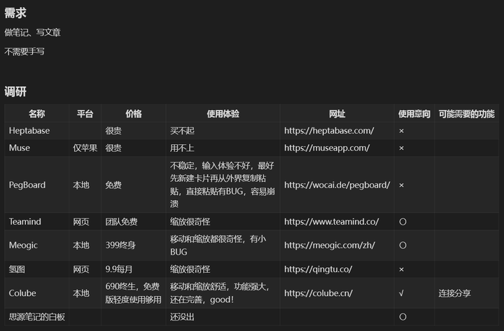
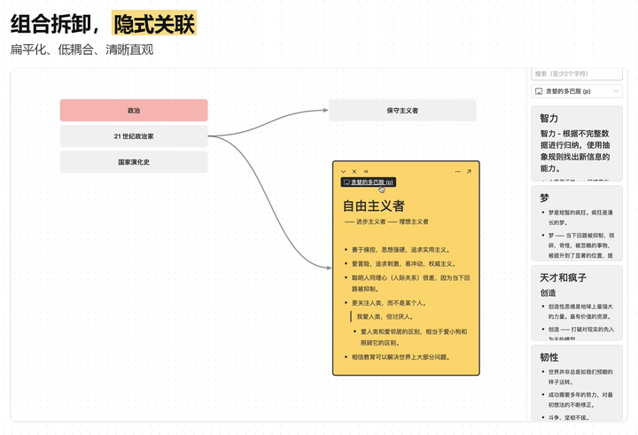
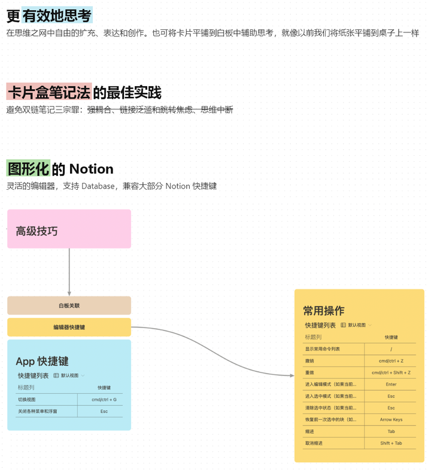
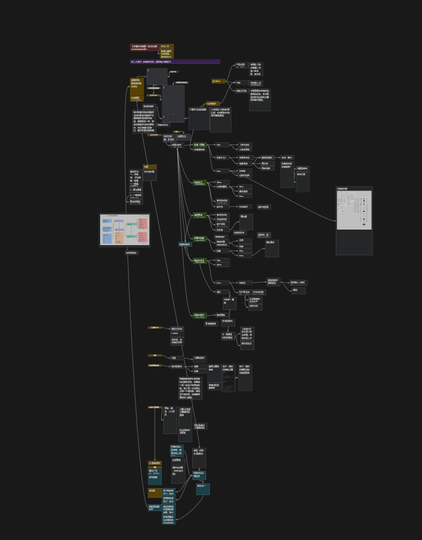
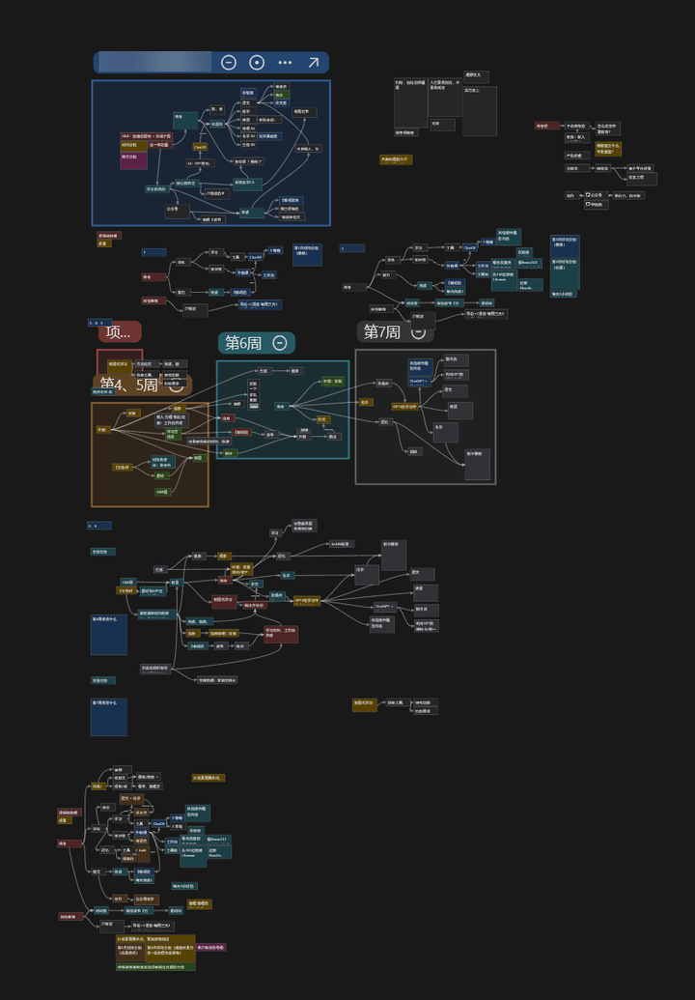

# 有没有一款能完美实践卡片笔记法的笔记软件？
> 💡 备注属性未写入，可能是备注属性名称或者类型被修改了，建议将字段类型设置为 rich_text，可以在小程序-操作-修改文章数据库页面进行调整
> 💡 原文链接:[https://mp.weixin.qq.com/s?__biz=MzkyMjQ5MzYxMw==&mid=2247483823&idx=1&sn=866e03a2d042e7938c3ffed88125196a&chksm=c0aa6b29b1a874cffce710c4fc07e596abd08407c45bae62adfe6556665321f3acf813510527#rd](https://mp.weixin.qq.com/s?__biz=MzkyMjQ5MzYxMw%3D%3D&mid=2247483823&idx=1&sn=866e03a2d042e7938c3ffed88125196a&chksm=c0aa6b29b1a874cffce710c4fc07e596abd08407c45bae62adfe6556665321f3acf813510527#rd)
我之前一直在使用 flomo（还买了年会员），但卡片笔记管理和关联的问题一直没有解决。
然后我又用思源笔记（一样付了费），但是我发现思源笔记对我来说更适合作为一个知识库，而非践行卡片笔记法的优秀工具。
工具选型
针对管理与关联卡片笔记的问题，我调研了一番然后决定上手白板类软件试试。
在明确了使用需求之后我就开始搜集资料，得出了以下表格的调研结果：

最后我选择是 Colube ( 20230907作者说即将改名为 Mefo ) ，这款软件类似面向海外的 Heptabase 。
我的个人观点是：Colube 比 Logseq 和 Roam 等笔记软件更适合实践卡片笔记法。可视化是我最看重的优点，双向链接 + 白板标签跳转 + 自动关联等功能我也觉得很好用。
先贴一下官网的简介，后面介绍我自己的用法：
简介

使用方法案例
Colube 是我目前重度使用的软件之一，有效帮助我管理好了卡片笔记。
以下是我的3种用法：

官网目前是：https://colube.cn/（点击文末的**阅读原文**可以直达）（你也可以在前面的工具选型那张图里找到我调研的其他软件的官网链接）。你可以在网站上了解更详细的内容。
**至此，flomo 已经变成我的素材收集箱了，负责给我的 Colube 填充内容。**
你的鼓励与支持就是我创作的最大动力。如果你认可这篇文章的价值，能否请你点个免费的赞，然后分享给你的好朋友——释放信号，能让更多人感受到你的独特价值。
有任何问题请私信，我看到了会认真解答

## 摘要

（待补充）

## 我的笔记

（待补充）
