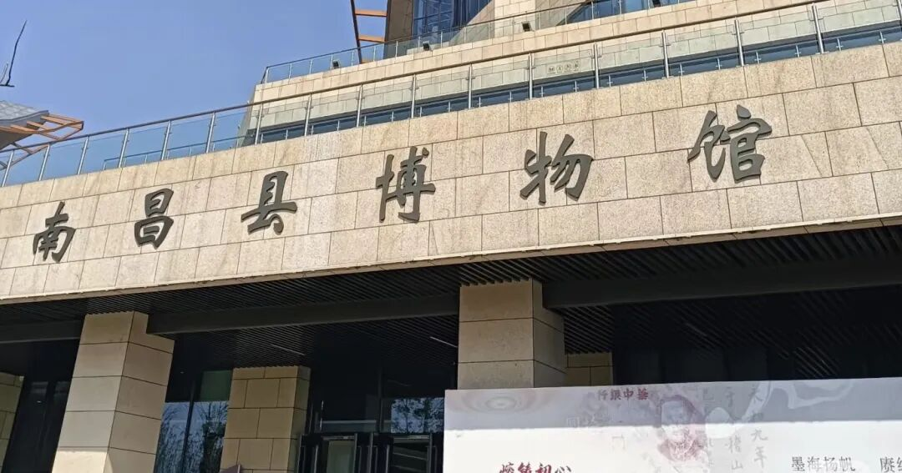

# 江西南昌县各大姓氏源流，看看你家从哪里迁过来的（上篇）
> 💡 备注属性未写入，可能是备注属性名称或者类型被修改了，建议将字段类型设置为 rich_text，可以在小程序-操作-修改文章数据库页面进行调整
> 💡 原文链接:[https://mp.weixin.qq.com/s?__biz=MzYzNjg0OTU4MA==&mid=2247484332&idx=1&sn=9933b65ba1c02ce28b65f483f3be9f61&chksm=f1c2b990f8f3391aba5abf2cf501568c47ee2174adc04ba140ff4eb09ea9baacea1ea34c55b2#rd](https://mp.weixin.qq.com/s?__biz=MzYzNjg0OTU4MA%3D%3D&mid=2247484332&idx=1&sn=9933b65ba1c02ce28b65f483f3be9f61&chksm=f1c2b990f8f3391aba5abf2cf501568c47ee2174adc04ba140ff4eb09ea9baacea1ea34c55b2#rd)

**南昌县**隶属江西南昌，地处赣鄱腹地，三面环抱省会南昌，国土面积 1810.94 平方公里，户籍人口超百万。**西汉高帝五年（公元前 202 年）置县，两千二百年古县，素有江南粮仓、豫章首邑之称。**笔者整理南昌县人口规模靠前30大主流姓氏源流，看看有你家的吗？欢迎在留言区交流。

**一，南昌县姓氏源流（上篇 30 姓）**

【1】李氏（陇西堂）：南昌县大姓。多支陇西李氏汇流，北宋靖康之难中原李氏南迁落籍，宋元有丰城、吉州李氏迁入，明初瓦屑坝移民继续补充支派。主要聚居莲塘镇、向塘镇、三江镇、蒋巷镇，幽兰、塘南、武阳、广福、南新、八一、黄马、塔城、富山、泾口均有大量李氏村落，宗祠遗存众多。 
【2】刘氏（彭城堂）：县域人口第二大姓，源流多元。豫章刘氏为本土主干，宋元由吉安庐陵、抚州临川迁入；明初瓦屑坝刘氏大批落籍蒋巷、塘南。蒋巷北冈刘氏为知名忠孝支派，全县各乡镇广泛分布，重点在蒋巷、南新、幽兰、武阳、向塘、三江、广福、塔城、富山、泾口。 
【3】陈氏（颍川堂 / 义门堂）：豫章老牌望族。主体为德安义门陈氏分庄后裔，两宋分迁南昌县，另有明初鄱阳瓦屑坝迁入支系。聚居向塘、广福、三江、幽兰，遍布莲塘、蒋巷、塘南、武阳、冈上、黄马、塔城、富山、南新、泾口。 
【4】张氏（清河堂）：多源融合大族。北宋末年河北清河张氏南迁入赣，宋元盱江、饶州分支迁入武阳、塔城；明初瓦屑坝张氏陆续落籍。核心聚居武阳镇、三江镇、冈上镇，莲塘、向塘、蒋巷、幽兰、塘南、广福、黄马、塔城、富山、南新、泾口均有分布。 
【5】罗氏（豫章堂）：南昌本土古老宗族，始祖罗珠筑豫章城，后裔世代扎根赣地。魏晋开始分支进入南昌县，宋元吉安罗氏不断迁入，三江、武阳、塔城为核心聚居地，散居莲塘、向塘、蒋巷、幽兰、塘南、广福、冈上、黄马、富山、南新、泾口。 
【6】黄氏（江夏堂）：唐末中原南渡入赣，宋元福建莆田支迁入，明初瓦屑坝移民接续汇入。主要分布于泾口、塘南、幽兰、蒋巷，莲塘、向塘、武阳、广福、三江、冈上、黄马、塔城、富山、南新均有黄氏聚居古村。 
【7】吴氏（延陵堂）：多支迁入，北宋抚州崇仁吴氏最早落籍黄马；南宋临川、进贤吴氏分迁广福、武阳、冈上；明初瓦屑坝吴氏补充塘南、蒋巷支派。重点聚居黄马、广福、武阳、冈上，全县各乡镇均有吴氏村落。 
【8】徐氏（东海堂 / 南州堂）：东汉南州高士徐孺子后裔为主体。宋代由新建、丰城分支迁入富山、幽兰、蒋巷；宋元多支落籍塔城、三江。核心分布幽兰镇、富山乡、蒋巷镇，莲塘、向塘、武阳、广福、冈上、黄马、塘南、南新、泾口、塔城都有族人聚居。 
【9】万氏（扶风堂）：豫章万氏核心支脉，宋元南昌本土万氏分支扩散县域各地，清代有经商支派兴起，三江、冈上、富山为主要聚居地，莲塘、向塘、蒋巷、幽兰、塘南、武阳、广福、黄马、塔城、南新、泾口均有分布。 
【10】邓氏（南阳堂）：江右邓氏古老支系，东汉末年邓禹后裔南迁豫章，唐末分支定居八一、泾口；宋元继续向外扩散。主要聚居八一乡、泾口乡，塘南、幽兰、蒋巷、向塘、三江、武阳、冈上、黄马、塔城、富山、南新均有村落。 
【11】胡氏（安定堂）：华林胡氏大宗分支，北宋自奉新迁入南昌县，宋元分支扩散冈上、黄马、广福；明初瓦屑坝胡氏落籍塘南、蒋巷。集中于冈上、黄马、广福，其余乡镇皆有散居村落。 
【12】熊氏（江陵堂）：豫章熊氏大宗，唐末南昌本土熊氏析迁县域各地，宋元分支迁入向塘、三江；明初瓦屑坝支派落籍蒋巷、塘南。主要分布向塘、三江、蒋巷、塘南，幽兰、武阳、广福、冈上、黄马、塔城、富山、南新、泾口均有聚居。
【13】周氏（汝南堂）：赣北周氏分支，宋元自吉州、饶州迁入，沿平原湖乡开基建村；明初瓦屑坝周氏迁入蒋巷、南新。核心聚居蒋巷、南新、塘南，幽兰、武阳、向塘、三江、广福、冈上、黄马、塔城、富山、泾口均有分布。 
【14】曾氏（三省堂）：孔门曾参后裔，南宋吉安曾氏迁入向塘、广福；后续分支蔓延黄马、冈上。以向塘、广福为核心，莲塘、蒋巷、幽兰、塘南、武阳、三江、塔城、富山、南新、泾口都有族人。
【15】傅氏（版筑堂）：宋元临川、丰城傅氏迁入，明初瓦屑坝傅氏落籍塘南、蒋巷。聚居塘南、蒋巷，幽兰、武阳、向塘、三江、广福、冈上、黄马、塔城、富山、南新、泾口均有古村。 
【16】章氏（全城堂）：章仔钧后裔，宋元从福建浦城、临川迁入南昌县，明清文脉兴盛，多出举人进士。主要分布塔城、武阳、幽兰，莲塘、向塘、蒋巷、塘南、广福、三江、冈上、黄马、富山、南新、泾口。 
【17】欧阳氏（渤海堂）：庐陵欧阳分支，南宋自吉州迁入，受赣中耕读文风熏陶。聚居黄马、三江、广福，向塘、武阳、幽兰、蒋巷、塘南、冈上、塔城、富山、南新、泾口均有分布。 
【18】杨氏（弘农堂）：宋元吉安、饶州杨氏迁入，明代多支省内宗族汇入。集中于蒋巷、南新、塘南，幽兰、武阳、向塘、三江、广福、冈上、黄马、塔城、富山、泾口遍布村落。 
【19】高氏（渤海堂）：元末鄱阳高氏迁入塘南、泾口；明初瓦屑坝高氏大批落籍蒋巷、南新。湖乡聚居为主，核心塘南、泾口、蒋巷、南新，其余乡镇零星分布。
【20】彭氏（陇西堂）：明初自湖口、都昌迁入，沿鄱阳湖湖滨扎根塘南、泾口、蒋巷。滨湖大村连片，塘南、泾口、蒋巷、南新为主，幽兰、武阳、向塘、三江、广福、冈上、黄马、塔城、富山均有支派。 
【21】涂氏（豫章堂）：豫章涂钦后裔，宋代奉新涂氏分支迁入幽兰、塔城；元明扩散武阳、冈上。核心聚居幽兰镇、塔城乡，其余各乡镇均有涂氏村落。 
【22】邹氏（范阳堂）：南宋南丰邹氏迁入广福、黄马；元明分支扩散冈上、向塘。主要分布广福、黄马、冈上、向塘，莲塘、蒋巷、幽兰、塘南、武阳、三江、塔城、富山、南新、泾口。 
【23】余氏（新安堂）：宋元徽州余氏避乱南迁，落籍三江、冈上；明初瓦屑坝余氏迁入塘南、蒋巷。聚居三江、冈上，塘南、蒋巷、幽兰、武阳、向塘、广福、黄马、塔城、富山、南新、泾口均有分布。 
【24】曹氏（谯国堂）：宋元由都昌、湖口迁入泾口、塘南；明初瓦屑坝曹氏落籍蒋巷、南新。滨湖乡镇集中，泾口、塘南、蒋巷、南新为主，幽兰、武阳、向塘、三江、广福、冈上、黄马、塔城、富山有村落。 
【25】冯氏（大树堂）：元初始祖冯培自临川迁入三江开基，为南昌冯氏主干，后世分支扩散蒋巷、向塘。核心三江镇、蒋巷镇，向塘、广福、黄马、冈上、幽兰、塘南、武阳、塔城、富山、南新、泾口均有族人。 
【26】方氏（河南堂）：宋元鄱阳方氏迁入塘南、泾口；明初瓦屑坝方氏落籍蒋巷、南新。沿滨湖平原聚居，塘南、泾口、蒋巷、南新为主，其余乡镇散居。
【27】蔡氏（济阳堂）：南宋福建蔡氏迁入向塘、广福；元明分支蔓延黄马、冈上。主要分布向塘、广福、黄马、冈上，莲塘、蒋巷、幽兰、塘南、武阳、三江、塔城、富山、南新、泾口均有。 
【28】廖氏（武威堂）：南宋吉水廖氏迁入黄马、广福；明初瓦屑坝廖氏落籍三江、冈上。集中黄马、广福、三江、冈上，其余乡镇均有廖氏古村。 
【29】康氏（京兆堂）：宋元吉安康氏迁入武阳、塔城；明代分支扩散幽兰、向塘。核心武阳镇、塔城乡，幽兰、向塘、三江、广福、冈上、黄马、蒋巷、塘南、富山、南新、泾口均有分布。 
【30】赵氏（天水堂）：两宋南渡皇室后裔，避元兵南迁，宋元落籍富山、冈上；后世低调繁衍，分支散布全县。聚居富山、冈上，莲塘、向塘、蒋巷、幽兰、塘南、武阳、三江、广福、黄马、塔城、南新、泾口均有赵氏村落。
** 上篇仅收录三十望族，南昌县其他姓氏未能尽数列举，还望各位宗亲多多包涵，其余县域姓氏将在下篇发布。**
** 二、结语 **
**为方便更多宗亲寻根溯源，欢迎大家转发至家族群、老乡社群。也可在留言区留下你的姓氏、乡镇与古村，完善南昌宗族脉络**
**往期回顾：**
[江西多地宗亲寻根溯源，看看有你的同姓家人吗（第3期）](https://mp.weixin.qq.com/s?__biz=MzYzNjg0OTU4MA%3D%3D&mid=2247484328&idx=1&sn=4fe50d1ab8cea10a0b54024ae6da4a8b&scene=21#wechat_redirect)
[村里没人住了，还有必要修祠堂吗？](https://mp.weixin.qq.com/s?__biz=MzYzNjg0OTU4MA%3D%3D&mid=2247484307&idx=2&sn=d389280b48e71e3a7e32a1773d1de8d2&scene=21#wechat_redirect)
[过继和抱养的子孙，能不能正常用本族字辈？](https://mp.weixin.qq.com/s?__biz=MzYzNjg0OTU4MA%3D%3D&mid=2247484291&idx=1&sn=e657aea52c6babbebde8711450ff7249&scene=21#wechat_redirect)
[家境贫富差距大，修宗祠捐款该不该强制统一？](https://mp.weixin.qq.com/s?__biz=MzYzNjg0OTU4MA%3D%3D&mid=2247484265&idx=2&sn=414cd91a8b5913a2e025702307679c3f&scene=21#wechat_redirect)
[古时候的字辈，是谁来负责拟定的？](https://mp.weixin.qq.com/s?__biz=MzYzNjg0OTU4MA%3D%3D&mid=2247484233&idx=2&sn=6d71278fb8743c3a08665d7e60b4a5f8&scene=21#wechat_redirect)
#江西南昌 #姓氏文化

## 摘要

（待补充）

## 我的笔记

（待补充）
