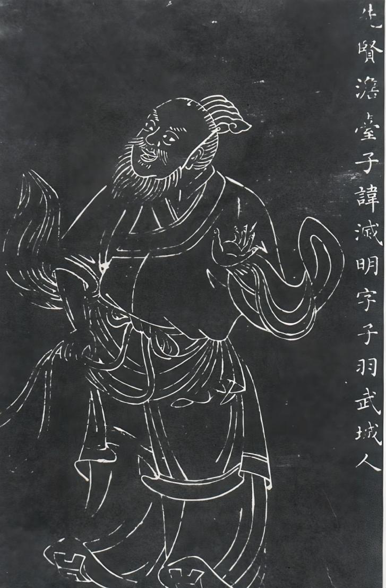
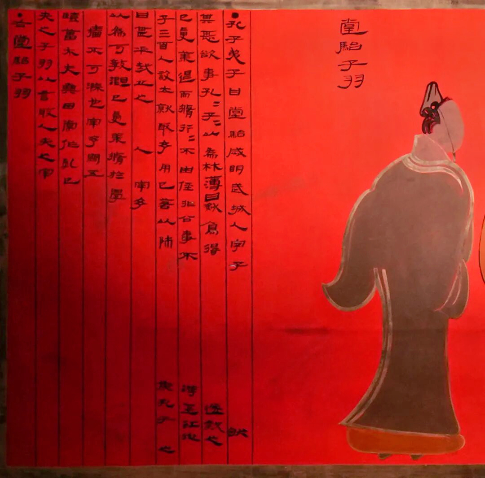
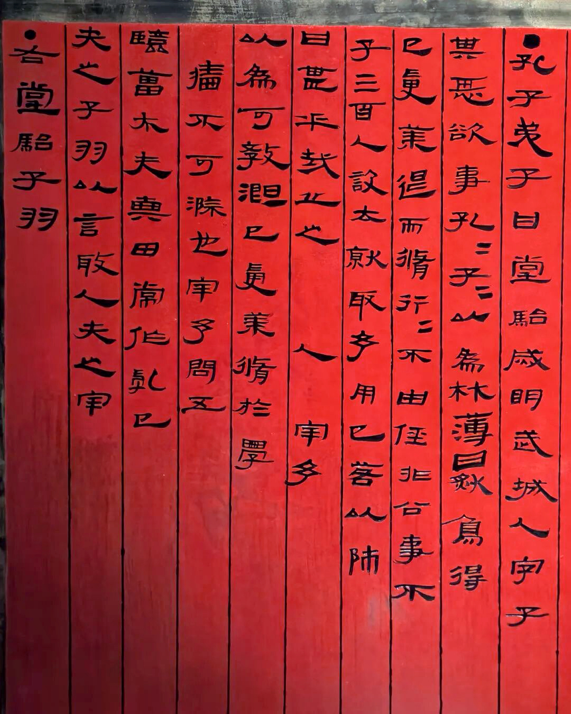
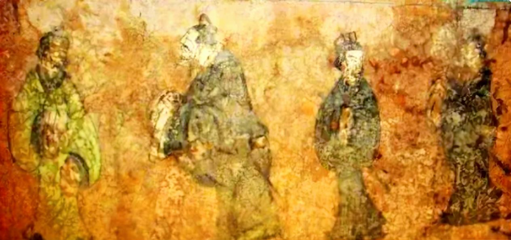
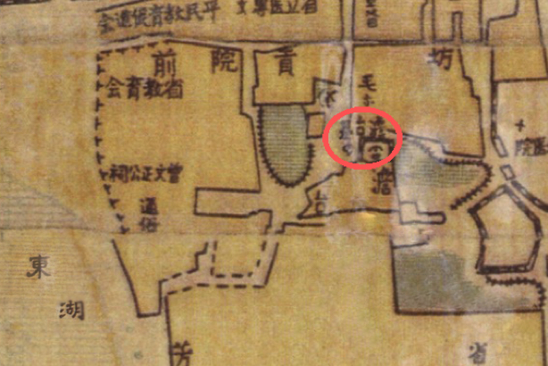
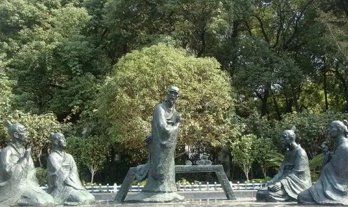
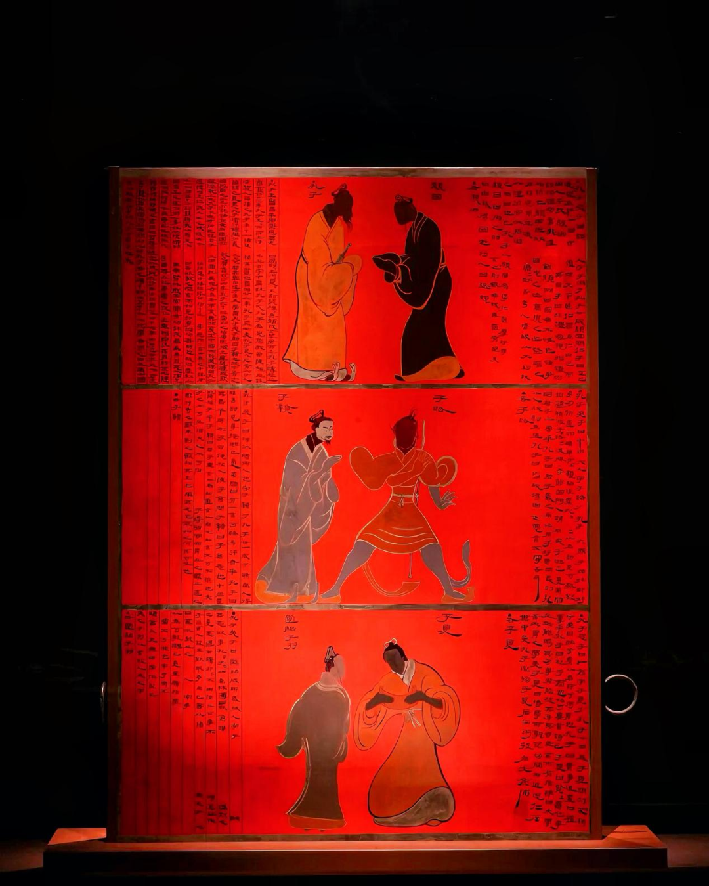

# 澹台灭明：叩启豫章文脉的千年回响
> 💡 备注属性未写入，可能是备注属性名称或者类型被修改了，建议将字段类型设置为 rich_text，可以在小程序-操作-修改文章数据库页面进行调整
> 💡 原文链接:[https://mp.weixin.qq.com/s?__biz=MzA4MDQzMzIxMQ==&mid=2652718028&idx=1&sn=0286f9e4ad0abec1722fc4c9849a67f8&chksm=85bb6f770766f3341732b8a2327cb28446bbabee680f7579b6ebb1d86dd379cad0caffc4d3f0#rd](https://mp.weixin.qq.com/s?__biz=MzA4MDQzMzIxMQ%3D%3D&mid=2652718028&idx=1&sn=0286f9e4ad0abec1722fc4c9849a67f8&chksm=85bb6f770766f3341732b8a2327cb28446bbabee680f7579b6ebb1d86dd379cad0caffc4d3f0#rd)
**点击蓝字关注我们**

澹台灭明，（公元前512年—？），字子羽，春秋时期鲁国武城人，孔门七十二贤之一，春秋末期著名思想家、教育家，也是儒家学说向南方传播的先驱人物。曾在东太湖（东湖）之畔，结庐建堂、开班讲学，广收门徒，首启赣地文教之风，被后世尊为豫章儒学之祖。

澹台灭明石刻像

九月南昌，暑气初敛，秋意渐浓。东湖如镜，倒映着湖畔南昌二中苏圃路校区内那一方静默的遗址。风过处，水波轻漾，仿佛还回荡着两千五百年前那琅琅书声。

东湖，澹台灭明讲学传道、终老归葬之地。一个被孔子以“材薄”相看、却以毕生践行儒学真谛的贤者，在这里点燃了赣鄱大地第一簇儒学星火，刻下豫章文脉发轫的起点。
**以貌取人 失之子羽**

孔子徒人图漆衣镜镜匣局部
澹台灭明相貌平平，其貌不扬。早年拜师孔子时，因为外形不出众，孔子曾误以为他资质平庸、难成大器。正如《史记·仲尼弟子列传》所记载：“澹台灭明，武城人，字子羽。少孔子三十九岁。状貌甚恶。欲事孔子，孔子以为材薄。”寥寥数语，道出了这位贤者初入孔门时的尴尬境遇。
然而，澹台灭明并未因此消沉。他始终恪守着“既已受业，退而修行，行不由径，非公事不见卿大夫”的初心，潜心治学，修身立德，踏实精进，用实际行动打破所有人的刻板印象。

壁画孔子问礼图
后来，澹台灭明远赴南方传播儒学，教化一方，声名传遍各地诸侯。孔子听闻他的成就与德行后，深感自责，留下了千古感慨：“吾以言取人，失之宰予；以貌取人，失之子羽。”

家喻户晓的成语“以貌取人”，便源自这段真实的历史典故。而澹台灭明本人，则用一生写下了对这句话最有力的注脚。
**南下传道 扎根东湖**
春秋时期，中原地区儒学兴盛、文教繁荣，而地处江南的豫章地区还相对偏远闭塞，民风质朴、文风未开。心怀传道之志的澹台灭明，不愿儒学只局限于北方，毅然告别家乡，渡过长江一路南下，几经辗转，最终落脚在如今的南昌东湖之畔，结庐建堂，开班讲学，正式开启了在江西的教化之路。

办学期间，澹台灭明始终秉持孔子“有教无类”的教育理念，不分门第，广收学子，前后培养弟子三百余人，桃李遍布江南各地。《史记》称其“南游至江，从弟子三百人，设取予去就，名施乎诸侯”。短短几十字，勾勒出一幅弦歌不辍、门庭若市的讲学图景。

澹台灭明在东太湖畔讲学 该图片由AI生成

据史料记载，澹台灭明品行端正、治学严谨，为人处世坚守道义，美名传遍各地诸侯。在他的教化下，诗书礼乐的文明新风慢慢浸润豫章大地，东湖草庐里传出的琅琅书声，是南昌历史上最早的儒学之声，正式拉开了赣鄱儒学发展的序幕，为豫章文脉的兴起打下了坚实根基。
**千年文脉 地名犹记**
弦歌不辍，终老于斯。澹台灭明终老于东湖之畔，逝后葬于讲学草堂旁，便是今天东湖区的澹台灭明墓。从结庐讲学到终老归葬，他将生命最厚重的篇章留在了这片土地，东湖也由此成为豫章儒学当之无愧的发轫之地。

斯人已逝，祠宇随之而起。自宋代起，墓旁修建澹台祠、友教堂，历代重修立碑。南宋绍兴年间，洪州知州曾重修澹台祠，并请朱熹门生、时任隆兴府学教授的黄灏撰写碑记，碑文中有“澹台子羽，孔门之高弟也，其言行见于传记，其遗迹见于豫章”之语，足见宋人对他的推崇。此后元、明、清历代均有修缮，祠前古木参天，碑石林立，成为豫章城中一处重要的人文胜迹。
宋明年间，赴洪州履职的官员、南来北往的文人，多到此拜谒先贤，留下大量诗文碑记。南宋诗人杨万里过洪州时，曾专程拜谒澹台祠，赋诗中有“我来欲问当年事，湖上青山似旧时”之句，一时传诵。明代大儒王阳明巡抚南赣时，亦曾登临东湖，凭吊澹台故迹，感叹“子羽之风，百世可师”。一祠一湖，遂成豫章文脉之象征。

1926年南昌市全图局部
澹台灭明的遗泽，更深深烙印在南昌的城市肌理之中。古时南昌城设有澹台门，城门虽已湮灭于岁月烟尘，但“澹台”之名却在方志典籍中代代相传，成为这座城市对先贤最朴素的纪念。为感念他举荐贤才、教化百姓之功，钟陵县改名进贤县，古城门进贤门由此得名。一县一门，皆因一人而改，跨越千年，至今仍活在南昌老城的记忆之中。

苏圃路二中校门南侧群雕《子羽游学》
地名如化石，镌刻着历史的年轮。澹台灭明或许不曾想到，自己当年筚路蓝缕的南下传道，竟在豫章大地上留下了如此深远的回响。从东湖草庐到澹台祠宇，从澹台门到进贤县，先贤的身影早已融入这座城市的血脉，成为南昌人日用而不觉的文化基因。
**文物印证 隔空呼应**
岁月沧桑，世事变迁。曾经的祠宇碑刻几经损毁修缮，但澹台灭明传承下来的儒学文脉，始终生生不息。

孔子徒人图漆衣镜镜匣
极具说服力的是，南昌海昏侯遗址出土的西汉孔子徒人图漆衣镜上，清晰绘有澹台灭明的圣贤画像。这件跨越两千年的珍贵文物，与东湖区东湖畔的澹台遗址相互印证、隔空呼应，用实物史料佐证了这段文脉传承，完整串联起江西两千余年的儒学发展脉络。

澹台灭明之于豫章，不啻为儒学火种的播撒者。他以一介布衣之身，在文风未开的江南之地结庐讲学，首开豫章儒学教育之先河，使仁义礼乐从北方的庙堂之高，走入江南的民间之远。此后两千余年，豫章文脉绵延不绝，书院林立、人才辈出，其源头活水皆可追溯至东湖之畔那间简陋的草庐。

如今，东湖岸边的澹台灭明群雕像静静伫立，依旧诉说着当年湖畔弦歌不绝、育人兴文的动人往事。那一缕从春秋吹来的风，穿过两千五百年的时光，依然在东湖的水波上轻轻荡漾。

先贤已远，文脉长存。
来源：南昌东湖区发布
编辑：万明 二审：胡志文 终审：凌云

**南昌发布**
**微信公众号：nc_fabu**

## 摘要

（待补充）

## 我的笔记

（待补充）
