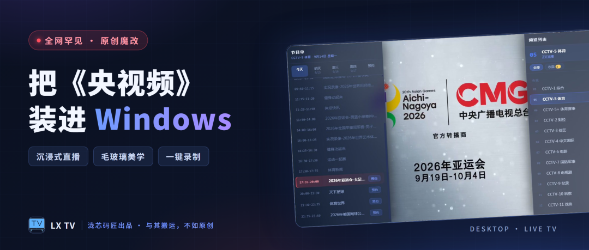
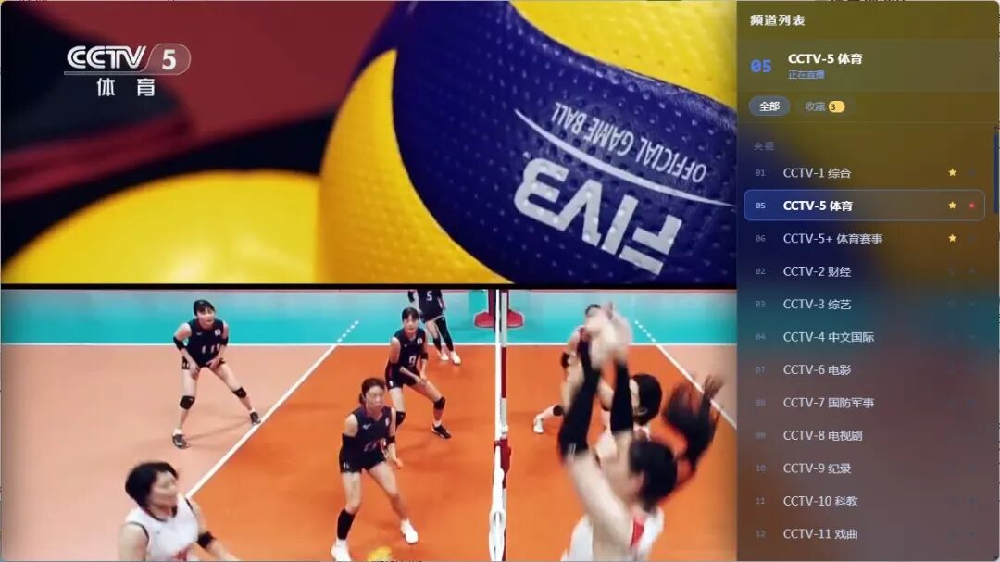
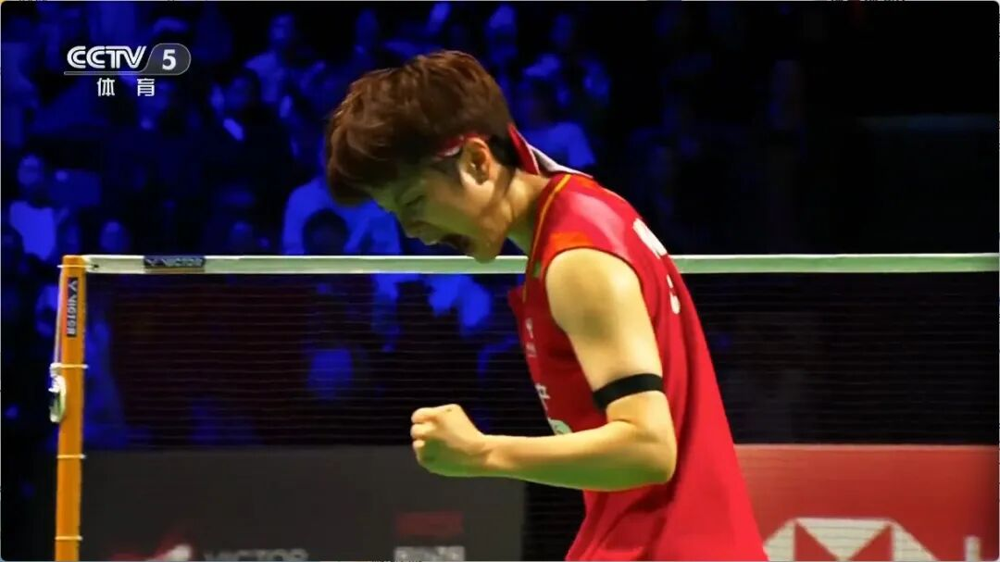
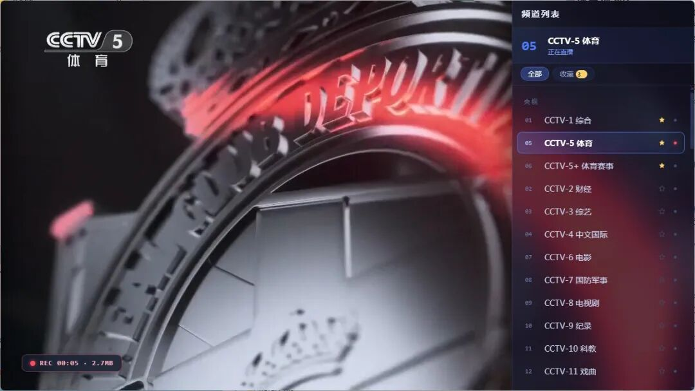

# 电脑上看电视直播太折腾？我把《央视频》魔改成了一台“电视”
> 💡 备注属性未写入，可能是备注属性名称或者类型被修改了，建议将字段类型设置为 rich_text，可以在小程序-操作-修改文章数据库页面进行调整
> 💡 原文链接:[https://mp.weixin.qq.com/s?__biz=MzA3MzgyMjM3OA==&mid=2247487260&idx=1&sn=80b05c5304d90356a095c8a4e49d2a35&chksm=9e1636f1ae5692affe17897ec291e920f13f501a80aeafeb6cc801462bf3ddc11c0576102760#rd](https://mp.weixin.qq.com/s?__biz=MzA3MzgyMjM3OA%3D%3D&mid=2247487260&idx=1&sn=80b05c5304d90356a095c8a4e49d2a35&chksm=9e1636f1ae5692affe17897ec291e920f13f501a80aeafeb6cc801462bf3ddc11c0576102760#rd)
👆 「关注」加「星标」，每次新作品都不错过

> **与其搬运，不如原创。今天聊聊我的新作品——LX TV，一个把官方直播页面“魔改”到极致的 Windows 电视应用。
> **
---
### 在电脑上看电视直播，有多难受？
你大概率也遇到过：
想看新闻直播，打开浏览器搜“电视直播”，跳出来的是**满屏弹窗广告**、真假难辨的播放按钮，画质还糊成一团。
官方网页倒是有，但小窗口播放、页面元素一堆，想全屏还得跟页面斗智斗勇。
装个电视软件？Windows 上的电视直播应用，**屈指可数**，界面还停留在十年前。
**我只是想在电脑上安安静静看个电视，怎么就这么难？**
---
### 换个思路：不写播放器，“魔改”官方页面
网上流传的直播源，画质没保障、说挂就挂。而《央视频》的官方直播流，经过浏览器端 WASM 解密，对页面域名和 UA 敏感——**自己硬解必然花屏**。
所以我干脆换了个思路：**不复制流、不自己解码，直接复用官方播放器的画面**，在它上面叠加一层我自己写的毛玻璃 UI 覆盖层。
这就是 LX TV——一个 14MB 的单文件 exe，免安装，双击就开。官方源 1080P 画质，解码天然正确，花屏从构造上就不可能发生。
打开之后是这样的：

整个画面就是电视本身：顶部一条毛玻璃顶栏显示频道，没有任何多余元素。鼠标不动三秒，**连控件都会自动隐去**，只留下纯粹的直播画面。
先看一段实际操作的演示：
---
### 一、频道面板：65 个频道，一秒切换
按 `S` 或点“频道”，毛玻璃频道面板从侧边滑出：

- 🖱️ **分类标签** — 央视 / 卫视 / CGTN，各归各位
- ⭐ **收藏置顶** — 常看的频道点亮 ★，下次打开还在最前面
- 🔢 **数字选台** — 直接按 158，像遥控器一样换台
换台瞬间，屏幕中央弹出频道名，一闪而过——**这个 OSD 细节，电视味一下就上来了**。
---
### 二、节目单：能看七天，还能预约
按 `E` 呼出节目单：

- 🔴 当前直播中的节目**高亮红标**，正在播什么一目了然
- 📅 前后七天节目随便翻，按日期切换
- ⏰ 没开播的节目点一下**预约**，到点自动提醒
---
### 三、一键录制：只录画面，干净得像源文件
这是我最得意的功能。按 `R`，左上角出现 REC 角标，计时 + 体积实时跳动：

- 🎬 **只录官方画面** — 录制走视频帧级捕获，OSD、面板、控制栏统统不进画面，成片干净得像源文件
- 🖼️ **原分辨率 6Mbps** — 1080P 画面原样落盘，webm 格式即录即存
- 🛡️ **仅前台录制** — 窗口一旦切到后台，录制自动停止。这是刻意为之的边界：录制行为只发生在你眼皮底下
> 📌 **路线图**：后台自动录制节目（人不在电脑前也能定时录球赛/新闻）已经在计划里了，下个版本见。
> 
截图也是同理，按 `X`，原画质一张，直接进截图文件夹。
---
### 四、细节控的舒适区

- 📌 **置顶浮窗** — 一键把电视钉在屏幕角落，边工作边看球
- ⌨️ **快捷键全家桶** — ↑↓ 切台、←→ 音量、空格暂停、F11 全屏，手不碰鼠标
- 💾 **记忆播放** — 上次看到哪个频道，下次打开直接续上
- 🖥️ **画面模式** — 完整画面 / 铺满裁剪，随喜好切换
---
### 郑重说明
LX TV 是我基于《央视频》官方页面做的**个人魔改作品**，直播内容与版权归《央视频》及各电视台所有。
**本应用仅限个人学习与使用，严禁任何形式的传播、售卖与二次分发。** 也请勿用于任何商业场景。
官方页面改版可能导致功能临时失效，我会持续跟进适配。
---
### 怎么获取？
关注公众号，后台回复 **“LX TV”** 获取下载。
单文件 exe，约 14MB，**免安装、双击即用**。Windows 10/11 均可运行。
---
### 更新预告
**后台自动录制 + 多段适配**：定时任务 + 自动落盘，让 LX TV 变成你的私人节目录像机。另外，Android 端同款 UI 也在路上了。
想看哪个优先做？评论区告诉我。
---
泷芯码匠 | 与其搬运，不如原创
---
觉得有用的话，**点个「赞」和「在看」**，把 LX TV 分享给同样想在电脑上看电视的朋友。
你希望下个版本支持什么功能？**评论区聊聊**，说不定下一期就实现了。

## 摘要

（待补充）

## 我的笔记

（待补充）
