# 白嫖党的终极胜利：用 Cloudflare 搭建永久免费图床+网盘，彻底告别服务器！
> 💡 备注属性未写入，可能是备注属性名称或者类型被修改了，建议将字段类型设置为 rich_text，可以在小程序-操作-修改文章数据库页面进行调整
> 💡 原文链接:[https://mp.weixin.qq.com/s?__biz=MzIwMjUyMjQ2Ng==&mid=2247484609&idx=1&sn=39514f3b3d9d8114d9a07813b2fda8ec&chksm=97e5d64d4b4eef6bd547b878cfe5657ef2cc8eb83dddf7b9fac131554cf98e91070e5ea624b8#rd](https://mp.weixin.qq.com/s?__biz=MzIwMjUyMjQ2Ng%3D%3D&mid=2247484609&idx=1&sn=39514f3b3d9d8114d9a07813b2fda8ec&chksm=97e5d64d4b4eef6bd547b878cfe5657ef2cc8eb83dddf7b9fac131554cf98e91070e5ea624b8#rd)
你现在用的图床，是不是还停留在这些阶段：
👉 免费图床不稳定，说挂就挂
👉 OSS / COS 每个月都要花钱
👉 VPS 自建图床，维护麻烦还容易崩
👉 图片外链经常被封、限速、掉链
如果你也踩过这些坑，那今天这个项目，基本可以帮你“彻底翻盘”。
---
## 🧠 为什么你需要一个“真正属于自己的图床”？
做博客、写公众号、做电商、搞副业的人，都绕不开一个问题：
👉 图片放哪？
但现实是：
- 免费图床：不稳定 + 广告 + 限制多
- 商业云存储：长期成本高
- 自建服务器：费钱 + 费精力
所以，本质问题只有一个：
👉 **有没有一种“免费 + 稳定 + 可控”的解决方案？**
答案是：有。
---
## 🔥 项目登场：CloudFlare-ImgBed
👉 GitHub：CloudFlare-ImgBed
地址：

```javascript
https://github.com/MarSeventh/CloudFlare-ImgBed
```
这是一个基于 Cloudflare 的开源项目，本质上它帮你实现：
👉 图床 + 文件床 + 轻量网盘 三合一
而且重点来了——
👉 **可以做到接近 0 成本运行**
---
## ⚙️ 它到底能干嘛？
简单说，这不是一个普通图床，而是一整套“文件托管系统”。
它支持：
#### 🖼️ 1. 图床功能（基础刚需）
- 图片上传 / 删除 / 管理
- 支持多格式（jpg / png / gif / 视频等）
- 一键复制外链
👉 写博客、发公众号直接用
---
#### ☁️ 2. 文件床 / 网盘
- 任意文件上传
- 目录管理
- 文件分享
👉 直接当私人网盘用
---
#### 🔗 3. API & WebDAV
- 支持 RESTful API
- 支持 WebDAV
👉 可接入：
- PicGo
- Obsidian
- Typora
---
#### 🤖 4. 多存储渠道（核心优势）
支持：
- Cloudflare R2
- Telegram Bot
- S3兼容存储
👉 可实现“无限扩展存储”  
---
#### 🧩 5. 全链路管理能力
- 上传 / 管理 / 读取 / 删除
- 权限控制
- 图片审核
- 随机图接口
👉 覆盖完整文件生命周期  
---
## 💥 为什么它这么香？（核心优势）
### ① 真·零服务器
基于 Cloudflare Pages + Workers：
👉 不需要 VPS
👉 不需要运维
---
### ② 成本几乎为 0
利用 Cloudflare 免费额度：
👉 免费 CDN
👉 免费 KV 数据库
👉 R2 低成本甚至白嫖
👉 **个人使用基本不花钱**

---
### ③ 全球加速
Cloudflare 自带：
👉 全球 CDN
👉 防 DDoS
👉 HTTPS
👉 图片访问速度直接起飞
---
### ④ 可控性拉满
区别于第三方图床：
👉 数据完全属于你
👉 不会被删
👉 不会跑路
---
### ⑤ 支持 Docker + 无服务器
- 小白：Cloudflare Pages 一键部署
- 老手：Docker 私有化部署
👉 灵活到离谱
---
## 👨‍💻 谁最适合用这个？
这项目不是给所有人的，但如果你是👇这些人，直接冲：
#### ✍️ 内容创作者
- 博客
- 公众号
- 技术写作
👉 稳定图床刚需
---
#### 🧑‍💻 开发者
- API 接入
- 自动上传
- 项目资源管理
---
#### 💰 副业玩家
- 电商图片托管
- 资源分发
- 引流工具
---
#### 🧠 折腾党（重点）
👉 喜欢“白嫖 + 自建 + 控制权”的人
---
## ⚠️ 也别盲目上（真实建议）
说点实话，不是无脑推荐：
👉 部署有一定门槛（需要 Cloudflare 基础）
👉 v2 版本仍在优化中
👉 Telegram 方案需要配置 Bot
👉 适合愿意折腾的人，不适合纯小白
---
## 📈 为什么这个项目容易火？
你可以看它的趋势：
👉 GitHub ⭐ 已达几千星
👉 持续更新
👉 社区活跃
👉 属于典型的“Cloudflare生态爆款项目”  
---
## 🧩 一句话总结
如果你还在：
❌ 用不稳定免费图床
❌ 每个月交 OSS 钱
❌ VPS 自建还容易崩
那这个项目的意义就是：
👉 **帮你用“0成本”搞定一个长期稳定的图床+网盘系统**
**搭建教程**
首先，访问 GitHub 搜索 CloudFlare-ImgBed 项目。点击 Fork，把它克隆到你自己的仓库里。这就是我们图床的心脏。
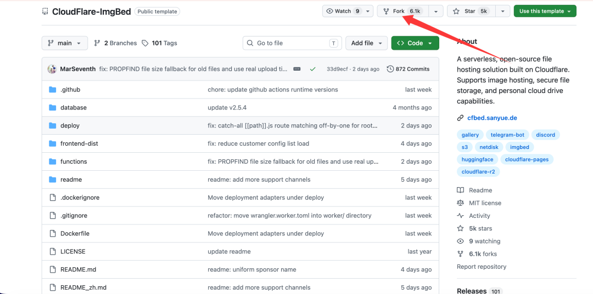
回到 Cloudflare 后台，点击 Workers 和 Pages，选择“创建项目”里的“Pages”。
关联你的 GitHub 帐号，选中刚才 Fork 的项目，点击“开始部署”。
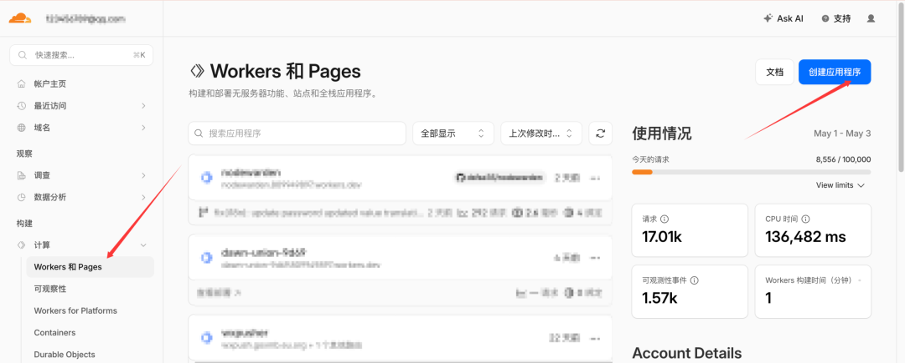
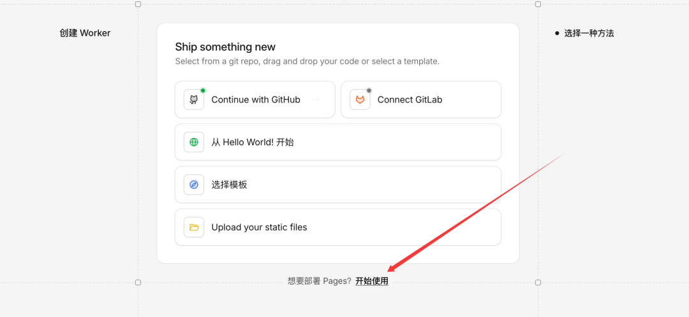
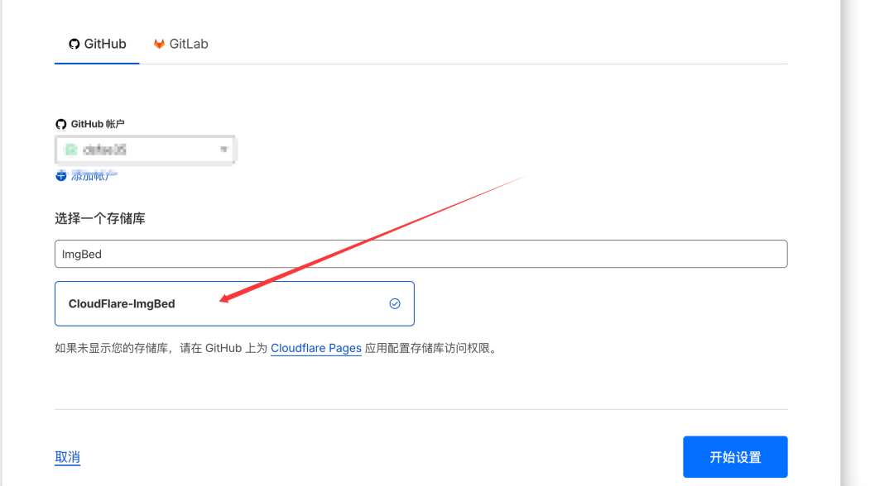
| 配置项 | 值 | 说明 |
| 项目名称 | `cloudflare-imgbed`（或自定义） | 项目标识符 |
| 生产分支 | `main` | 生产环境分支 |
| 构建命令 | `npm install` | **重要：v2.0 新构建命令** |
| 构建输出目录 | `/frontend-dist` | 前端构建产物目录 |
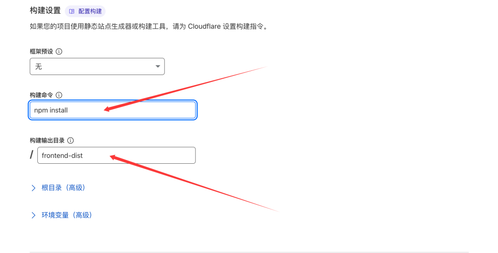
创建 R2 存储桶： 进入 R2 页面，新建一个存储桶，名字起叫 my-img-bed。
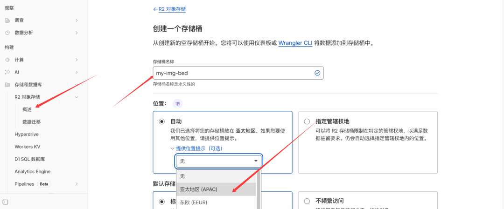
创建 KV 数据库： 进入 Workers KV，创建一个命名空间，名字填 img_url。这能保证你的图片链接永久有效。
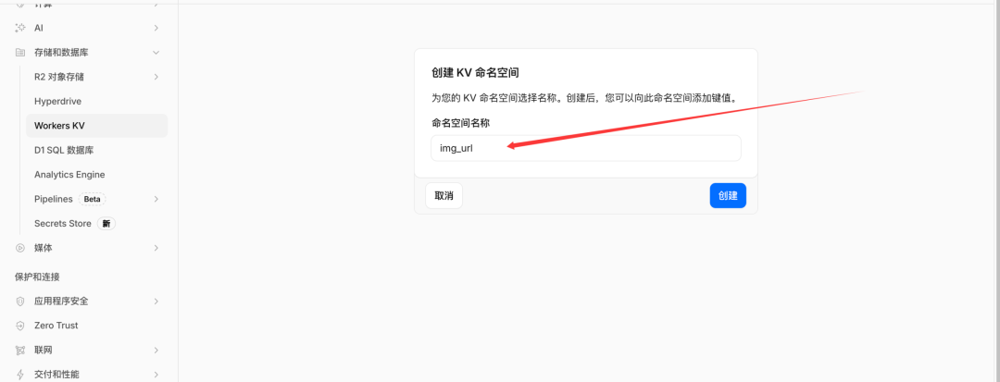
回到 Cloudflare Pages 的项目设置，在配置里找到「绑定（Bindings）」这一项。
接着新增一个 KV 绑定：
- 变量名填写：img_url
- 绑定目标选择你刚刚创建的同名 KV 命名空间
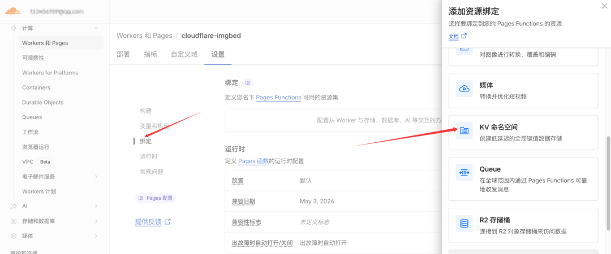
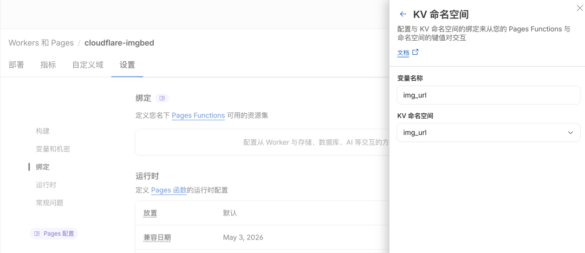
添加 R2 绑定：变量名设为 img_r2，指向你的存储桶 my-img-bed。
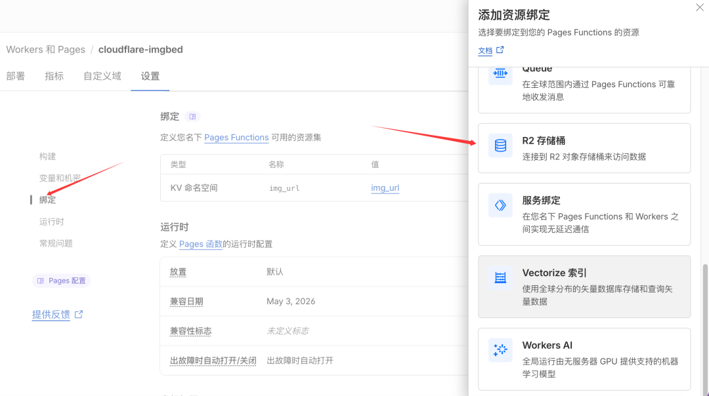
👉 为了避免你的图床被别人随意使用，可以在环境变量里加一层“安全校验”：
- AUTH_CODE：相当于上传时用的密钥，没有这个码就不能上传文件
- BASIC_USER 和 BASIC_PASS：用来给后台管理页面加一层登录认证（账号 + 密码）
简单来说，就是添加三个变量 给上传入口和管理后台各上一把锁，防止被滥用。
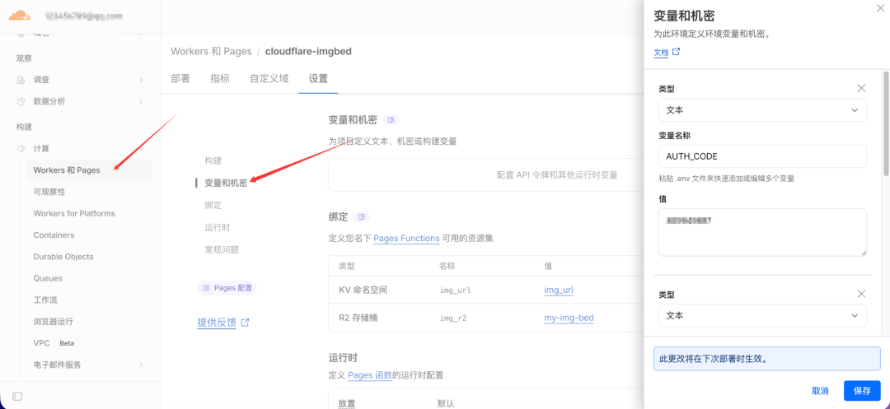
配置完成后，点击重新部署。
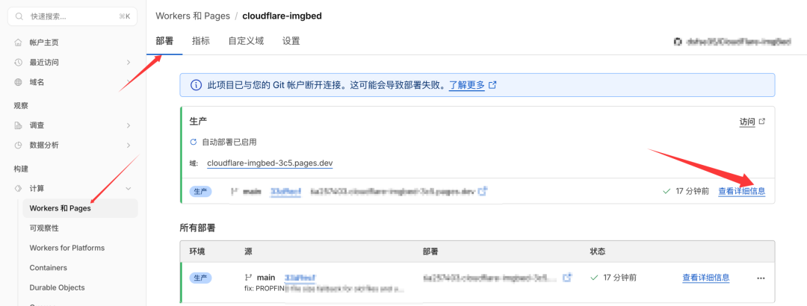
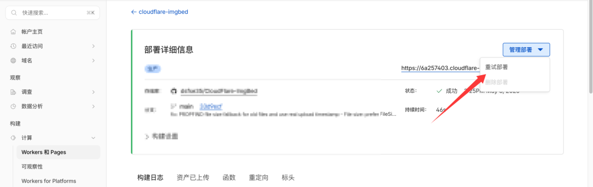
最后一步：点击自定义域，绑定你自己的域名。
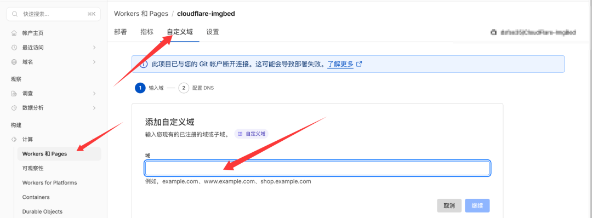
搭建完成！现在你已经拥有一套支持拖拽上传、运行稳定、权限可控的专属图床系统，一切数据都掌握在自己手里。访问域名，输入自定义的密码进入即可。
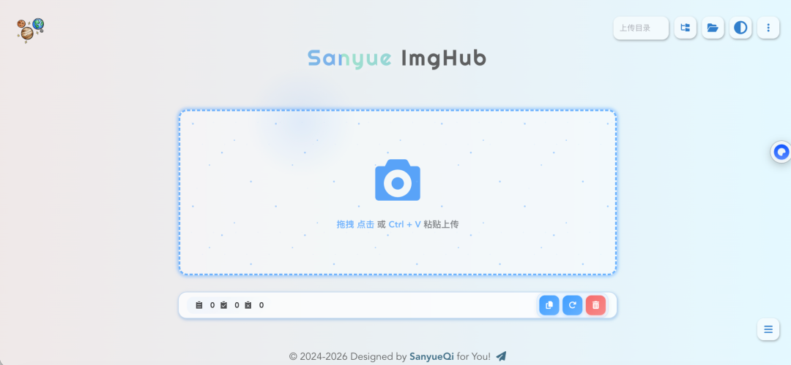
--完--

读到这里说明你喜欢本公众号的文章，欢迎 **置顶（标星）**本公众号 **小目标工作室**，这样就可以第一时间获取推送了~

## 摘要

（待补充）

## 我的笔记

（待补充）
