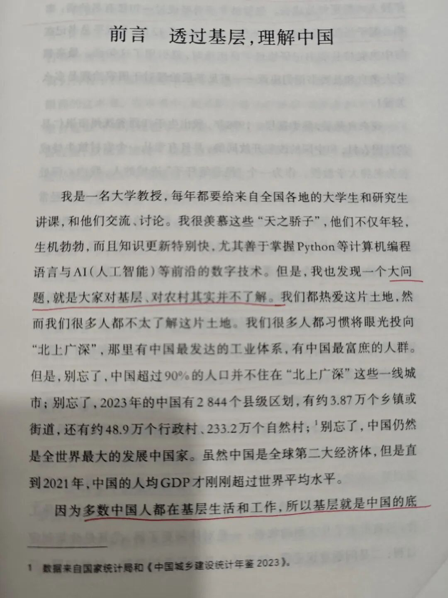
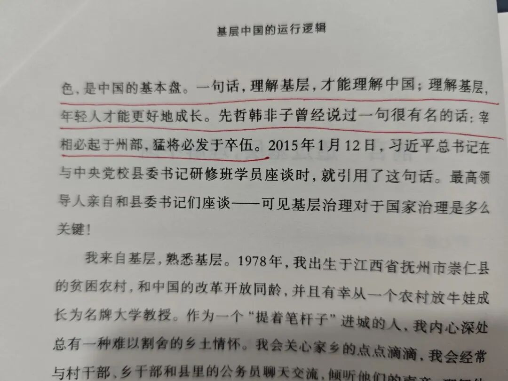
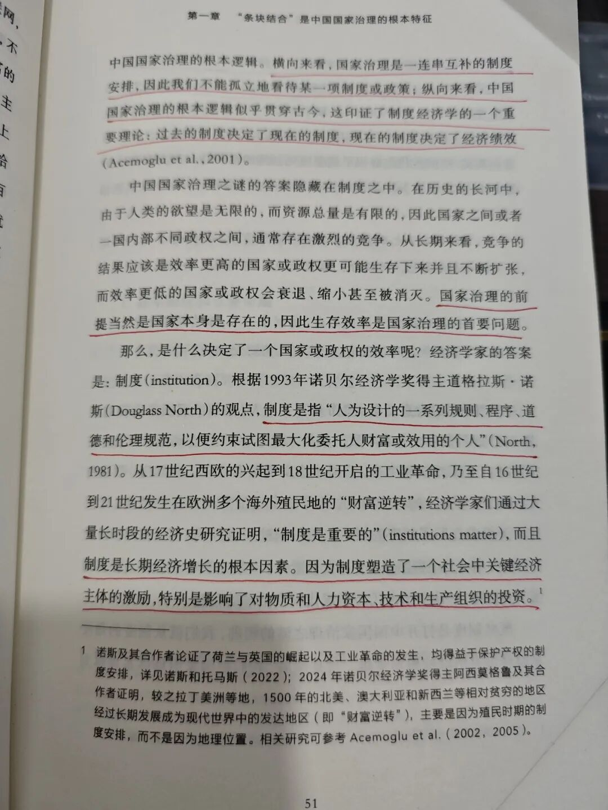
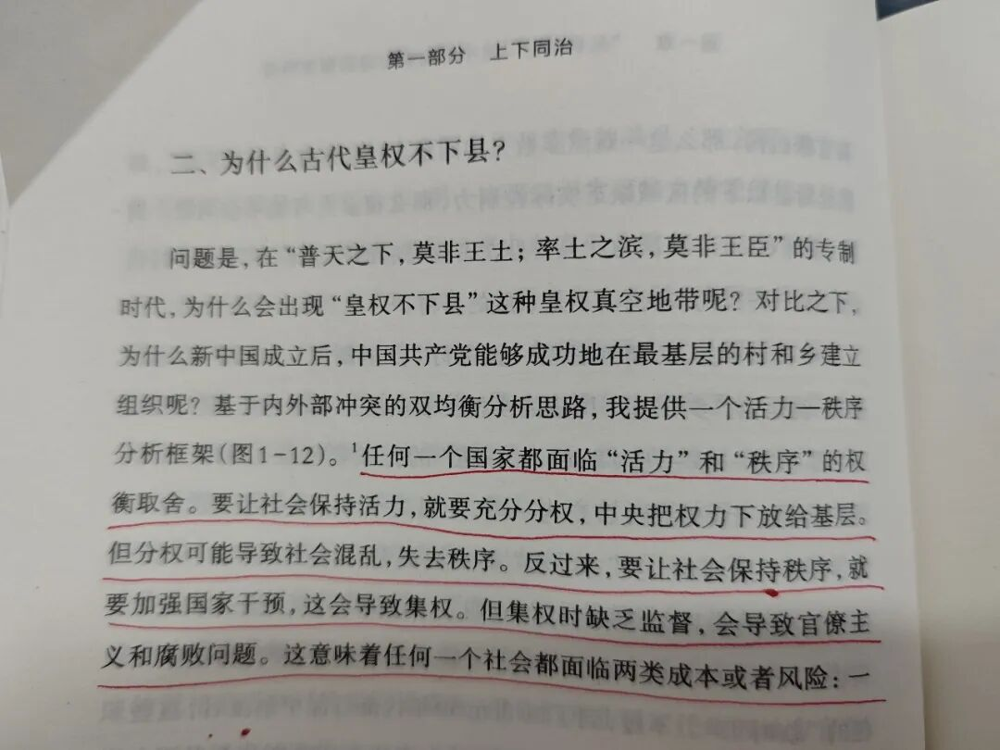
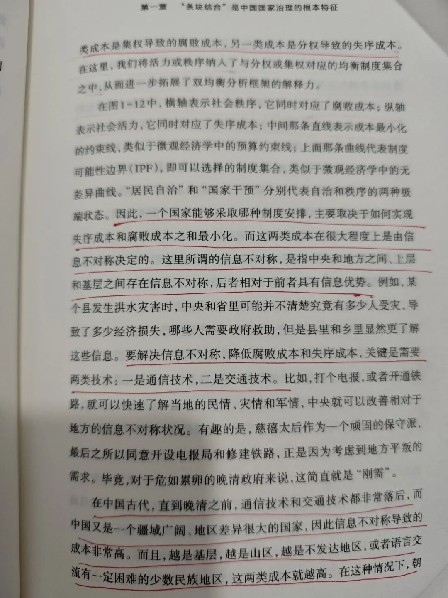
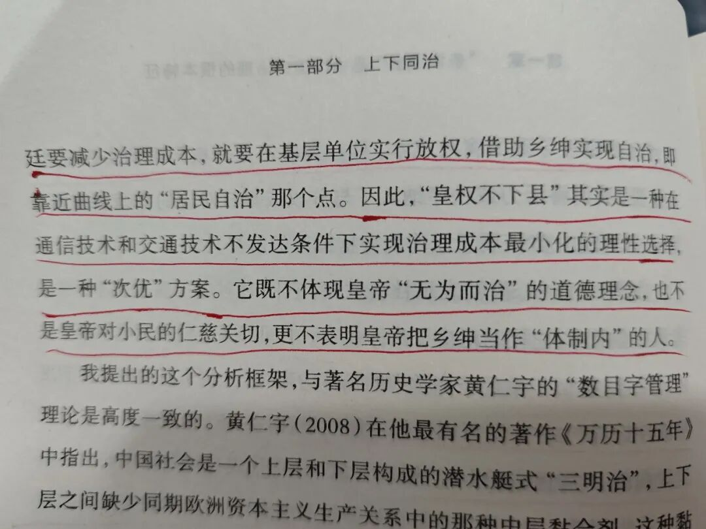
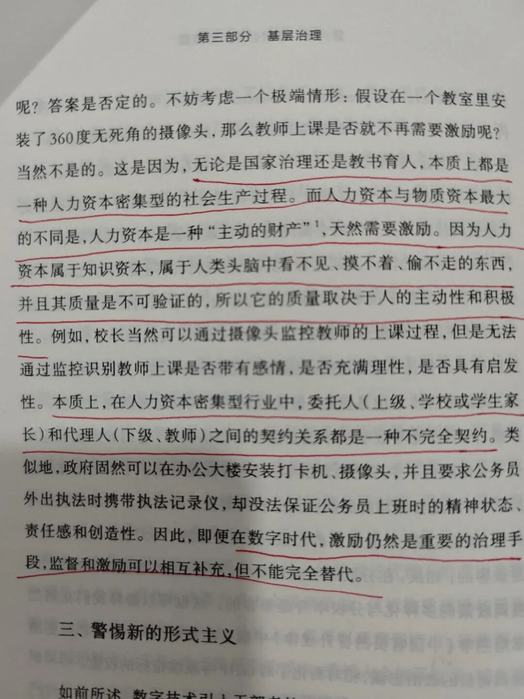
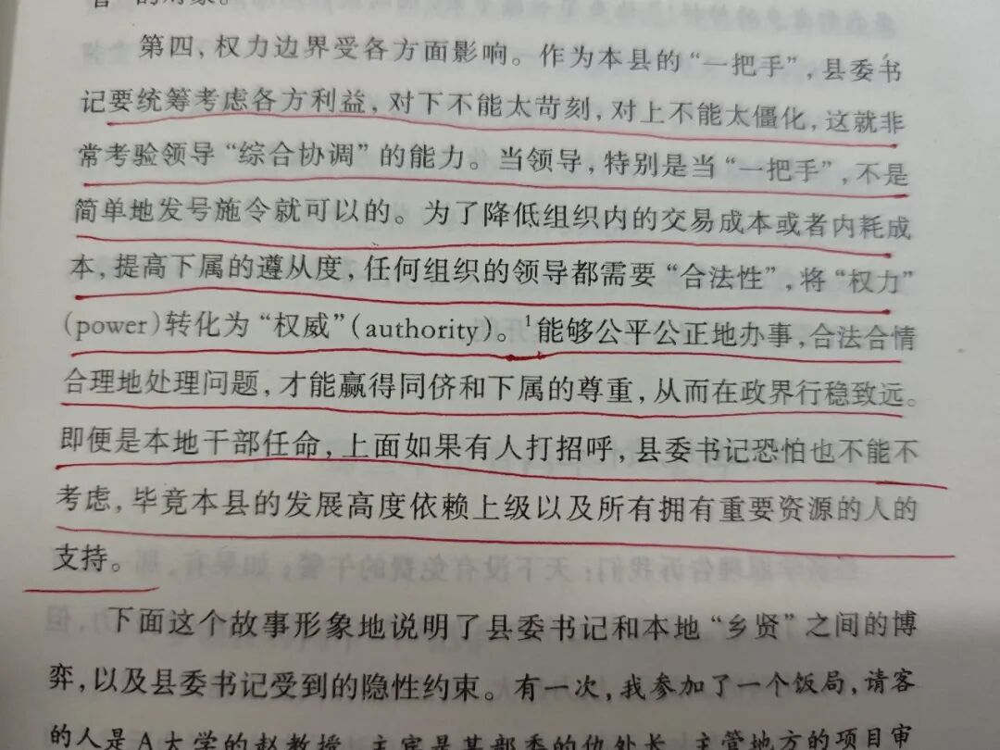
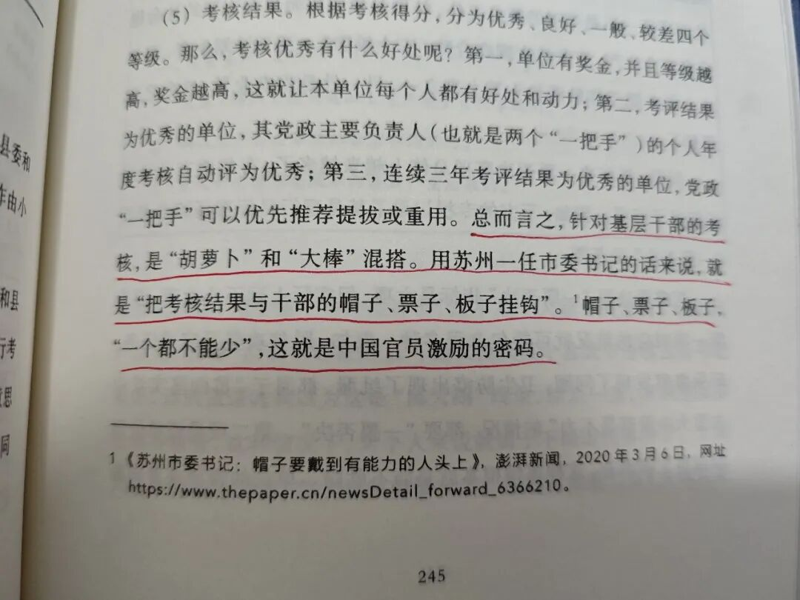

# 阅读《基层中国的运行逻辑》：基层就是中国的底色，是中国的基本盘，理解基层，才能理解中国。
> 💡 备注属性未写入，可能是备注属性名称或者类型被修改了，建议将字段类型设置为 rich_text，可以在小程序-操作-修改文章数据库页面进行调整
> 💡 原文链接:[https://mp.weixin.qq.com/s?__biz=MzE5MTEwMTg0NQ==&mid=2247485865&idx=1&sn=f02abe673dcf112ab2513caf69df5099&chksm=979d7dffa22fb7d1689a748ead0fef0108435c7cef352a05eac442d4b8e88ce54476d0307963#rd](https://mp.weixin.qq.com/s?__biz=MzE5MTEwMTg0NQ%3D%3D&mid=2247485865&idx=1&sn=f02abe673dcf112ab2513caf69df5099&chksm=979d7dffa22fb7d1689a748ead0fef0108435c7cef352a05eac442d4b8e88ce54476d0307963#rd)
**一、前言**
有句俗语叫“人往高处走，水往低处流”。这句话描绘的既是一个自然的物理现象，也是一个社会心理现象。
因为人民追求美好生活需要的愿望是普遍的，但正如该书《前言》部分所言**：“多数中国人都在基层生活和工作，所以基层就是中国的底色，是中国的基本盘。一句话，理解基层，才能理解中国。”**

当然我们也可以换一种更正式或者说更理论化一点的说法，比如“经济基础决定上层建筑，上层建筑反作用于经济基础”。
为什么会有那么多的人想要去“理解”上层建筑，**说白了，**不**就是想在这个“反作用”中获取一定的经济利益**吗？但其中的一部分人却忽略了，经济基础与上层建筑是一体两面的关系，只知阳而不知阴。要知道“孤阴不长、独阳不生”啊！
**上层建筑只是不容易被单个人的、小的经济基础决定而已，但却始终要受到大的、宏观的经济基础所决定。**
就像生活在奴隶社会时期的人，是不可能会有什么具体的星链计划、星际穿越或星球大战的想法与认识一样。
**二、制度**
那国家治理的前提是什么？是国家的存在。国家都不存在，那你还治理什么国家？
那什么叫治理国家呢？或者说治理国家的本质目的是什么呢？从上面的道理中，我们可以理解到**：所谓治理国家，其本质的目的就是维护国家经济基础与上层建筑的长续存在，也就是不崩盘。**
经济基础与上层建筑这两个大盘有任何一个崩了，那这个国家很可能就得崩了。那**为了维护这两个大盘的不崩，就需要有制度。**
那么什么叫制度呢？依据该书第一章所列举的1993年诺贝尔经济学奖得主道格拉斯·诺斯的观点**：“制度是指人为设计的一系列规则、程序，道德和伦理规范，以便约束试图最大化委托人财富或效用的个人。**”

什么叫“以便约束试图最大委托人财富或效用的个人”？**我的理解是：不允许个人的欲望凌驾于总体之上——不是要求个人大公无私，而是要求个人“先公而后私、大公而小私”。**毕竟“人非草木、孰能无情”？既然皆是有情众生，那又怎么可能真的做到无私？
《后汉书·第五伦》记载：“或问伦曰：“‘公有私乎？’对曰：‘昔人有与吾千里马者，吾虽不受，每三公有所选举，心不能忘，而亦终不用也。吾兄子尝病，一夜十往，退而安寝；吾子有疾，虽不省视，而竟夕不眠。**若是者，岂可谓无私乎？’”**
**“第五伦”是东汉的一位名臣，以清廉正直著称。**这一段文言文的翻译是：有人问第五伦：“您有私心吗？”第五伦回答：“从前有人送我一匹千里马，我虽然没有收下，但每逢三公选拔官吏的时候，心里总会想起这个人，可终究也没有任用他。我哥哥的儿子曾经生病，我一夜去探望十次，回来之后就能安稳睡觉；我的儿子生病，我即使不去探望，却整夜睡不着觉。**像这样，难道可以说没有私心吗？”**
你若说他“无私”，对于那个送礼的人，他始终记得；哥哥的儿子与自己的儿子，在他的心里，也确实有着区别。可你若说他“不公”，不该收的礼他没收，人也没有因为始终记得就强行任用；作为长辈，该有的探望行为他又已经做到位了。
**所以，在我个人的认知里，只要是一个有情感的人，那就不存在有绝对意义上的大公无私，只存在有相对意义上的大公无私——即“先公而后私、大公而小私”而已。**
**那从这个角度讲，我们就可以比较简单的理解为什么以前古代的王朝总是会周期性的灭亡。**不就是没有做到“先公而后私，大公而小私”吗？不就是以个人的欲望，或者说小集体的欲望，凌驾于总体之上了吗？不就是一再突破了“最大化委托人财富或效个人效用”的制度约束了吗？
当然了，道格拉斯·诺斯是经济学家，所以他对于制度的定义与理解会更偏向经济一些，或者说更**偏向于治理国家的内部矛盾一些。但要治理一个国家，所要面对的却不只是内部矛盾而已，还有一定的外部矛盾，**或者说外部威胁，不过这就不一一展开详谈了。
**三、“皇权”下县**
那么古代中国的基层治理制度是什么？是皇权不下县。那么为什么皇权不下县呢？
如该书所言：**任何一个国家都面临“活力”和“秩序”的权衡取舍。**要让社会保持活力，就要充分分权，中央把权力下放给基层。但分权可能导致社会混乱，失去秩序。反过来，要让社会保持秩序，就要加强国家干预，这会导致集权。但集权时缺乏监督，会导致官僚主义和腐败问题。**这意味着任何一个社会都面临两类成本或者风险：一类成本是集权导致的腐败成本，另一类成本是分权导致的失序成本。……因此，一个国家能够采取哪种制度安排，主要取决于如何实现失序成本和腐败成本之和最小化。而这两类成本在很大程度上是由信息不对称决定的。这里所谓的信息不对称，是指中央和地方之间、上层和基层之间存在信息不对称，后者相对于前者具有信息优势。……要解决信息不对称，降低腐败成本和失序成本，关键是需要两类技术：一是通信技术，二是交通技术。**……在中国古代，直到晚清之前，通信技术和交通技术都非常落后，而中国又是一个疆域广阔、地区差异很大的国家，因此信息不对称导致的成本非常高。而且，越是基层，越是山区，越是不发达地区，或者语言交流有一定困难的少数民族地区，这两类成本就越高。在这种情况下，朝廷要减少治理成本，就要在基层单位实行放权，借助乡绅实现自治，即靠近曲线上的“居民自治”那个点。因此，**“皇权不下县”其实是一种在通信技术和交通技术不发达条件下实现治理成本最小化的理性选择，是一种“次优”方案。它既不体现皇帝“无为而治”的道德理念，也不是皇帝对小民的仁慈关切，更不表明皇帝把乡绅当作“体制内”的人。**

那为什么现在的中国“皇权”又下县了呢？首先，中国共产党本身是依靠农工群众起家的，革命成功的战略就是“农村包围城市”，在那个时候，所谓的“基层的信息不对称”基本上是不存在的，而且**这种信息优势反而构成了革命成功的基础，既然如此，那这种优势为什么要舍掉呢？所以“皇权”必须要下县。**其次，在新中国成立之后，中国政府已经依据过往的经历与经验建立起了直达村庄的组织体系，即**“党支部”。**其三，随着通信技术与交通技术的不断进步，“皇权下县”的治理成本也在不断地降低。
**四、参考与借鉴**
在该书的第六章《基层公务员的激励》里写道：无论是国家治理还是教书育人，本质上都是一种人力资本密集型的社会生产过程。而**人力资本与物质资本最大的不同是，人力资本是一种“主动的财产”，天然需要激励。因为人力资本属于知识资本，属于人类头脑中看不见、摸不着、偷不走的东西，并且其质量是不可验证的，所以它的质量取决于人的主动性和积极性。**

而在该书的第三章《基层首长的权力清单》里则写道：第四，权力边界受各方面影响。作为本县的“一把手”，县委书记要统筹考虑各方利益，**对下不能太苛刻，对上不能太僵化，这就非常考验领导“综合协调”的能力。当领导，特别是当“一把手”，不是简单地发号施令就可以的。为了降低组织内的交易成本或者内耗成本，提高下属的遵从度，任何组织的领导都需要“合法性”，将“权力”（power）转化为“权威”（authority）。能够公平公正地办事，合法合情合理地处理问题，才能赢得同侪和下属的尊重，从而**在政界**行稳致远。**即便是本地干部任命，上面如果有人打招呼，县委书记恐怕也不能不考虑，毕竟本县的发展高度依赖上级以及所有拥有重要资源的人的支持。

同在在该书的第六章《基层公务员的激励》里写道：总而言之，针对基层干部的考核，是“胡萝卜”和“大棒”混搭。用苏州一任市委书记的话来说，就是“把考核结果与干部的帽子、票子、板子挂钩”。**帽子、票子、板子，“一个都不能少”，这就是**中国官员**激励的密码。**

所以，除了最基本的对“基层中国的运行逻辑”有所了解之外，**你所在的组织或企业中，“经济基础”与“上层建筑”这两个大盘还好吗？有没有“先公而后私、大公而小私”的认知理念与制度？“皇权”有没有下县？对下苛刻、对上僵化吗？“帽子、票子、板子”都有吗？**
如果你是管理人员这意味着什么？如果你不是管理人员这又意味着什么？

## 摘要

（待补充）

## 我的笔记

（待补充）
